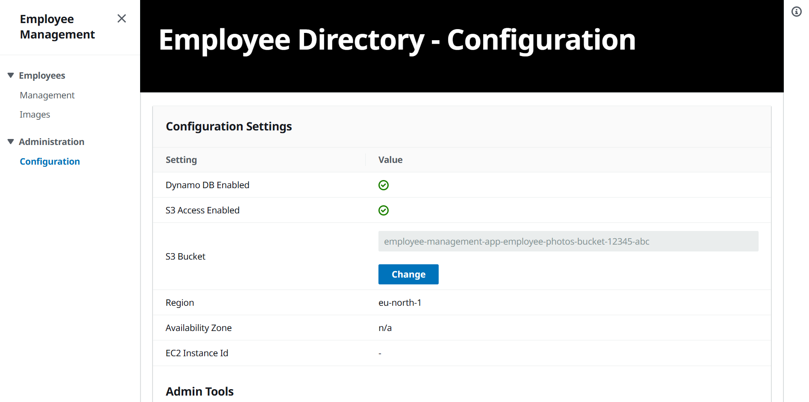
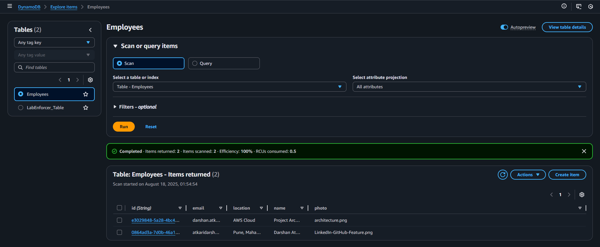

# AWS 3‑Tier High Availability App

A production‑style reference for deploying a highly available **3‑tier web application** on **AWS** using **Application Load Balancer (ALB)**, **Auto Scaling**, **private subnets**, **NAT gateways**, **DynamoDB**, **S3**, **IAM**, and **CloudWatch**.

This repo includes two end‑to‑end deployment paths:

* **AWS Management Console** (click‑through)
* **Terraform** (Infrastructure as Code)

## Architecture

### Core components

1. **Amazon VPC** with **public** and **private** subnets across **two AZs**
2. **Internet Gateway** and **NAT Gateways** for egress from private subnets
3. **Application Load Balancer (ALB)** routing traffic to EC2 targets
4. **Auto Scaling Group (ASG)** spanning private subnets
5. **EC2 Launch Template** with **User Data** to bootstrap the app
6. **DynamoDB** for application data (NoSQL)
7. **S3** for object storage (e.g., employee photos)
8. **IAM** role + **instance profile** for the EC2 instances
9. **CloudWatch** for logs/metrics/alarms
10. **Bastion Host** in a public subnet for controlled SSH access

## Architecture Flow

The application follows a **classic 3-tier pattern** on AWS with clear separation of responsibilities:

1. **Client Access (Public Tier)**  
   * End-users access the application via the **Application Load Balancer (ALB)**, exposed in the **public subnets**.  
   * The ALB terminates HTTP(S) requests and forwards traffic to healthy EC2 instances in the private subnets.

2. **Application Tier (Private Subnets + Auto Scaling)**  
   * EC2 instances (running the web app) live in **private subnets** and scale automatically via an **Auto Scaling Group (ASG)**.  
   * Each instance is launched from a **Launch Template** that includes **User Data** for bootstrapping the app and an **IAM instance profile** for secure access to AWS services.  
   * Outbound internet traffic (for package updates, app dependencies, etc.) is routed through a **NAT Gateway** in the public subnet.

3. **Data Tier (Managed AWS Services)**  
   * **DynamoDB** stores structured application data. In this reference, each employee record (ID, name, department, etc.) is stored as an item in DynamoDB.  
   * **S3** stores unstructured objects. For example, when a new employee is created, their profile picture is uploaded to S3, and the corresponding object URL is referenced in the DynamoDB record.

4. **Management & Security**  
   * A **Bastion Host** in the public subnet provides controlled SSH access to private EC2 instances.  
   * **CloudWatch** collects application and infrastructure logs/metrics and triggers alarms for scaling or fault recovery.  
   * Security groups and IAM roles enforce least-privilege access - app servers can reach DynamoDB and S3, but inbound internet traffic never directly reaches them.

---

### End-to-End Flow Example:
1. A user opens the Employee Directory web app → request hits the **ALB**.  
2. ALB forwards the request to an **EC2 instance** in a private subnet.  
3. The EC2 app processes the request:  
   * **Create employee** → saves structured data (ID, name, department, S3 image URL) in **DynamoDB**, uploads profile picture to **S3**.  
   * **View employee** → reads metadata from **DynamoDB**, fetches image from **S3**.  
4. Application scales out automatically when load increases; unhealthy instances are replaced by the **ASG**.  
5. Operations (patching, logs, monitoring) flow through **NAT** + **CloudWatch**, without exposing app servers to the public internet.

---

### Why this design

* **Highly available**: multi‑AZ, health checks, Auto Scaling
* **Secure by default**: app servers live in **private** subnets; outbound internet via **NAT**; **bastion** for admin access
* **Cost‑aware**: can use **Spot** or **On‑Demand** instances; scale in to zero at low load
* **Cloud‑native**: managed services (ALB, DynamoDB, S3, CloudWatch) reduce ops overhead

## What you’ll deploy

* VPC (CIDR you choose), 2× public + 2× private subnets
* Routing: IGW, NAT, route tables
* Security Groups for ALB, EC2, Bastion
* ALB + target group + HTTP listener
* DynamoDB table and S3 bucket
* EC2 Launch Template with IAM instance profile and User Data
* Auto Scaling Group across private subnets
* Optional Bastion host

> **Tip:** Health check path should match your app (e.g., `/` or `/health`). Set **ASG health\_check\_type = "ELB"** and grace period (e.g., 300s).

## Application Overview

## Quick Start

Pick one of the deployment guides:

* **[Deploy with AWS Console](./docs/console.md)**
* **[Deploy with Terraform](./docs/terraform.md)**

## Troubleshooting

* **ALB shows unhealthy targets**: check security groups, target group health check path/port, grace period, app actually listening.
* **EC2 can’t reach S3/DynamoDB**: confirm **IAM instance profile attached** to Launch Template; check route via NAT in private subnets.

## Cleanup

* **Terraform**: `terraform destroy`
* **Console**: delete in reverse order (ASG → LT → ALB/TG → EC2/bastion → DynamoDB/S3 (empty bucket first) → NAT → subnets → VPC)

---
