# Deploying using AWS Console

### Step 1: Create S3 Bucket
1. Navigate to the **S3 Console** -> **Create Bucket**.  
Enter Bucket Name -> leave rest default -> click create bucket
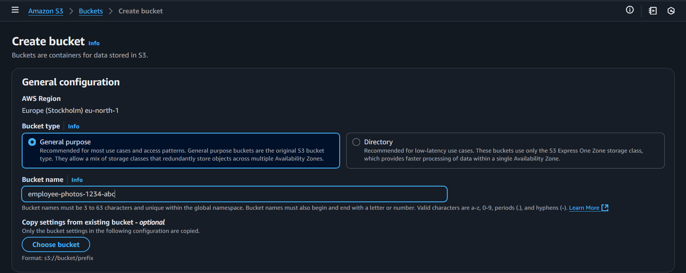

### Step 2: Create DynamoDB Table
1. Navigate to the **DynamoDB Console** -> **Create Table**.  

### Step 3: Create a VPC
1. Navigate to the **VPC Console** -> **Create VPC**.
2. Select **VPC and More**.
3. Provide a name for the project.
   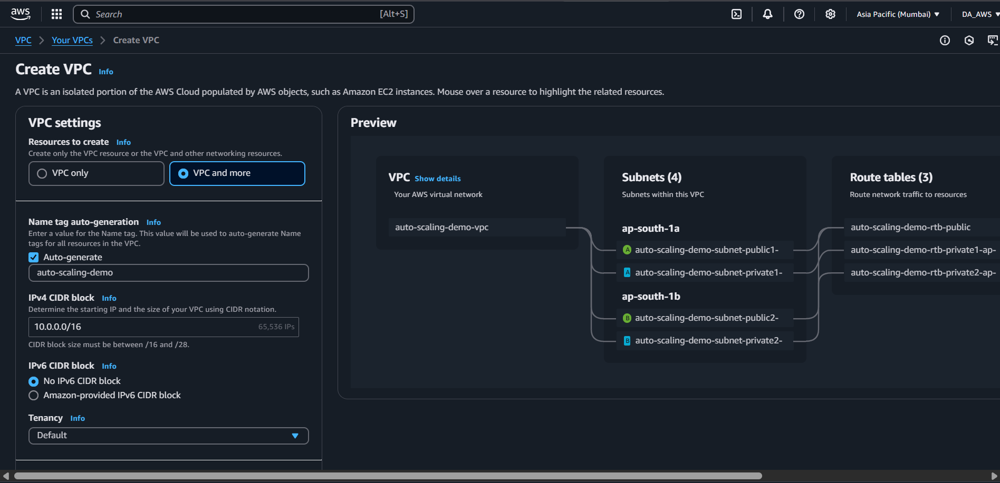
4. Keep other settings as default.
5. Scroll down to **NAT Gateway** and select **1 per Availability Zone (AZ)**.
6. In **VPC Endpoint**, select **None**.
   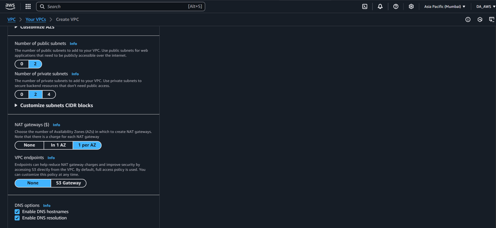
7. Click **Create**.
   

---

### Step 4: Create a Launch Template
1. Go to **EC2 Console** -> **Instances** -> **Launch Template**.
2. Click on **Create Launch Template**.
3. Provide a **name** and **description**.
   
4. Select the **Amazon Machine Image (AMI)** and **Instance Type**.
   
5. Choose a **key pair**.
6. Create a **new security group** and select the **VPC** created earlier.
7. Configure **Inbound Rules**:
   - Allow **Port 22** (SSH) from **anywhere**.
   - Allow **Port 80** (HTTP) from **anywhere**.

   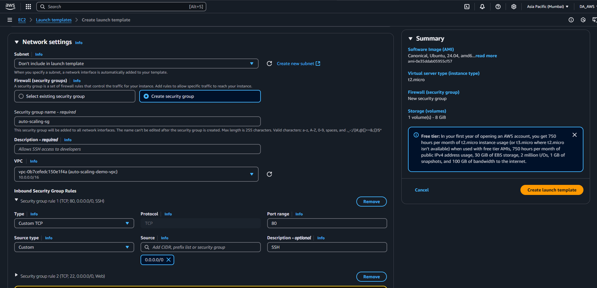
8. Click Advanced Details -> Scroll down: now paste the script there
   ![[lt-5]](./images/lt-5.png)
8. Leave other settings as default and click **Create Launch Template**.
   

---

### Step 5: Create an Auto Scaling Group
1. Navigate to **EC2 Console** -> **Auto Scaling** -> **Create Auto Scaling Group**.
2. Provide a **name** and select the **Launch Template** created earlier.
   
3. Click **Next**.
4. In **Networking Tab**:
   - Select the created **VPC**.
   - In **Availability Zones and Subnets**, select **both private subnets**.

   
5. Click **Next**.
6. In **Load Balancing**, select **No Load Balancer** (for private subnets).
   
7. Set desired, minimum, and maximum instance values (as per requirement).
   
8. Click **Next** -> **Review** -> **Create and Launch**.
   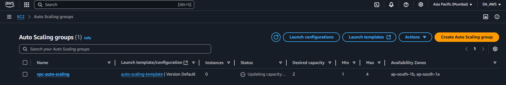

---

### Step 6: Verify EC2 Instances
- Go to **EC2 Console** and check if the Auto Scaling group is launching instances in private subnets.

---

### Step 7: Create a Bastion Host
1. Navigate to **EC2 Console** -> **Launch Instance**.
2. Provide a **name**.
   
3. Choose **Ubuntu Server** and select **Key Pair**.
   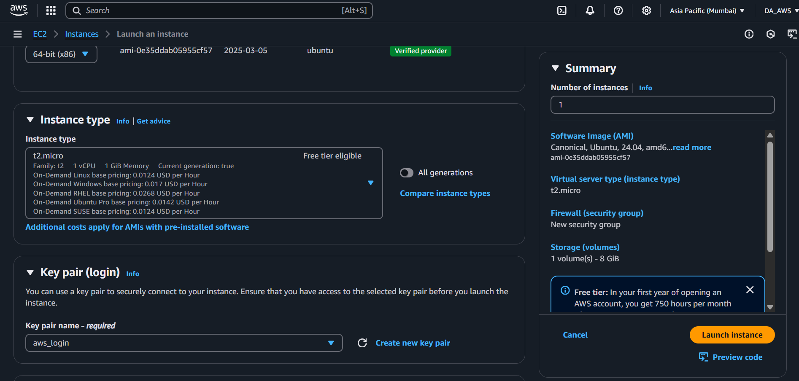
4. In **Networking**:
   - Edit and select the **VPC**.
   - Enable **Auto Assign Public IP**.
   - Select the **Security Group** (ensure SSH is allowed).

   
5. Scroll down and **Launch Instance**.
   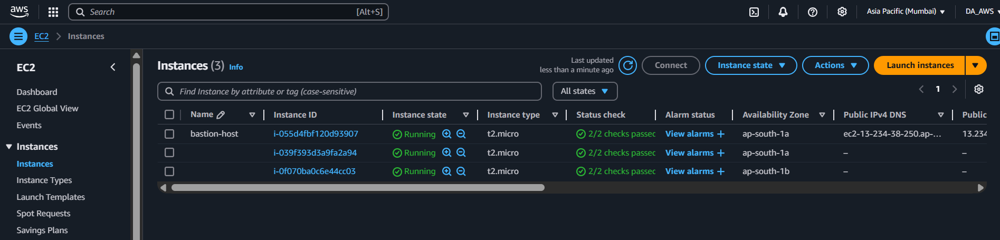
   

---

### Step 8: Create a Target Group for the Load Balancer
1. Navigate to **EC2 Console** -> **Target Groups** -> **Create Target Group**.
2. Select **Target Type** as **EC2 Instance**.
3. Provide a **Target Group Name**.
   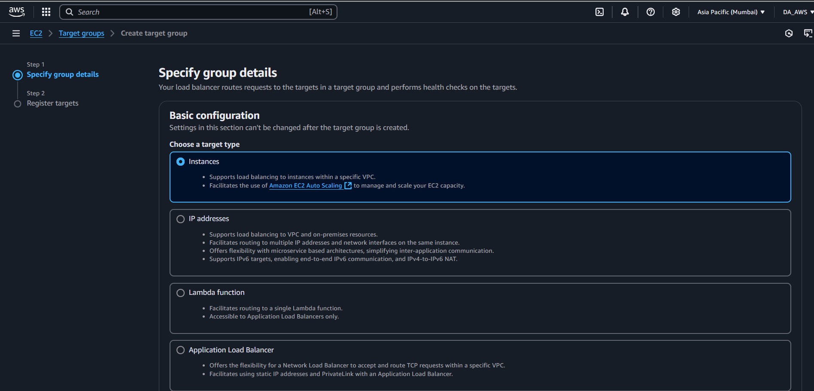
4. Set **Protocol** to **HTTP** and **Port 80**.
5. Select the created **VPC**.
   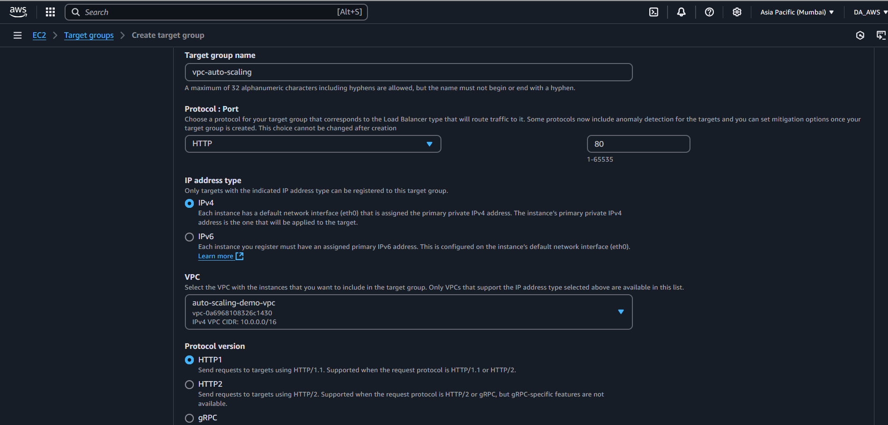
6. Next -> Select **EC2 Instances** -> Click **Include as Pending Below**.
   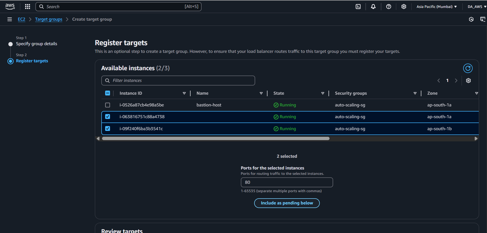
   
7. Click **Create Target Group**.
   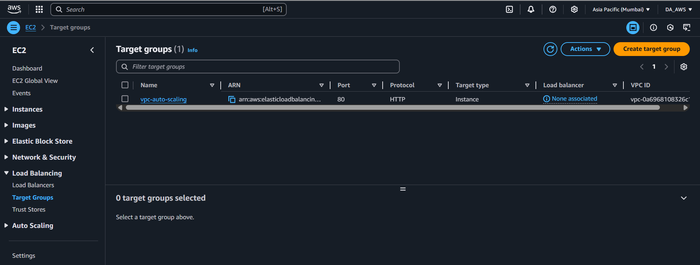

---

### Step 9: Create an Application Load Balancer (ALB)
1. Navigate to **EC2 Console** -> **Load Balancers** -> **Create Load Balancer**.
2. Select **Application Load Balancer**.
3. Set **Schema** to **Internet Facing**.
4. Select **IPv4**.
   
5. In **Network Mapping**:
   - Select the created **VPC**.
   - Select **both Availability Zones** and the **public subnets**.

   
6. Choose the **Security Group**.
7. In **Listeners and Routing**:
   - Set **Protocol HTTP** and **Port 80**.
   - Select the created **Target Group**.
   
   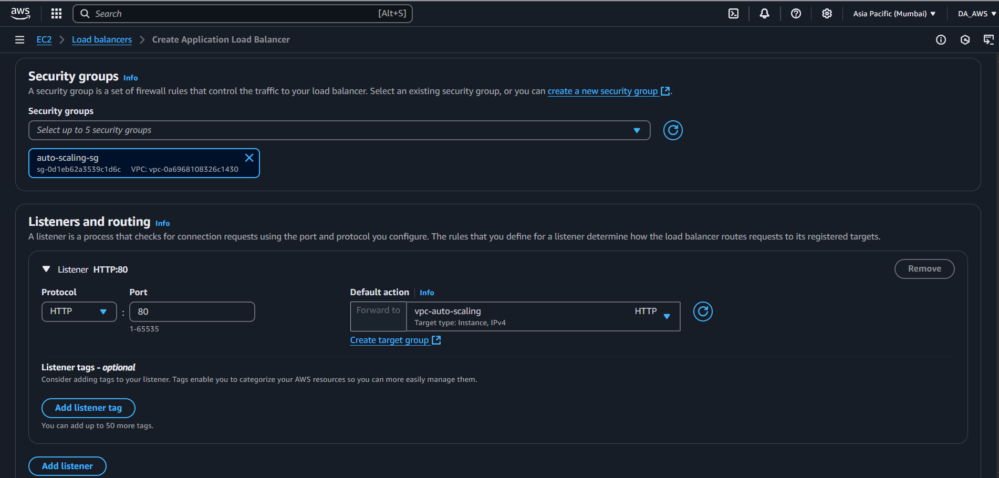
8. Click **Create Load Balancer**.
   
---

### Step 9: Verify the Application
Copy the **Load Balancer DNS Name** and open it in the browser to verify.

---

### Step 10: Checking High Avalability
Start the stress test for the application
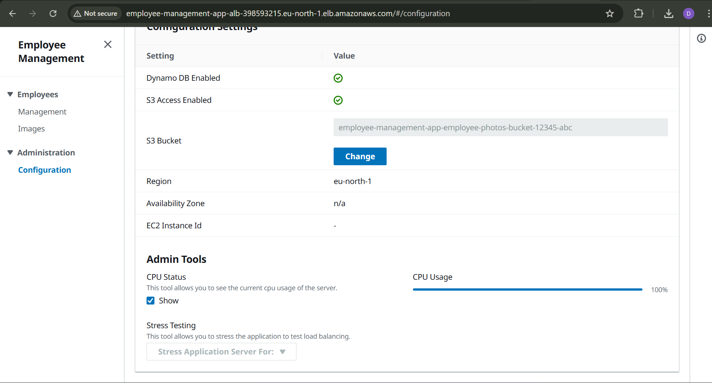

Now verify the number of instances in the ec2 dashboard - They got populated for 2 to 4

---

### Note on HTTPS:
For a secure connection using HTTPS, it is recommended to configure an SSL/TLS certificate using AWS Certificate Manager (ACM). This allows the ALB to handle encrypted traffic securely, improving security and compliance.
