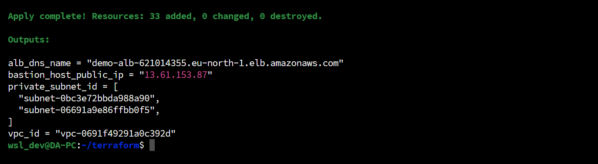

# 🚀 Deploying Using Terraform

## 📋 Deployment Steps

### 1. **Navigate to the Terraform Directory**

```bash
cd terraform
```

### 2. **Generate SSH Key**

Generate an SSH key pair for accessing EC2 instances:

```bash
ssh-keygen
```

Name the SSH key as `ssh-key` and use the public key to set up access. The public key will be used for accessing EC2 instances.

> **Note:** Copy and paste the SSH public key into the Terraform `aws_key_pair` resource in [launch_template.tf](./infra/launch-template.tf)


### 3. **Initialize Terraform**

This command initializes the Terraform environment, downloads required providers, and sets up the backend.

```bash
terraform init
```

### 4. **Set Variables (Optional)**

You can customize your deployment by editing values in the `variables.tf` file or creating a `terraform.tfvars` file. These variables allow you to adjust settings such as instance type, VPC CIDR block, and region.

And the `infra` module  is used in [main.tf](./main.tf) file.


### 5. **Plan Infrastructure**

Run the plan command to see what Terraform will create, modify, or destroy:

```bash
terraform plan
```

This helps verify that the setup will match your expectations before actually applying the changes.


### 6. **Apply and Deploy**

Deploy the infrastructure with the following command. This will create all the resources defined in your Terraform configuration:

```bash
terraform apply --auto-approve
```



### 7. **Accessing Your Load Balancer**

After deployment, wait until the target group gets healthy (It will take some time). Check the output for the **ALB DNS name**. Open this in your web browser to verify that the setup is working.


**Paste the alb dns in the browser**


### 8. Checking High Avalability
Start the stress test for the application


Now verify the number of instances in the ec2 dashboard - They got populated for 2 to 4


## 🛠 Troubleshooting

### Health Check

If you encounter issues such as a `502 Bad Gateway`, verify the target group's health check configuration. Make sure the health check endpoint is correct and that your EC2 instances are responding as expected.

## 🔐 SSH Access

To troubleshoot or deploy any application on your EC2 instances:

1. **SSH to Bastion Host**

   First, SSH into the Bastion host using the following command:

   ```bash
   scp ssh-key ssh-key ubuntu@<bastion_host_public_ip>:/home/ubuntu
   ssh -i ssh-key ubuntu@<bastion_host_public_ip>
   ```

2. **SSH into EC2 Instances**

   Once connected to the Bastion host, you can SSH into any EC2 instance in your private subnet using its private IP:

   ```bash
   ssh -i ssh-key ubuntu@<ec2_private_ip>
   ```

   From here, you can deploy any application you wish on the EC2 instances.

## 📦 Customizing and Deploying Applications

By SSHing into the EC2 instances through the Bastion host, you can deploy any application (e.g., a web server, database, or custom app) as needed. The instances are running in a highly available environment with load balancing and auto-scaling.

You can use this setup to deploy web apps, microservices, or any application requiring scalability and high availability.

> Just make sure to open necessary ports.

## 📝 Outputs

Once the infrastructure is deployed, Terraform will output the following:

- **ALB DNS Name**: Access your application through the load balancer.
- **Bastion Host Public IP**: Used to connect to the Bastion host for further SSH access.
- **VPC ID**: The ID of the created VPC.
- **Private Subnets**: The private subnets where EC2 instances are located.

## Clean Up Resources

To destroy all provisioned AWS resources:

```bash
terraform destroy --auto-approve
```

---
