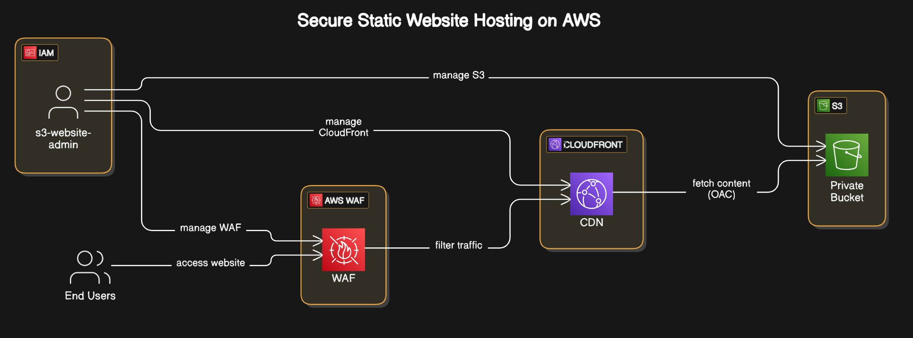
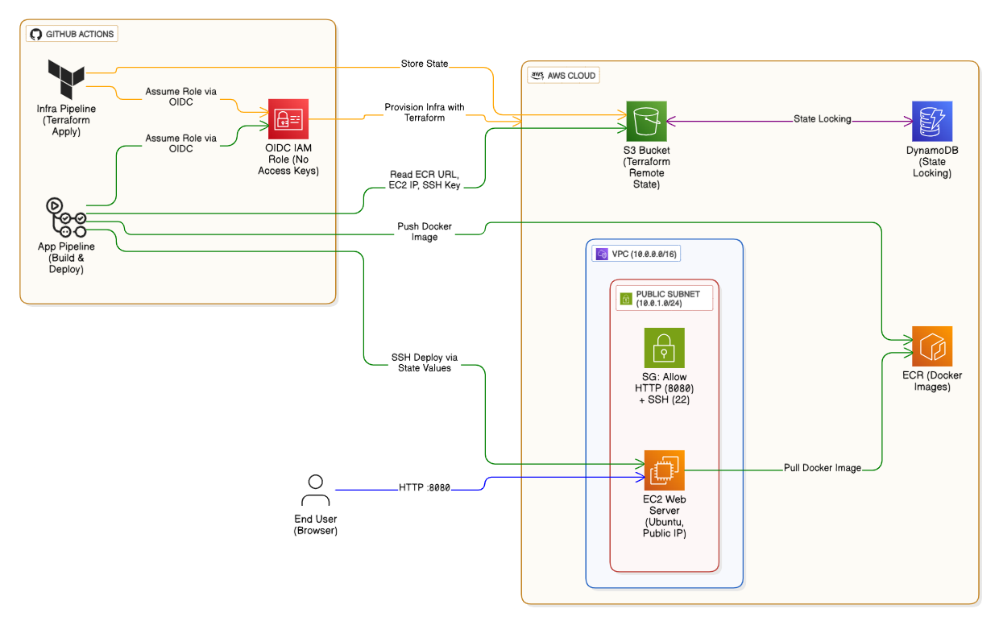

# 🚀 AWS Cloud Projects Portfolio

*A comprehensive collection of differently architectured AWS cloud solutions*

## 🎯 Overview

This repository contains **AWS cloud projects** demonstrating various services and architectural patterns. Each project includes detailed documentation and deployment instructions for hands-on learning and implementation.

## 📚 Project Portfolio

### 🏗️ **3-Tier High Availability Application**

<table border="1" cellpadding="15" cellspacing="0" style="border-collapse: collapse; width: 100%; border: 2px solid #FF9900;">
<tr>
<td width="30%" style="border: 2px solid #FF9900; padding: 20px; vertical-align: top;">

**[3tier-ha-app](./3tier-ha-app/)**  
*Production-style 3-tier web application with Auto Scaling and Load Balancing*
- Application Load Balancer (ALB)
- Auto Scaling Groups
- Private subnets with NAT Gateway
- DynamoDB & S3 integration
- CloudWatch monitoring

</td>
<td width="60%" style="border: 2px solid #FF9900; margin-left:20px; padding: 15px; vertical-align: middle; text-align: center;">

</td>
</tr>
</table>

### 🔗 **Serverless URL Shortener**

<table border="1" cellpadding="15" cellspacing="0" style="border-collapse: collapse; width: 100%; border: 2px solid #FF6B35;">
<tr>
<td width="30%" style="border: 2px solid #FF6B35; padding: 20px; vertical-align: top;">

**[serverless-url-shortener](./serverless-url-shortener/)**  
*Event-driven serverless application with API Gateway and Lambda*
- AWS Lambda functions
- API Gateway REST API
- DynamoDB NoSQL database
- S3 static website hosting
- CloudWatch logging

</td>
<td width="60%" style="border: 2px solid #FF6B35; margin-left:20px; padding: 15px; vertical-align: middle; text-align: center;">

</td>
</tr>
</table>

### 🌐 **Secure Static Website Hosting**

<table border="1" cellpadding="15" cellspacing="0" style="border-collapse: collapse; width: 100%; border: 2px solid #4A90E2;">
<tr>
<td width="30%" style="border: 2px solid #4A90E2; padding: 20px; vertical-align: top;">

**[secure-static-hosting](./secure-static-hosting/)**  
*Private S3 bucket with CloudFront CDN and WAF protection*
- Private S3 bucket storage
- CloudFront global CDN
- Origin Access Control (OAC)
- AWS WAF security rules
- HTTPS enforcement

</td>
<td width="60%" style="border: 2px solid #4A90E2; margin-left:20px; padding: 15px; vertical-align: middle; text-align: center;">

</td>
</tr>
</table>

### ☸️ **EKS Fargate Deployment**

<table border="1" cellpadding="15" cellspacing="0" style="border-collapse: collapse; width: 100%; border: 2px solid #326CE5;">
<tr>
<td width="30%" style="border: 2px solid #326CE5; padding: 20px; vertical-align: top;">

**[eks-fargate-deployment](./eks-fargate-deployment/)**  
*Serverless Kubernetes with EKS Fargate and Application Load Balancer*
- EKS Fargate serverless compute
- Application Load Balancer
- Kubernetes deployments
- Service mesh integration
- Container orchestration

</td>
<td width="60%" style="border: 2px solid #326CE5; margin-left:20px; padding: 15px; vertical-align: middle; text-align: center;">

</td>
</tr>
</table>

### 🤖 **Terraform GitHub Actions Deploy**

<table border="1" cellpadding="15" cellspacing="0" style="border-collapse: collapse; width: 100%; border: 2px solid #28A745;">
<tr>
<td width="30%" style="border: 2px solid #28A745; padding: 20px; vertical-align: top;">

**[terraform-github-actions-deploy](./terraform-github-actions-deploy/)**  
*Complete CI/CD automation with Terraform, GitHub Actions, and OIDC*
- GitHub Actions workflows
- OIDC authentication
- Automated infrastructure deployment
- Application CI/CD pipelines

</td>
<td width="60%" style="border: 2px solid #28A745; margin-left:20px; padding: 15px; vertical-align: middle; text-align: center;">

</td>
</tr>
</table>

### 🚀 **ECS CI/CD Pipeline**

<table border="1" cellpadding="15" cellspacing="0" style="border-collapse: collapse; width: 100%; border: 2px solid #D24939;">
<tr>
<td width="30%" style="border: 2px solid #D24939; padding: 20px; vertical-align: top;">

**[ecs-cicd-pipeline](./ecs-cicd-pipeline/)**  
*Automated container deployment with ECS and CodePipeline*
- AWS CodePipeline automation
- ECS container orchestration
- ECR container registry
- Blue/Green deployments
- Automated testing & deployment

</td>
<td width="60%" style="border: 2px solid #D24939; margin-left:20px; padding: 15px; vertical-align: middle; text-align: center;">

</td>
</tr>
</table>

### 🏛️ **Terraform Remote Backend**

<table border="1" cellpadding="15" cellspacing="0" style="border-collapse: collapse; width: 100%; border: 2px solid #7B42BC;">
<tr>
<td width="30%" style="border: 2px solid #7B42BC; padding: 20px; vertical-align: top;">

**[terraform-remote-backend](./terraform-remote-backend/)**  
*Secure Terraform state management with S3 and DynamoDB*
- S3 backend configuration
- DynamoDB state locking
- Encryption at rest
- Version control integration
- Multi-environment support

</td>
<td width="60%" style="border: 2px solid #7B42BC; margin-left:20px; padding: 15px; vertical-align: middle; text-align: center;">

</td>
</tr>
</table>

## 📄 License

This project is licensed under the MIT License - see the [LICENSE](LICENSE) file for details.

---

**⭐ Star this repository if you find it helpful!**

<!-- *Built with ❤️ for the AWS community* -->

