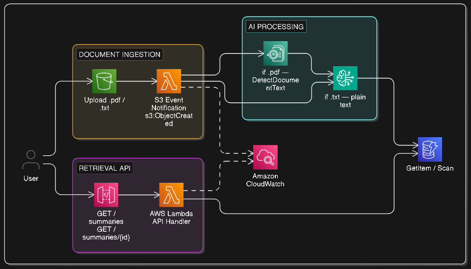

# 🤖 AI Document Summarizer

*Event-driven document processing pipeline using S3, Textract, Lambda, Amazon Bedrock, DynamoDB, and API Gateway*

---

## 🧩 Problem Statement

Organizations deal with a constant flood of documents — contracts, research papers, reports, invoices, policy documents. Reading and extracting key information from each one manually is slow, expensive, and doesn't scale.

The real-world problems:

- **Manual bottleneck** — a human has to read every document before anything useful can be done with it
- **No automation** — there's no way to process a document the moment it arrives without custom integration work
- **Inconsistent output** — different people extract different things from the same document; there's no standardized summary format
- **No retrieval** — once processed, summaries are scattered across emails, notes, and spreadsheets — not queryable

**The solution:** an event-driven pipeline where uploading a document is the only action required. The system automatically extracts the text, sends it to an AI model, and stores a structured summary that's immediately retrievable via an API.

---

## 🎯 What We're Building

A fully serverless document processing backend where:

1. A user uploads a document (`.pdf` or `.txt`) to an **S3 bucket**
2. The upload automatically triggers a **Lambda** function via S3 event notification
3. Lambda extracts the text — PDFs go through **Amazon Textract**, `.txt` files are read directly
4. Lambda sends the extracted text to **Amazon Bedrock** (Claude model) with a structured prompt
5. Bedrock returns an AI-generated summary
6. Lambda stores the summary + metadata in **DynamoDB**
7. A second Lambda exposed via **API Gateway** lets users retrieve summaries by document ID or list all processed documents

> The pipeline naturally extends to any UTF-8 plain text format (`.md`, `.csv`, `.json`) — they follow the same direct-read path as `.txt` with no additional code.

---

## 🏗️ Architecture



<!-- ```
User uploads document (.pdf / .txt)
        │
        ▼
   S3 Bucket (documents/)
        │  S3 Event Notification (s3:ObjectCreated)
        ▼
Lambda — Processor
   ├── .pdf → Amazon Textract (extract text) → plain text string (in memory)
   └── .txt → read directly from S3 → plain text string (in memory)
        │
        ▼ plain text string passed to Bedrock prompt
   Amazon Bedrock (Claude) — summarize
        │
        ▼
    DynamoDB
   (document_id, s3_key, summary, status, created_at)
        ▲
        │
Lambda — API Handler
        │
        ▼
API Gateway
   GET /summaries/{document_id}   → fetch one summary
   GET /summaries                 → list all summaries
``` -->

---

## ✅ How Our Solution Solves the Problem

| Problem | Our Solution |
|---------|-------------|
| Manual reading bottleneck | S3 upload triggers automatic processing — no human step required |
| No automation on file arrival | S3 event notification fires the processor Lambda the moment a file lands |
| Inconsistent summary format | Structured prompt to Bedrock enforces consistent output every time |
| Summaries not queryable | DynamoDB stores every summary with metadata — retrievable by document ID via API |
| Scaling with document volume | Fully serverless — Lambda and Bedrock scale automatically with upload rate |

> 📖 For deep notes on Bedrock, Textract, the processing pattern, and design decisions — see [`docs/concepts.md`](./docs/concepts.md)

---

## ☁️ AWS Services Used

| Service | Role |
|---------|------|
| **S3** | Document storage — receives uploads and fires event notifications to trigger processing |
| **Lambda (processor)** | Dispatches to Textract or direct read based on file type, calls Bedrock, writes result to DynamoDB |
| **Amazon Textract** | Extracts text from PDF documents — handles text-based and scanned PDFs |
| **Amazon Bedrock** | Managed AI service — invokes Claude to generate the document summary |
| **DynamoDB** | Stores summaries and document metadata — keyed by `document_id` for fast retrieval |
| **Lambda (API handler)** | Handles `GET /summaries` and `GET /summaries/{id}` — reads from DynamoDB |
| **API Gateway** | HTTP entry point — exposes the retrieval API to clients |
| **IAM** | Least-privilege roles — processor Lambda gets `textract:DetectDocumentText`, `bedrock:InvokeModel`, `s3:GetObject`, `dynamodb:PutItem` only |
| **CloudWatch** | Logs and metrics for both Lambdas |

---

## 🔄 Processing Flow (Step by Step)

**Document upload and processing:**

1. User uploads a document to S3 under the `documents/` prefix
2. S3 fires an `s3:ObjectCreated` event to the processor Lambda
3. Lambda extracts the S3 bucket name and object key from the event
4. Lambda checks the file extension:
   - `.pdf` → calls **Textract** `DetectDocumentText` — returns plain text string in memory
   - `.txt` → reads the file directly from S3 and decodes as UTF-8
   - anything else → logs unsupported format and exits cleanly
5. Lambda constructs a prompt with the extracted text and calls `bedrock:InvokeModel` (Claude)
6. Bedrock returns a structured summary (title, key points, one-line summary)
7. Lambda writes to DynamoDB: `document_id` (UUID), `s3_key`, `summary`, `status: DONE`, `created_at`

**Summary retrieval:**

1. Client calls `GET /summaries/{document_id}` with the document ID
2. API Gateway routes to the API handler Lambda
3. Lambda queries DynamoDB by `document_id`
4. Returns the summary and metadata as JSON

---

## 📄 DynamoDB Item Structure

```json
{
  "document_id": "a3f9c1d2-...",
  "s3_key": "documents/contract.pdf",
  "file_name": "contract.pdf",
  "summary": {
    "title": "Service Agreement — Acme Corp",
    "one_liner": "A 12-month SaaS service agreement with payment terms and SLA clauses.",
    "key_points": [
      "Contract duration: 12 months from signing",
      "Payment: monthly, net-30",
      "SLA: 99.9% uptime guarantee",
      "Termination: 30-day written notice"
    ]
  },
  "status": "DONE",
  "created_at": "2026-04-25T11:00:00Z"
}
```

---

## 🛡️ Design Decisions

| Decision | Reasoning |
|----------|-----------|
| S3 event trigger (not polling) | Zero latency — processing starts the moment the file lands, no scheduled polling needed |
| Textract for PDFs, direct read for plain text | Textract handles scanned and image-based PDFs that a simple parser can't. Plain text files need no extraction layer |
| Synchronous Textract + Bedrock calls inside Lambda | Documents are small enough that Lambda's 15-min timeout is never a concern; keeps the pipeline simple |
| DynamoDB over S3 for summaries | Summaries are retrieved by ID — a key-value access pattern. DynamoDB gives single-digit millisecond reads; S3 would require listing objects |
| Structured prompt | Enforces consistent JSON-shaped output from Bedrock — makes the API response predictable |
| `documents/` prefix filter on S3 trigger | Prevents the processor Lambda from triggering on unrelated files in the same bucket |

---

## 🚀 Deployment Options

- **Console** — follow [docs/console.md](./docs/console.md) for manual step-by-step setup
- **Terraform** — follow [docs/terraform.md](./docs/terraform.md) for full IaC deployment
