# Deploying Using AWS Console

Complete step-by-step guide to manually set up the AI Document Summarizer.

---

## Overview of What We'll Create

1. S3 Bucket — document uploads + event trigger
2. DynamoDB Table — stores summaries
3. IAM Roles — one per Lambda (least privilege)
4. Lambda — Processor (S3 trigger → Textract for PDFs / direct read for `.txt` → Bedrock → DynamoDB)
5. Lambda — API Handler (reads summaries from DynamoDB)
6. S3 Event Notification — wires the upload trigger to the processor Lambda
7. API Gateway HTTP API — exposes `GET /summaries` and `GET /summaries/{document_id}`

---

## Step 1: Create the S3 Bucket

1. Go to **S3** → **Create bucket** 
  - Bucket Type: **General-purpose** (default).
  - Buckert Namespace -> Select **Account Regional Namespace**.
2. **Bucket name**: `ai-doc-summarizer`.
  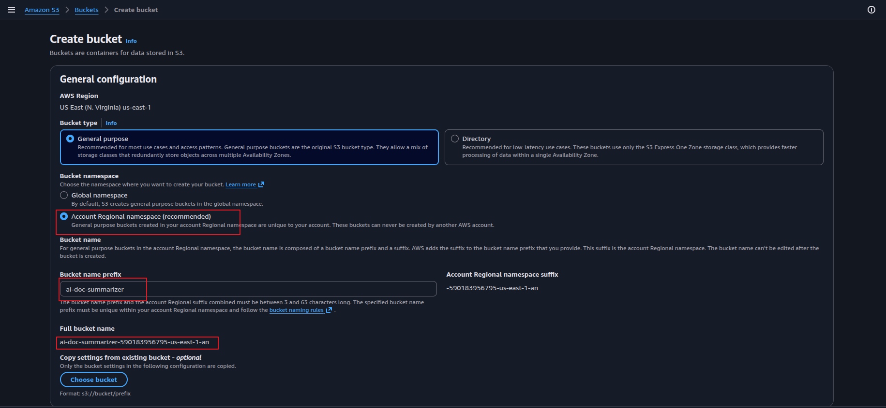
3. **Block Public Access**: leave all options **enabled** (default) — the bucket stays private.
4. Leave everything else default → **Create bucket**.
5. Open the bucket → **Create folder** → name it `documents` → **Create folder**.
  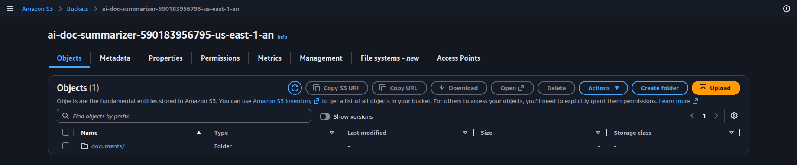

> The `documents/` folder prefix is used to scope the S3 event trigger — only files uploaded here will trigger the processor Lambda.

---

## Step 2: Create the DynamoDB Table

1. Go to **DynamoDB** → **Tables** → **Create table**.
2. Set:
   - **Table name**: `document-summaries`
   - **Partition key**: `document_id` (String)
3. **Table settings**: select **Customize settings**.
4. **Capacity mode**: select **On-demand**.
5. Leave everything else default → **Create table**.

> **Why On-Demand?** Document uploads are unpredictable — you might process 2 documents one hour and 200 the next. On-Demand scales automatically with no capacity planning and you pay per request. Provisioned capacity is only worth it for steady, predictable traffic where you can commit to a fixed RCU/WCU — that's not this workload.

---

## Step 3: Create IAM Roles for Lambda

### 3.1 Role: `doc-processor-role`

This role is for the processor Lambda — it needs to read from S3, call Textract (for PDFs), call Bedrock, and write to DynamoDB.

1. Go to **IAM** → **Roles** → **Create role**.
2. **Trusted entity**: AWS service → **Lambda** → **Next**.
  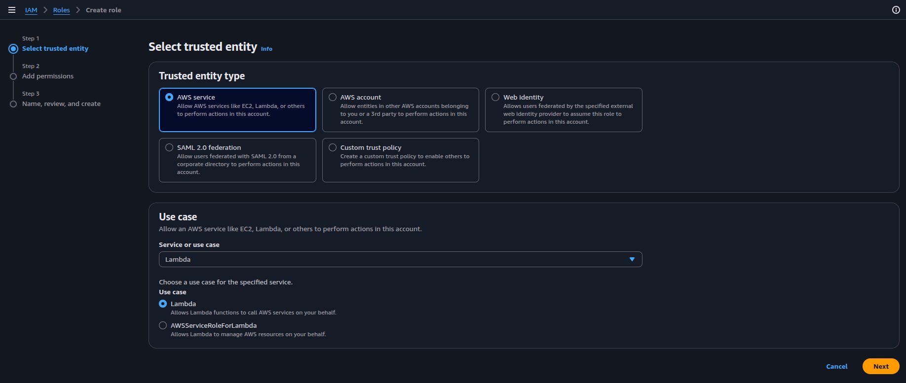
3. Attach managed policy: **AWSLambdaBasicExecutionRole** → **Next**.
  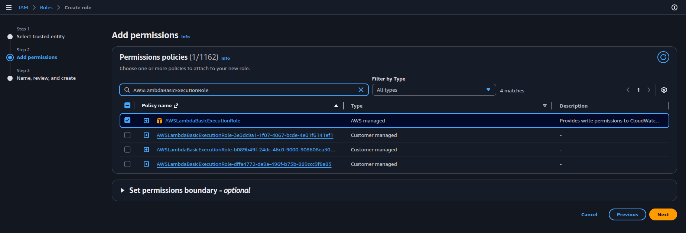
4. **Role name**: `doc-processor-role` → **Create role**.
5. Open the role → **Add permissions** → **Create inline policy** → **JSON** tab:

```json
{
  "Version": "2012-10-17",
  "Statement": [
    {
      "Sid": "ReadFromS3",
      "Effect": "Allow",
      "Action": "s3:GetObject",
      "Resource": "arn:aws:s3:::<bucket-name>/documents/*"
    },
    {
      "Sid": "ExtractWithTextract",
      "Effect": "Allow",
      "Action": "textract:DetectDocumentText",
      "Resource": "*"
    },
    {
      "Sid": "InvokeBedrock",
      "Effect": "Allow",
      "Action": "bedrock:InvokeModel",
      "Resource": [
        "arn:aws:bedrock:*::foundation-model/<model-id-from-console>",
        "arn:aws:bedrock:<your-region>:<your-account-id>:inference-profile/us.<model-id-from-console>"
      ]
    },
    {
      "Sid": "BedrockMarketplaceSubscribe",
      "Effect": "Allow",
      "Action": [
        "aws-marketplace:ViewSubscriptions",
        "aws-marketplace:Subscribe"
      ],
      "Resource": "*"
    },
    {
      "Sid": "WriteToDynamoDB",
      "Effect": "Allow",
      "Action": "dynamodb:PutItem",
      "Resource": "arn:aws:dynamodb:<your-region>:*:table/document-summaries"
    }
  ]
}
```

> Replace `<bucket-name>`, `<your-region>`, `<your-account-id>`, and `<model-id-from-console>` with your actual values.

  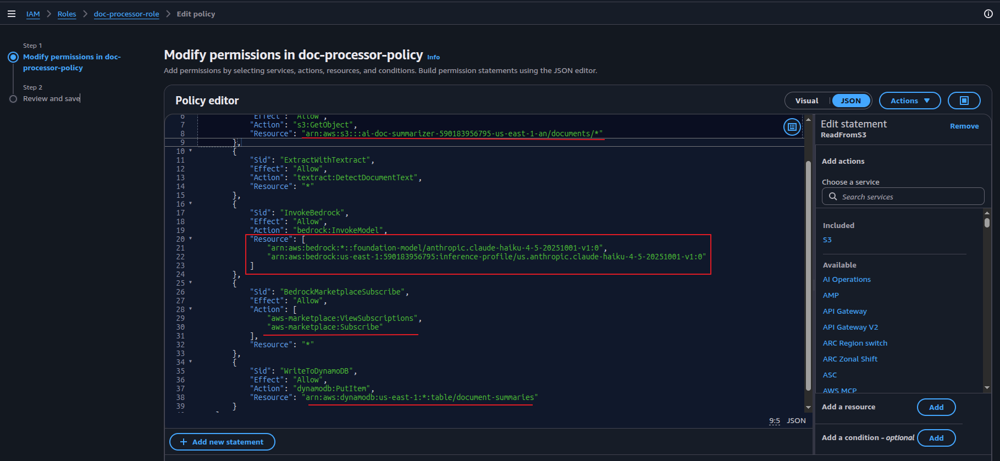

> **Why `BedrockMarketplaceSubscribe`?** Current Claude models (Haiku 4.5 and newer) are distributed through AWS Marketplace. On the very first invocation, Bedrock auto-creates a Marketplace subscription for your account — this requires `aws-marketplace:Subscribe`. This is a **one-time setup per account**: after the first successful call the subscription exists and these permissions are never exercised again. All billing still goes through your AWS bill, not a separate Anthropic account.
>
> `textract:DetectDocumentText` does not support resource-level scoping — `"Resource": "*"` is correct per AWS IAM documentation.

  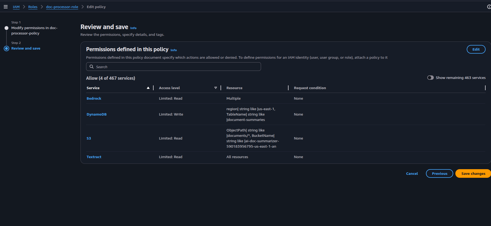

6. **Policy name**: `doc-processor-policy` → **Create policy**.

---

### 3.2 Role: `doc-api-role`

This role is for the API handler Lambda — it only needs to read from DynamoDB.

1. **Create role** → Lambda → attach **AWSLambdaBasicExecutionRole** → **Next**.
2. **Role name**: `doc-api-role` → **Create role**.
3. Add inline policy:

```json
{
  "Version": "2012-10-17",
  "Statement": [
    {
      "Sid": "ReadFromDynamoDB",
      "Effect": "Allow",
      "Action": [
        "dynamodb:GetItem",
        "dynamodb:Scan"
      ],
      "Resource": "arn:aws:dynamodb:<your-region>:*:table/document-summaries"
    }
  ]
}
```

4. **Policy name**: `doc-api-policy` → **Create policy**.


### All IAM roles created:
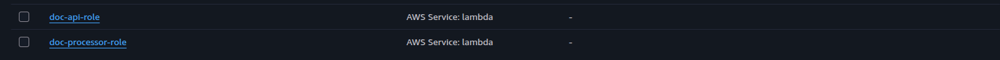

---

## Step 4: Create Lambda Functions

### 4.1 Processor Lambda

> **Purpose:** Triggered by S3 when a file is uploaded to `documents/`. Reads the file, sends it to Amazon Bedrock (Claude), and stores the structured summary in DynamoDB.

> ⚠️ **Before writing the Lambda code — get the correct model ID from the console.**
> Model IDs change as new versions release. Go to **Amazon Bedrock** → **Model catalog** → search **Claude** → open the model card for the latest Claude Haiku → copy the exact **Model ID** shown there. Replace `<model-id-from-console>` in both the Lambda code and the IAM policy resource ARN (Step 3.1) with the ID you copied.


1. Go to **Lambda** → **Create function** → **Author from scratch**.
2. **Function name**: `doc-processor`.
3. **Runtime**: Python 3.12.
4. **Execution role**: select **Use an existing role** → `doc-processor-role`.
  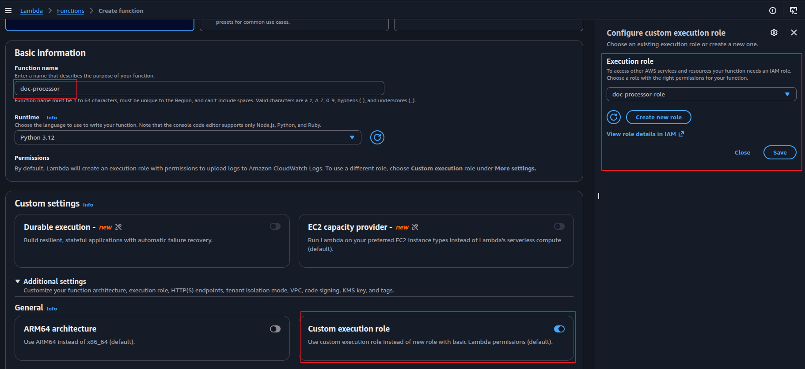
5. **Create function**.
6. Replace the default code with:

```python
import json
import boto3
import uuid
import os
import urllib.parse
from datetime import datetime, timezone

s3 = boto3.client('s3')
textract = boto3.client('textract')
bedrock = boto3.client('bedrock-runtime', region_name=os.environ.get('AWS_REGION', 'us-east-1'))
dynamodb = boto3.resource('dynamodb')
table = dynamodb.Table('document-summaries')

SUPPORTED_EXTENSIONS = {'.pdf', '.txt'}
# Extend to other UTF-8 plain text formats (.md, .csv, .json) by adding to this set —
# they follow the same direct-read path as .txt with no additional code

PROMPT_TEMPLATE = """You are a document analysis assistant. Analyze the document below and respond with a JSON object only — no explanation, no markdown, just the raw JSON.

{{
  "title": "<inferred document title or filename if unclear>",
  "one_liner": "<one sentence summary of the entire document>",
  "key_points": ["<key point 1>", "<key point 2>", "<key point 3>"]
}}

Document:
{content}"""

def extract_text(bucket, key):
    ext = '.' + key.rsplit('.', 1)[-1].lower() if '.' in key else ''

    if ext not in SUPPORTED_EXTENSIONS:
        raise ValueError(f"Unsupported file type: {ext}")

    if ext == '.pdf':
        # Use Textract for PDFs — handles text-based and scanned/image PDFs
        response = textract.detect_document_text(
            Document={'S3Object': {'Bucket': bucket, 'Name': key}}
        )
        lines = [b['Text'] for b in response['Blocks'] if b['BlockType'] == 'LINE']
        return '\n'.join(lines)
    else:
        # Plain text formats — read and decode directly
        obj = s3.get_object(Bucket=bucket, Key=key)
        return obj['Body'].read().decode('utf-8')

def lambda_handler(event, context):
    record = event['Records'][0]['s3']
    bucket = record['bucket']['name']
    key = urllib.parse.unquote_plus(record['object']['key'])

    try:
        content = extract_text(bucket, key)
    except ValueError as e:
        print(f"Skipping {key}: {e}")
        return {'statusCode': 200}

    # Truncate to ~10,000 chars to stay within Bedrock token limits
    content = content[:10000]

    # Call Bedrock — Claude Haiku
    bedrock_response = bedrock.invoke_model(
        modelId='<model-id-from-console>',  # copy from Bedrock → Model catalog
        body=json.dumps({
            'anthropic_version': 'bedrock-2023-05-31',
            'max_tokens': 1024,
            'messages': [
                {'role': 'user', 'content': PROMPT_TEMPLATE.format(content=content)}
            ]
        })
    )

    response_body = json.loads(bedrock_response['body'].read())

    try:
        raw_text = response_body['content'][0]['text'].strip()
        # Strip markdown code fences if Claude wraps the JSON despite instructions
        if raw_text.startswith('```'):
            raw_text = raw_text.split('```')[1]
            if raw_text.startswith('json'):
                raw_text = raw_text[4:]
        summary = json.loads(raw_text.strip())
    except (json.JSONDecodeError, KeyError, IndexError) as e:
        # Bedrock occasionally returns malformed or wrapped JSON — store as FAILED
        # so the record is visible in DynamoDB rather than silently dropped
        print(f"Failed to parse Bedrock response for {key}: {e}")
        table.put_item(Item={
            'document_id': str(uuid.uuid4()),
            's3_key': key,
            'file_name': key.split('/')[-1],
            'summary': {},
            'status': 'FAILED',
            'created_at': datetime.now(timezone.utc).isoformat()
        })
        return {'statusCode': 200}

    # Store in DynamoDB
    item = {
        'document_id': str(uuid.uuid4()),
        's3_key': key,
        'file_name': key.split('/')[-1],
        'summary': summary,
        'status': 'DONE',
        'created_at': datetime.now(timezone.utc).isoformat()
    }
    table.put_item(Item=item)

    print(f"Processed: {key} → document_id: {item['document_id']}")
    return {'statusCode': 200}
```

  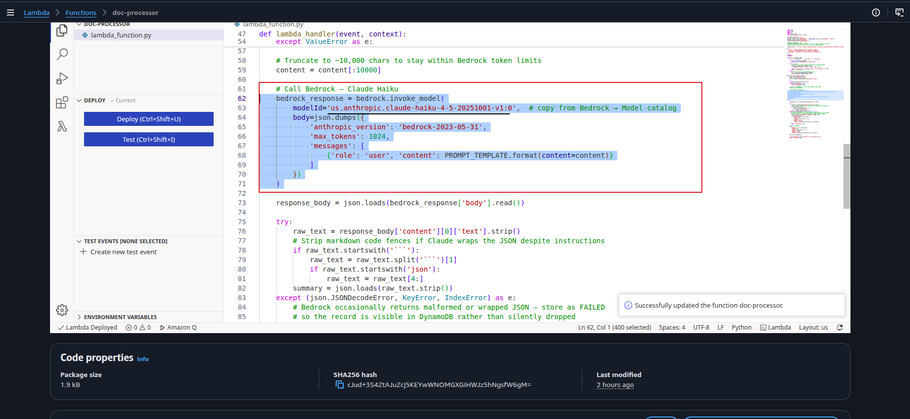

7. Click **Deploy**.
8. Go to **Configuration** → **General configuration** → **Edit**:
   - **Timeout**: set to `2 min 0 sec` (Textract + Bedrock calls combined can take several seconds for larger documents).
   - **Save**.

   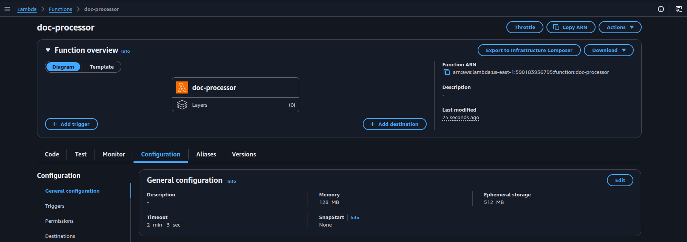

> **Note on Bedrock model access:** Current Claude models are AWS Marketplace models. On the **first invocation**, Bedrock auto-creates a Marketplace subscription for your account using the `aws-marketplace:Subscribe` permission in the role. This takes ~2 minutes to complete — if you get an `AccessDeniedException` on the first call, wait 2 minutes and re-upload the file to trigger the Lambda again. All subsequent calls go through immediately. Billing stays on your AWS bill.

---

### 4.2 API Handler Lambda

> **Purpose:** Handles `GET /summaries` (list all) and `GET /summaries/{document_id}` (fetch one). Reads from DynamoDB and returns the summary as JSON.

1. **Create function** → **Author from scratch**.
2. **Function name**: `doc-api-handler`.
3. **Runtime**: Python 3.12.
4. **Execution role**: `doc-api-role`.
5. **Create function**.
6. Replace code:

```python
import json
import boto3
from boto3.dynamodb.conditions import Key

dynamodb = boto3.resource('dynamodb')
table = dynamodb.Table('document-summaries')

def lambda_handler(event, context):
    path_params = event.get('pathParameters') or {}
    document_id = path_params.get('document_id')

    if document_id:
        # GET /summaries/{document_id}
        response = table.get_item(Key={'document_id': document_id})
        item = response.get('Item')
        if not item:
            return {'statusCode': 404, 'body': json.dumps({'error': 'Not found'})}
        return {'statusCode': 200, 'body': json.dumps(item, default=str)}
    else:
        # GET /summaries — list all (Scan is fine for this project scale)
        response = table.scan()
        items = sorted(response.get('Items', []), key=lambda x: x.get('created_at', ''), reverse=True)
        return {'statusCode': 200, 'body': json.dumps(items, default=str)}
```

7. Click **Deploy**.

---

## Step 5: Add S3 Event Trigger to Processor Lambda

1. Open the `doc-processor` Lambda → **Configuration** → **Triggers** → **Add trigger**.
2. **Trigger source**: S3.
3. **Bucket**: select `ai-doc-summarizer-<your-account-id>`.
4. **Event types**: `PUT` (covers standard uploads).
5. **Prefix**: `documents/` — restricts the trigger to only files in the `documents/` folder.
6. Check the acknowledgment checkbox → **Add**.
  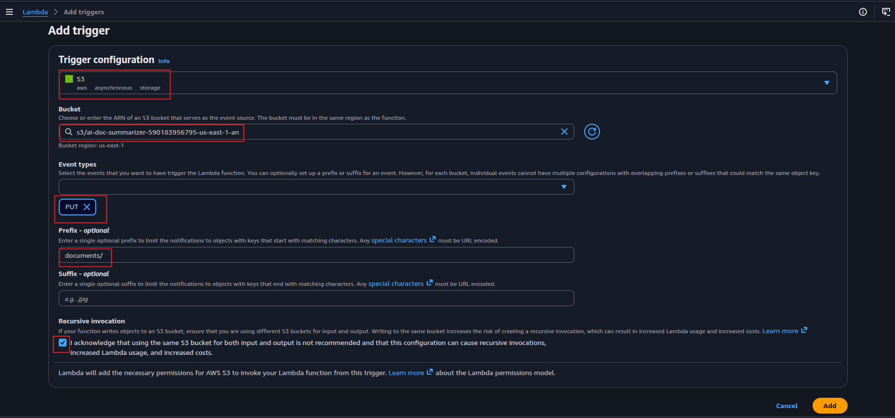

> The prefix filter is critical. Without it, any file written anywhere in the bucket (including future outputs) would trigger the Lambda.

  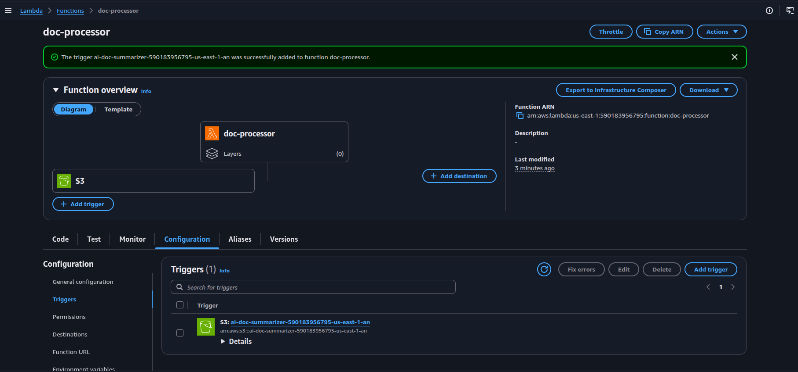

---

## Step 6: Create API Gateway HTTP API

### 6.1 Create the API

1. Go to **API Gateway** → **Create API** → **HTTP API** → **Build**.
2. Under **Integrations**, click **Add integration**:
   - **Integration type**: Lambda.
   - **Lambda function**: `doc-api-handler`.
   - Click **Add**.
3. **API name**: `doc-summarizer-api`.
  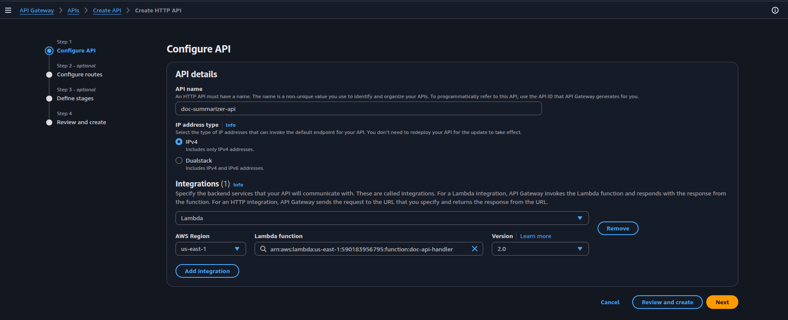
4. Click **Next** → **Configure routes**. Add two routes:

   | Method | Path | Integration |
   |--------|------|-------------|
   | GET | `/summaries` | `doc-api-handler` |
   | GET | `/summaries/{document_id}` | `doc-api-handler` |

   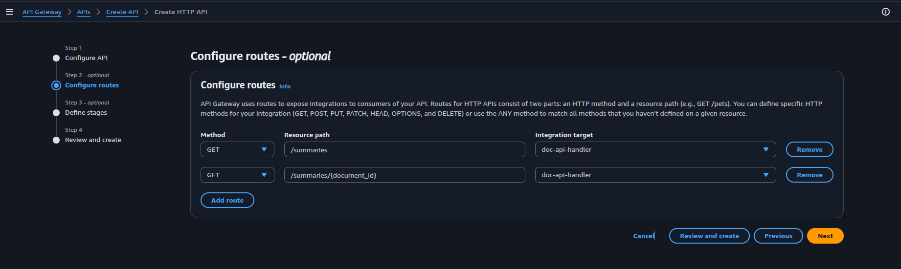

5. Click **Next** → **Stage**: leave `$default`, enable **Auto-deploy** → **Next** → **Create**.
  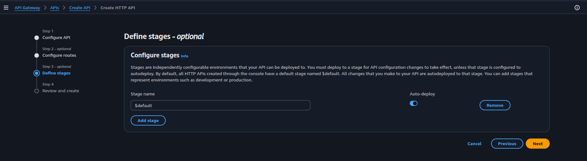
  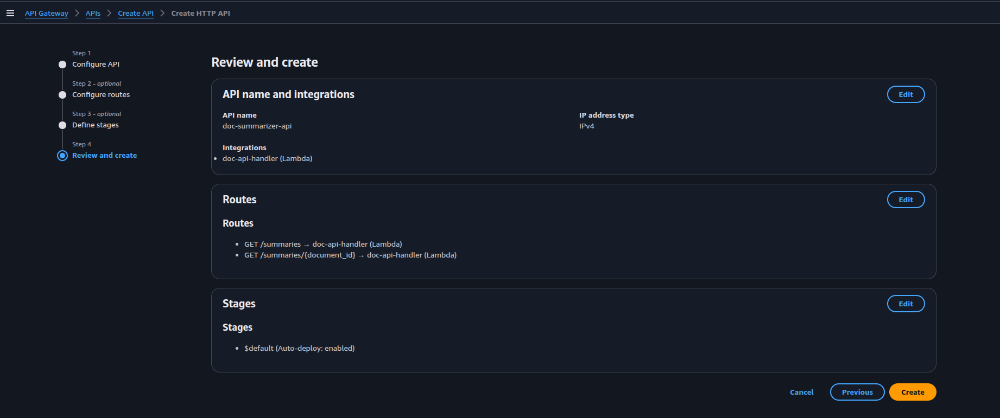
6. **Copy the Invoke URL** from the API overview — you'll use this to test.

---

## Step 7: Test the Full Flow

### 7.1 Upload a Text Document

Create a sample text file locally:

```bash
cat > sample-contract.txt << 'EOF'
SERVICE AGREEMENT

This Service Agreement ("Agreement") is entered into as of January 1, 2026, between Acme Corp ("Provider") and Globex Inc ("Client").

1. SERVICES: Provider agrees to deliver cloud infrastructure consulting services for a period of 12 months.
2. PAYMENT: Client agrees to pay $5,000 per month, due on the 1st of each month, net-30.
3. SLA: Provider guarantees 99.9% uptime for all managed services. Downtime exceeding this threshold entitles Client to a 10% service credit.
4. TERMINATION: Either party may terminate this agreement with 30 days written notice.
5. CONFIDENTIALITY: Both parties agree to keep all shared information confidential for a period of 3 years post-termination.
6. GOVERNING LAW: This agreement is governed by the laws of the State of Delaware.
EOF
```

Upload it to S3:

```bash
aws s3 cp sample-contract.txt s3://<bucket-name>/documents/sample-contract.txt
```

Or upload via the S3 console: open the bucket → `documents/` folder → **Upload** → select the file → **Upload**.

  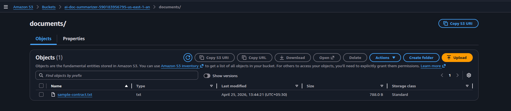

---

### 7.2 Check Lambda Execution

1. Go to **Lambda** → `doc-processor` → **Monitor** → **View CloudWatch logs**.
2. Open the latest log stream — you should see the processed document ID logged.

Expected log line:
```
Processed: documents/sample-contract.txt → document_id: a3f9c1d2-...
```

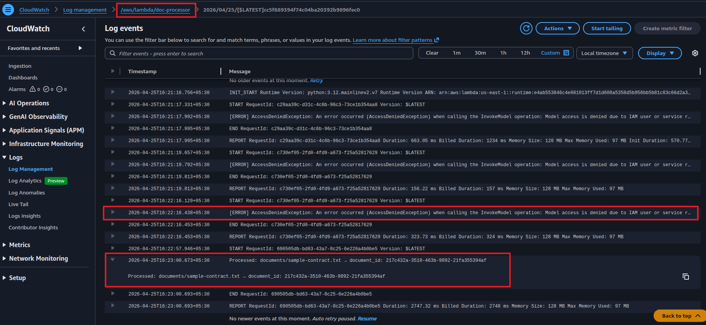

---

### 7.3 Verify DynamoDB Record

1. Go to **DynamoDB** → **Tables** → `document-summaries` → **Explore table items**.
2. You should see one item with `status: DONE` and a populated `summary` object.

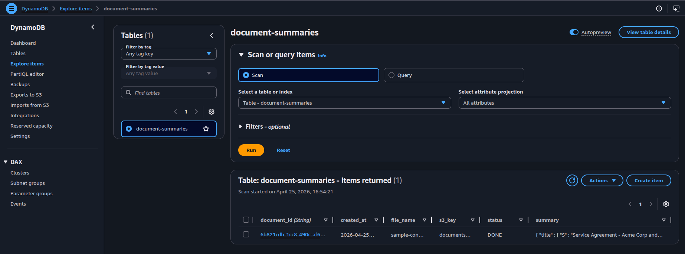

---

### 7.4 Fetch Summary via API

List all summaries:
```bash
curl https://<invoke-url>/summaries | python3 -m json.tool
```

Expected response:
```json
[
  {
    "document_id": "a3f9c1d2-...",
    "file_name": "sample-contract.txt",
    "s3_key": "documents/sample-contract.txt",
    "summary": {
      "title": "Service Agreement — Acme Corp and Globex Inc",
      "one_liner": "A 12-month cloud consulting agreement with monthly payment, SLA guarantees, and standard termination and confidentiality clauses.",
      "key_points": [
        "12-month cloud infrastructure consulting engagement",
        "$5,000/month payment, net-30, with 10% SLA credit for downtime breaches",
        "30-day termination notice and 3-year post-termination confidentiality"
      ]
    },
    "status": "DONE",
    "created_at": "2026-04-25T..."
  }
]
```

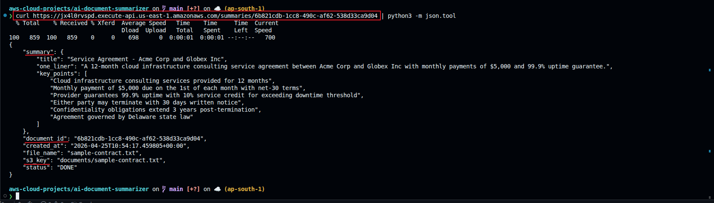

Fetch by document ID:
```bash
curl https://<invoke-url>/summaries/a3f9c1d2-... | python3 -m json.tool
```

---

### 7.5 Test with a PDF Document

Upload any PDF you have — a contract, a report, an invoice — to the `documents/` folder:

```bash
aws s3 cp your-document.pdf s3://<bucket-name>/documents/your-document.pdf
```

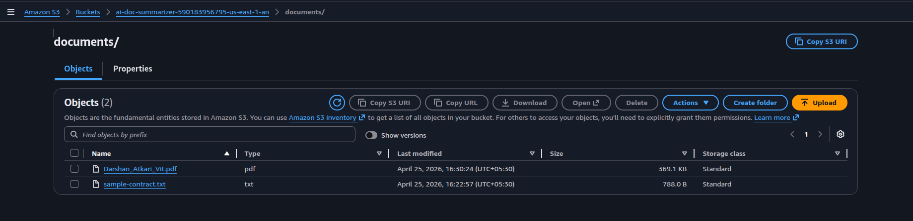

The Lambda will route it through Textract automatically based on the `.pdf` extension. Check CloudWatch logs to confirm Textract was called, then fetch the summary via the API the same way.

> Textract handles both text-based PDFs (where text is stored as characters) and scanned PDFs (where pages are images). A plain PDF parser would return empty text on scanned pages — Textract uses OCR to handle both.

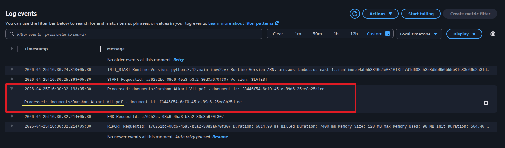

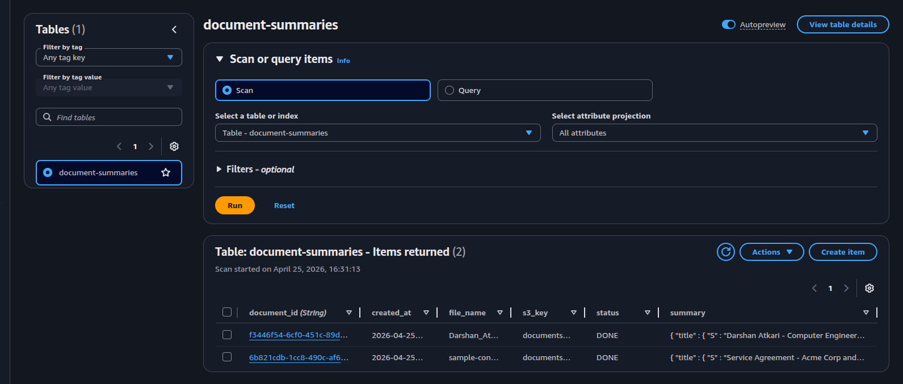

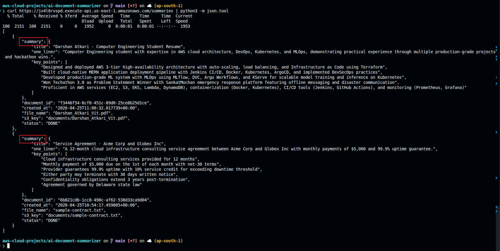

---

### 7.6 Test with a Different Text Format

Upload a second file to see consistent structured output:

```bash
cat > research-notes.txt << 'EOF'
Q1 2026 Market Research Summary

Key findings from our customer survey (n=500):
- 73% of respondents prefer monthly billing over annual contracts
- Top requested features: mobile app (68%), API access (54%), SSO integration (41%)
- NPS score: 42 (up from 31 in Q4 2025)
- Churn rate: 3.2% monthly, down from 4.1% last quarter
- Primary churn reason: pricing (44%), missing features (31%), competitor switch (25%)

Recommendations:
1. Prioritize mobile app development for Q2
2. Introduce a lower-cost tier to address price sensitivity
3. Fast-track SSO integration — high demand, low engineering effort
EOF

aws s3 cp research-notes.txt s3://<bucket-name>/documents/research-notes.txt
```

Wait ~10 seconds, then call `GET /summaries` — all processed documents should appear.

---

## Cleanup

Delete in this order to avoid dependency errors:

1. **API Gateway** → delete `doc-summarizer-api`
2. **Lambda** → delete `doc-processor` and `doc-api-handler`
3. **S3** → empty the bucket first (select all objects → Delete), then delete the bucket
4. **DynamoDB** → delete `document-summaries` table
5. **CloudWatch** → delete log groups `/aws/lambda/doc-processor` and `/aws/lambda/doc-api-handler`
6. **IAM** → delete `doc-processor-role` and `doc-api-role`
