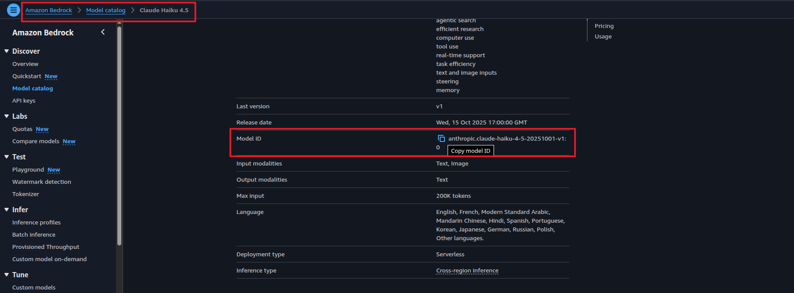
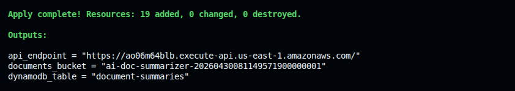

# 🚀 Deploying the AI Document Summarizer with Terraform

This guide provisions the entire pipeline — S3 bucket, DynamoDB, two Lambda functions, and API Gateway — with a single `terraform apply`.

---

## ✅ Prerequisites

- [AWS CLI](https://docs.aws.amazon.com/cli/latest/userguide/getting-started-install.html) installed and configured
- [Terraform](https://developer.hashicorp.com/terraform/install) installed
- **Amazon Bedrock model access enabled** — Claude must be enabled in your account before deploying

### Configure AWS CLI

```bash
aws configure
```

Provide your Access Key ID, Secret Access Key, region (e.g., `us-east-1`), and output format (`json`).

### Enable Bedrock model access

Before deploying, enable access to the Claude model in your AWS account:

1. Go to **AWS Console → Amazon Bedrock → Model catalog**
2. Search for **Claude Haiku** (latest version)
3. Click the model → **Request model access** → **Submit**
4. Wait for status to show **Access granted** (usually instant for Haiku)
5. Copy the exact **Model ID** shown on the model card — you'll need it for `terraform.tfvars`

> Current Claude models (Haiku 4.5+) are AWS Marketplace models. On the first invocation, Bedrock auto-creates a Marketplace subscription using the `aws-marketplace:Subscribe` permission in the Lambda role. This is a one-time setup per account — all billing stays on your AWS bill.

---

## 📁 File Structure

```
terraform/
├── providers.tf          # AWS provider + Terraform version
├── variables.tf          # aws_region, bedrock_model_id
├── s3.tf                 # documents bucket + S3 event notification
├── dynamodb.tf           # document-summaries table
├── iam.tf                # doc-processor-role + doc-api-role
├── lambda.tf             # doc-processor + doc-api-handler functions
├── api_gateway.tf        # HTTP API + GET /summaries routes
├── outputs.tf            # api_endpoint, documents_bucket
├── terraform.tfvars.example
└── lambda/
    ├── processor.py / processor.zip
    └── api_handler.py / api_handler.zip
```

---

## 🚀 Deployment Steps

### 1. Navigate to the Terraform directory

```bash
cd terraform
```

### 2. Set your variables

```bash
cp terraform.tfvars.example terraform.tfvars
```

Edit `terraform.tfvars`:

```hcl
aws_region       = "us-east-1"
bedrock_model_id = "us.anthropic.claude-haiku-4-5-20251001-v1:0"
```

> Replace `bedrock_model_id` with the exact Model ID you copied from the Bedrock console. The ID changes as new versions release.


### 3. Initialize Terraform

```bash
terraform init
```

### 4. Plan

```bash
terraform plan
```

Review what will be created — S3 bucket, DynamoDB table, 2 Lambda functions, API Gateway, and IAM roles.

### 5. Apply

```bash
terraform apply
```

Type `yes` when prompted. Takes ~20 seconds.

Outputs:
```
api_endpoint     = "https://<id>.execute-api.us-east-1.amazonaws.com"
documents_bucket = "ai-doc-summarizer-<random>"
dynamodb_table   = "document-summaries"
```



---

## ✅ Testing the Pipeline

### Upload a text document

Create a sample file and upload it to the `documents/` prefix:

```bash
cat > sample-contract.txt << 'EOF'
SERVICE AGREEMENT

This Service Agreement is entered into as of January 1, 2026, between Acme Corp and Globex Inc.

1. SERVICES: Cloud infrastructure consulting for 12 months.
2. PAYMENT: $5,000/month, net-30.
3. SLA: 99.9% uptime guarantee with 10% credit for breaches.
4. TERMINATION: 30 days written notice.
5. CONFIDENTIALITY: 3 years post-termination.
EOF

aws s3 cp sample-contract.txt s3://<documents-bucket-name>/documents/sample-contract.txt
```

### Fetch the summary

Wait ~10 seconds for processing, then:

```bash
curl <api-gateway-endpoint>/summaries | python3 -m json.tool
```

Expected response:
```json
[
  {
    "document_id": "a3f9c1d2-...",
    "file_name": "sample-contract.txt",
    "summary": {
      "title": "Service Agreement — Acme Corp and Globex Inc",
      "one_liner": "A 12-month cloud consulting agreement with monthly payment and SLA guarantees.",
      "key_points": [
        "12-month cloud infrastructure consulting engagement",
        "$5,000/month payment, net-30, with 10% SLA credit",
        "30-day termination notice and 3-year confidentiality"
      ]
    },
    "status": "DONE",
    "created_at": "2026-04-25T..."
  }
]
```

### Fetch by document ID

```bash
curl <api-gateway-endpoint>/summaries/<document_id> | python3 -m json.tool
```

### Upload a PDF

```bash
aws s3 cp your-document.pdf s3://<documents-bucket-name>/documents/your-document.pdf
```

The Lambda routes `.pdf` files through Textract automatically. Check CloudWatch logs for `doc-processor` to confirm processing.

### Verify each step

| What to check | Where |
|---|---|
| Lambda triggered | CloudWatch → Log Groups → `/aws/lambda/doc-processor` |
| Summary stored | DynamoDB → `document-summaries` → Explore items |
| API response | `curl <api_endpoint>/summaries` |

---

## 🔥 Cleanup

```bash
terraform destroy --auto-approve
```

`force_destroy = true` on the S3 bucket means Terraform will empty and delete it automatically.

Two things are **not** managed by Terraform and must be deleted manually:

- **CloudWatch Log Groups** — created automatically by Lambda at runtime; go to CloudWatch → Log Groups → delete `/aws/lambda/doc-processor` and `/aws/lambda/doc-api-handler`
- **Bedrock Marketplace subscription** — created on first model invocation; go to AWS Marketplace → Your Subscriptions if you want to remove it
