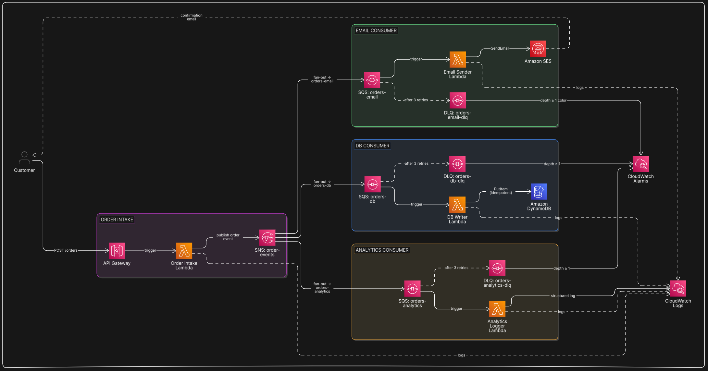

# 📦 Event-Driven Order Processing Pipeline

*Decoupled, resilient order processing system using SNS, SQS, Lambda, DynamoDB, and SES*

---

## 🧩 Problem Statement

In a traditional monolithic order system, when a customer places an order, the application handles everything synchronously — payment, inventory update, email notification, analytics — all in one request. This creates several real-world problems:

- **Tight coupling** — if the email service is down, the entire order fails
- **No resilience** — a spike in orders can overwhelm the system
- **Hard to scale** — you can't scale individual parts independently
- **No retry mechanism** — a failed step means a lost order

**The solution:** decouple every concern into its own independent service, connected through events. An order placed is just an *event* — and multiple downstream systems react to it independently, asynchronously, and resiliently.

---

## 🎯 What We're Building

A serverless, event-driven backend that processes customer orders through a pipeline:

1. Customer places an order via **API Gateway**
2. A **Lambda** function validates and publishes the order event to **SNS**
3. SNS fans out the event to multiple **SQS queues** (one per concern)
4. Separate **Lambda** functions consume each queue:
   - Save order to **DynamoDB**
   - Send confirmation email via **SES**
   - Log to inventory/analytics (extensible)
5. Failed messages go to a **Dead Letter Queue (DLQ)** for inspection and retry
6. **CloudWatch** monitors the entire pipeline


---

## 🏗️ Architecture



<!-- ```
Customer
   │
   ▼
API Gateway (POST /orders)
   │
   ▼
Lambda — Order Intake
   │  (validates input, generates order ID)
   ▼
SNS Topic — order-events
   │
   ├──────────────────────┬──────────────────────┐
   ▼                      ▼                      ▼
SQS — orders-db      SQS — orders-email    SQS — orders-analytics
   │                      │                      │
   ▼                      ▼                      ▼
Lambda — DB Writer   Lambda — Email Sender  Lambda — Analytics Logger
   │                      │                      │
   ▼                      ▼                      ▼
DynamoDB             SES (email)            CloudWatch Logs
   
   
Each SQS queue has a paired DLQ:
SQS — orders-db-dlq
SQS — orders-email-dlq
SQS — orders-analytics-dlq
``` -->

---

## ✅ How Our Solution Solves the Problem

| Problem | Our Solution |
|---------|-------------|
| Tight coupling — email failure kills the order | SNS fan-out: each concern (DB, email, analytics) is a separate independent consumer. One failing doesn't affect others |
| No resilience under traffic spikes | SQS buffers all incoming orders. Lambda processes them at a controlled rate — nothing is lost, nothing is overwhelmed |
| No retry mechanism | SQS automatically retries failed messages up to N times before moving them to a DLQ — zero manual intervention |
| Hard to scale individual parts | Each SQS queue + Lambda pair scales independently based on its own queue depth |
| Lost orders on failure | Messages sit durably in SQS (up to 14 days) until successfully processed and deleted |
| No visibility into failures | DLQ + CloudWatch alarms — if anything fails, you know immediately and the message is preserved for replay |
| Adding new features breaks existing code | New consumers just subscribe to the SNS topic — zero changes to existing Lambdas |

**The core shift:** In the old model, placing an order meant *doing everything right now*. In our model, placing an order means *publishing an event* — and the system reacts to it asynchronously, resiliently, and independently.

> 📖 For deep notes on each service and pattern used, see [`docs/concepts.md`](./docs/concepts.md)

---

## ☁️ AWS Services Used

| Service | Role |
|---------|------|
| **API Gateway** | HTTP entry point — exposes `POST /orders` to the outside world |
| **Lambda (intake)** | Validates the order payload, generates order ID, publishes to SNS |
| **SNS** | Message broker — receives the order event and fans it out to all subscribers |
| **SQS** | Message queues — buffers events for each downstream consumer independently |
| **Lambda (consumers)** | Individual processors — one for DB, one for email, one for analytics |
| **DynamoDB** | NoSQL store — persists all order records |
| **SES** | Email service — sends order confirmation to the customer |
| **DLQ (SQS)** | Dead letter queues — catches failed messages after max retries |
| **CloudWatch** | Logs, metrics, and alarms across all Lambdas and queues |
| **IAM** | Least-privilege roles for every Lambda function |

---

## 🔑 Key Concepts You'll Learn

### SNS Fan-Out Pattern
One SNS topic, multiple SQS subscribers. When an order event is published, *all* queues receive it simultaneously. This is the core of event-driven decoupling — the publisher doesn't know or care who's listening.

### SQS as a Buffer
SQS decouples the producer (SNS) from the consumer (Lambda). If the DB Lambda is slow or temporarily down, messages queue up safely and are processed when it recovers — no data loss.

### Dead Letter Queues (DLQ)
If a Lambda fails to process a message after N retries (configurable), SQS moves it to the DLQ. This prevents poison-pill messages from blocking the queue forever and gives you a place to inspect and replay failures.

### Idempotency
Because SQS can deliver a message more than once (at-least-once delivery), the DB writer Lambda must be idempotent — writing the same order twice should not create duplicates. We handle this using the order ID as the DynamoDB partition key with a conditional write.

### Least-Privilege IAM
Each Lambda gets only the permissions it needs:
- Intake Lambda → `sns:Publish` only
- DB Writer Lambda → `dynamodb:PutItem` only
- Email Lambda → `ses:SendEmail` only


---

## 📨 Order Payload

```json
{
  "customer_name": "John Doe",
  "customer_email": "john@example.com",
  "items": [
    { "product_id": "PROD-001", "name": "Wireless Headphones", "qty": 1, "price": 79.99 }
  ],
  "total_amount": 79.99
}
```

The intake Lambda enriches this with:
- `order_id` — UUID generated at intake
- `status` — `RECEIVED`
- `created_at` — ISO timestamp

---

## 🔄 Message Flow (Step by Step)

1. `POST /orders` hits API Gateway with the order payload
2. **Intake Lambda** validates required fields, generates `order_id`, publishes to SNS
3. **SNS** delivers the message to all 3 SQS queues simultaneously
4. **DB Writer Lambda** picks up from `orders-db` queue → writes to DynamoDB with conditional check (idempotency)
5. **Email Lambda** picks up from `orders-email` queue → sends confirmation email via SES
6. **Analytics Lambda** picks up from `orders-analytics` queue → logs structured data to CloudWatch
7. If any Lambda throws an error, SQS retries up to 3 times, then moves the message to the respective **DLQ**
8. CloudWatch alarms fire if DLQ depth > 0

---

## 🛡️ Resilience Design

| Failure Scenario | How It's Handled |
|-----------------|-----------------|
| Email service down | Only email queue backs up; DB write still succeeds |
| DB Lambda crashes | SQS retries 3x, then DLQ — order not lost |
| Duplicate message delivery | Idempotent DynamoDB write (conditional put) |
| Malformed message | DLQ captures it; alarm notifies via CloudWatch |
| Lambda cold start spike | SQS buffers the load; Lambda scales concurrently |

### Architectural Decision: Optimistic Email Confirmation

Because SNS fans out to all queues simultaneously, the email confirmation is sent independently of the DB write — meaning a customer could receive a confirmation email even if the DB write temporarily fails.

This is an intentional design choice — **optimistic confirmation** — and is standard practice in async event-driven systems (Amazon, Swiggy, etc. all do this). The reasoning:

- Lambda code failures (bugs) are caught in testing before production
- Infrastructure failures (DynamoDB throttle, network blip) are transient — the DLQ retries and the order eventually gets saved
- If a message truly can't be processed after all retries, the DLQ alarm fires and a human intervenes

The alternative is **orchestration** (AWS Step Functions) — run DB write first, only send email on success. This gives stricter consistency but loses parallelism and adds complexity. For this architecture, eventual consistency via DLQ redrive is the right tradeoff.

---

## 🔔 Alarming Mechanism

### SQS Metrics Explained

Every SQS queue exposes two key visibility metrics:

| Metric | What it means |
|--------|--------------|
| `ApproximateNumberOfMessagesVisible` | Messages sitting in the queue, waiting to be picked up by a consumer |
| `ApproximateNumberOfMessagesNotVisible` | Messages currently being processed by a consumer — picked up but not yet deleted |

**On the main queues** (`orders-db`, `orders-email`, `orders-analytics`), you'll see `NotVisible` rise during processing — that's normal. A message is picked up by Lambda, held invisible during processing, then deleted on success.

**On the DLQs**, nothing consumes messages — they just land and sit. So `ApproximateNumberOfMessagesVisible` is the right metric to alarm on for DLQs. The moment it goes ≥ 1, something has failed all retries.

### How the Full Alarm Flow Works

```
Lambda fails to process message
        ↓
SQS visibility timeout expires → message becomes visible again
        ↓
Lambda retries (up to 3 times)
        ↓
After 3 failures → SQS moves message to DLQ
        ↓
DLQ ApproximateNumberOfMessagesVisible = 1
        ↓
CloudWatch Alarm condition met (>= 1)
        ↓
Alarm triggers → publishes to SNS topic "dlq-alerts"
        ↓
SNS sends alert email to you (the developer)
        ↓
You inspect DLQ → fix the Lambda → redrive message back to source queue
        ↓
Message reprocessed successfully → deleted from DLQ
        ↓
CloudWatch Alarm returns to OK state
```

### Alarms in This Project

| Alarm | Monitors | Fires When |
|-------|----------|------------|
| `dlq-orders-db-alarm` | `orders-db-dlq` | Order failed to save to DynamoDB after 3 retries |
| `dlq-orders-email-alarm` | `orders-email-dlq` | Confirmation email failed to send after 3 retries |
| `dlq-orders-analytics-alarm` | `orders-analytics-dlq` | Analytics logging failed after 3 retries |

All 3 alarms notify via the same SNS topic `dlq-alerts` → your email. This way a single subscription covers all failure scenarios.

---


## 🚀 Deployment Options

- **Console** — follow [docs/console.md](./docs/console.md) for manual step-by-step setup
- **Terraform** — follow [docs/terraform.md](./docs/terraform.md) for full IaC deployment

---
