# Deploying Using AWS Console

Complete step-by-step guide to manually set up the event-driven order processing pipeline.

---

## Overview of What We'll Create

1. SES — verify sender & recipient emails
2. DynamoDB — orders table
3. IAM Roles — one per Lambda (least privilege)
4. SNS Topic — order-events
5. SQS Queues + DLQs — db, email, analytics
6. SNS → SQS Subscriptions — fan-out wiring
7. Lambda Functions — intake, db-writer, email-sender, analytics-logger
8. API Gateway — POST /orders entry point
9. CloudWatch Alarms — DLQ depth monitoring

---

## Step 1: Verify Emails in SES

> SES is in sandbox mode by default — you must verify both sender and recipient emails before any email can be sent.

1. Go to **Amazon SES** → **Configuration** -> **Identities** → **Create Identity**.
2. Select **Email Address**, enter your sender email (e.g., `orders@yourdomain.com`), click **Create Identity**.
  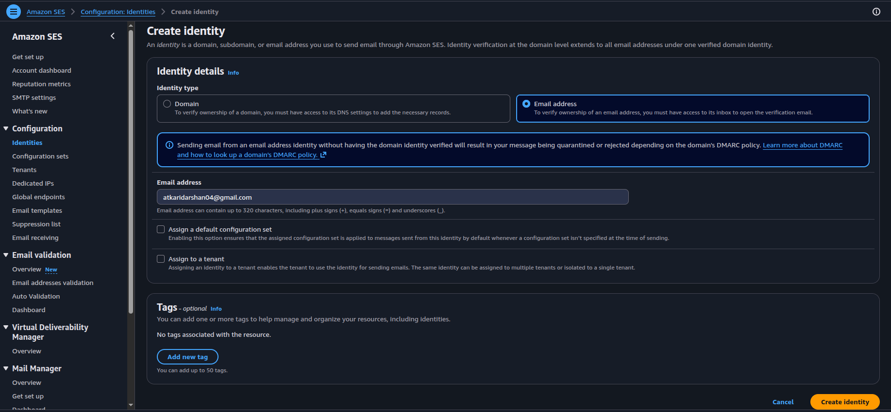
3. Check your inbox and click the verification link.
  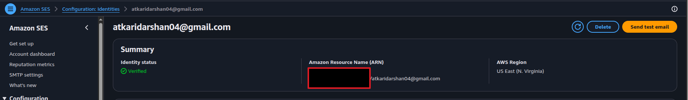
4. Repeat for your test recipient email address.
  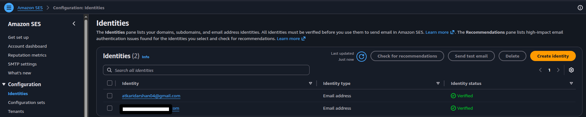

Both emails must show **Verified** status before proceeding.

---

## Step 2: Create DynamoDB Table

1. Go to **DynamoDB** → **Tables** → **Create Table**.
2. Set:
   - **Table Name**: `orders`
   - **Partition Key**: `order_id` (String)
3. **Table settings**: Select **Customize settings**.
4. **Capacity mode**: Choose **Provisioned** → set Read/Write to `1` (stays in free tier).
5. Leave everything else default → **Create Table**.

---

## Step 3: Create IAM Roles for Lambda

We need 4 roles — one per Lambda. Each gets only the permissions it needs.

### 3.1 Role: `order-intake-role`

1. Go to **IAM** → **Roles** → **Create Role**.
2. **Trusted entity**: AWS Service → **Lambda** → Next.
  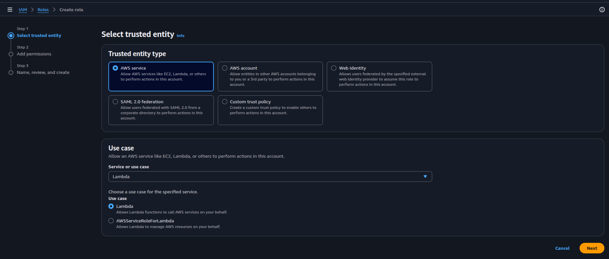
3. Attach policy: **AWSLambdaBasicExecutionRole** (for CloudWatch logs).
  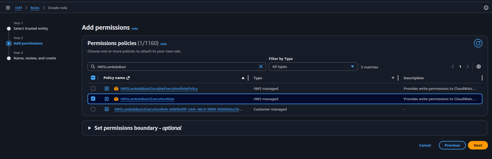
4. Click **Next**, name it `order-intake-role` → **Create Role**.
5. Open the role → **Add permissions** → **Create inline policy**.
6. Switch to **JSON** tab, paste:
   ```json
   {
     "Version": "2012-10-17",
     "Statement": [
       {
         "Effect": "Allow",
         "Action": "sns:Publish",
         "Resource": "*"
       }
     ]
   }
   ```
    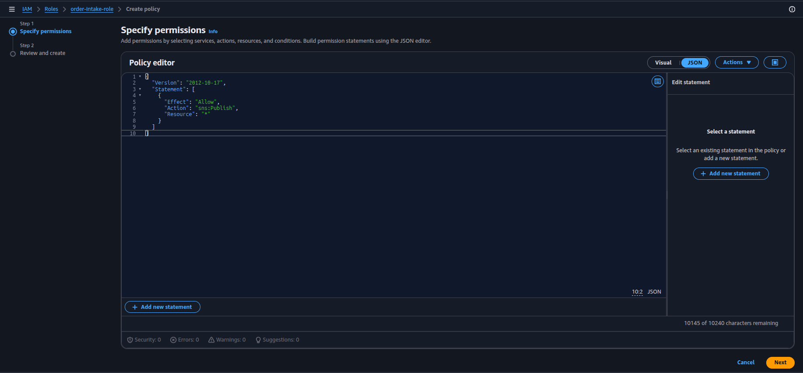
7. Name it `allow-sns-publish` → **Create policy**.
  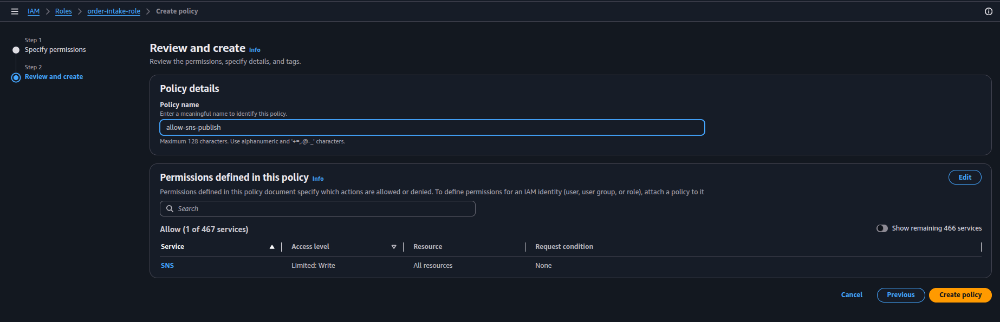
  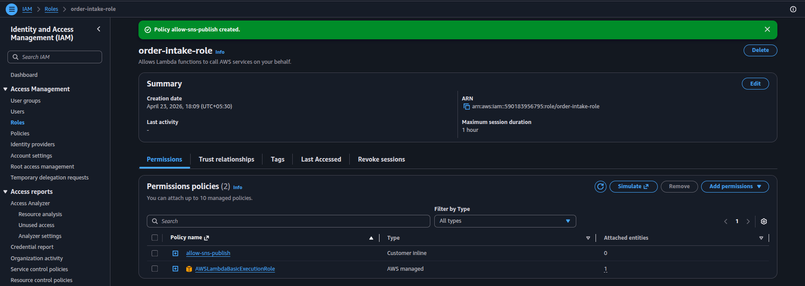

> We'll update the `Resource` to the exact SNS ARN after creating the topic.

---

### 3.2 Role: `order-db-writer-role`

1. **Create Role** → Lambda → attach **AWSLambdaBasicExecutionRole** → name `order-db-writer-role`.
2. Add inline policy:
   ```json
   {
     "Version": "2012-10-17",
     "Statement": [
       {
         "Effect": "Allow",
         "Action": [
           "dynamodb:PutItem",
           "dynamodb:GetItem"
         ],
         "Resource": "arn:aws:dynamodb:*:*:table/orders"
       },
       {
         "Effect": "Allow",
         "Action": [
           "sqs:ReceiveMessage",
           "sqs:DeleteMessage",
           "sqs:GetQueueAttributes"
         ],
         "Resource": "*"
       }
     ]
   }
   ```
3. Name it `allow-dynamodb-sqs` → **Create policy**.

---

### 3.3 Role: `order-email-sender-role`

1. **Create Role** → Lambda → attach **AWSLambdaBasicExecutionRole** → name `order-email-sender-role`.
2. Add inline policy:
   ```json
   {
     "Version": "2012-10-17",
     "Statement": [
       {
         "Effect": "Allow",
         "Action": "ses:SendEmail",
         "Resource": "*"
       },
       {
         "Effect": "Allow",
         "Action": [
           "sqs:ReceiveMessage",
           "sqs:DeleteMessage",
           "sqs:GetQueueAttributes"
         ],
         "Resource": "*"
       }
     ]
   }
   ```
3. Name it `allow-ses-sqs` → **Create policy**.

---

### 3.4 Role: `order-analytics-role`

1. **Create Role** → Lambda → attach **AWSLambdaBasicExecutionRole** → name `order-analytics-role`.
2. Add inline policy:
   ```json
   {
     "Version": "2012-10-17",
     "Statement": [
       {
         "Effect": "Allow",
         "Action": [
           "sqs:ReceiveMessage",
           "sqs:DeleteMessage",
           "sqs:GetQueueAttributes"
         ],
         "Resource": "*"
       }
     ]
   }
   ```
3. Name it `allow-sqs-consume` → **Create policy**.

### All roles created:
  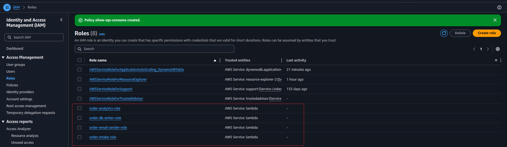

---

## Step 4: Create SNS Topic

1. Go to **Amazon SNS** → **Topics** → **Create Topic**.
2. **Type**: Standard.
3. **Name**: `order-events`.
  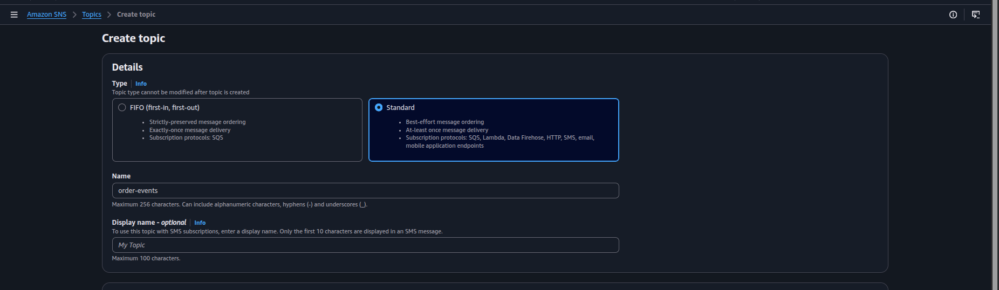
4. Leave everything else default → **Create Topic**.
  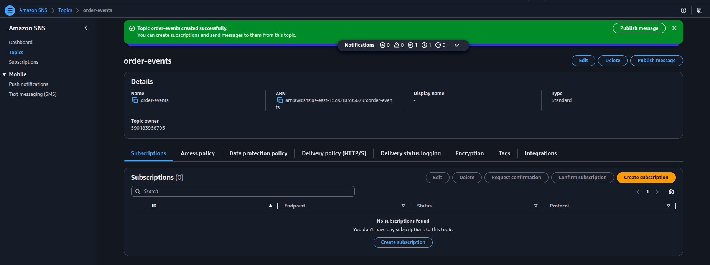
5. **Copy the Topic ARN**

### Update IAM Role with Exact ARN

1. Go to **IAM** → **Roles** → `order-intake-role`.
2. Edit the `allow-sns-publish` inline policy.
3. Replace `"Resource": "*"` with `"Resource": "<your-sns-topic-arn>"`.
  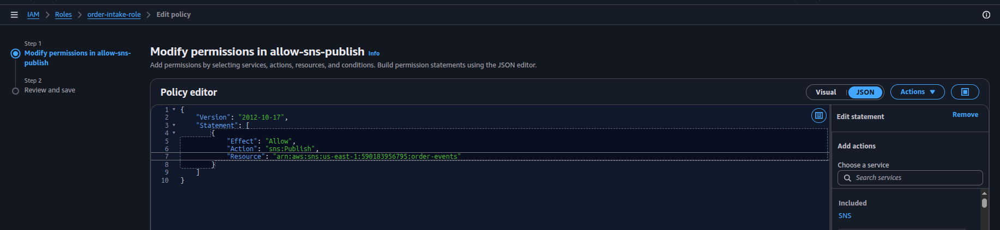
4. Save changes.
  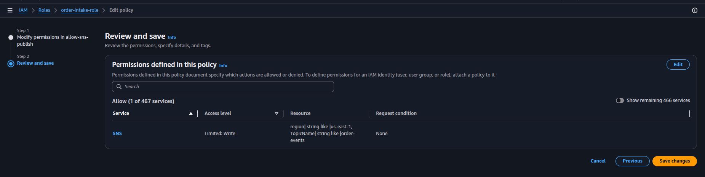

---

## Step 5: Create SQS Queues and DLQs

We need 3 queues, each with its own DLQ. Create DLQs first.

### 5.1 Create Dead Letter Queues

Repeat these steps 3 times for each DLQ:

**DLQ 1:**
1. Go to **Amazon SQS** → **Create Queue**.
2. **Type**: Standard.
3. **Name**: `orders-db-dlq`.
  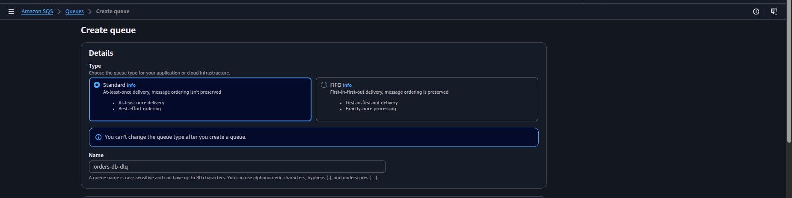
  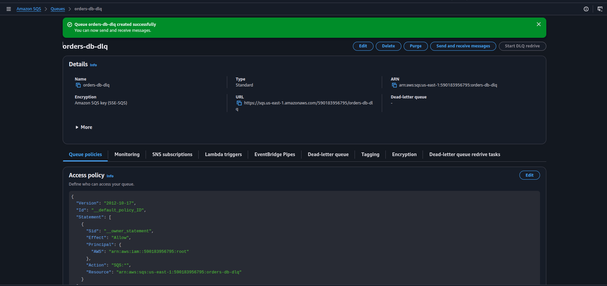
4. Leave defaults → **Create Queue**.

**DLQ 2:** Same steps, name: `orders-email-dlq`. Copy ARN.

**DLQ 3:** Same steps, name: `orders-analytics-dlq`. Copy ARN.

  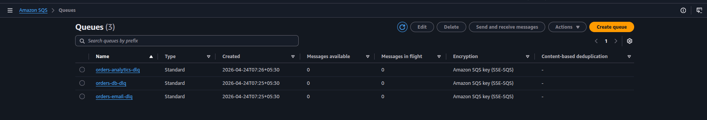

---

### 5.2 Create Main Queues

**Queue 1 — orders-db:**
1. **Create Queue** → Standard → Name: `orders-db`.
  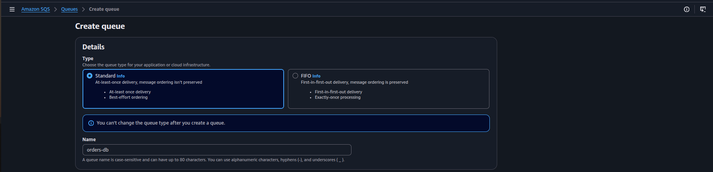
2. Scroll to **Dead-letter queue** section → **Enable**.
3. Select the ARN of `orders-db-dlq`.
4. **Maximum receives**: `3`.
  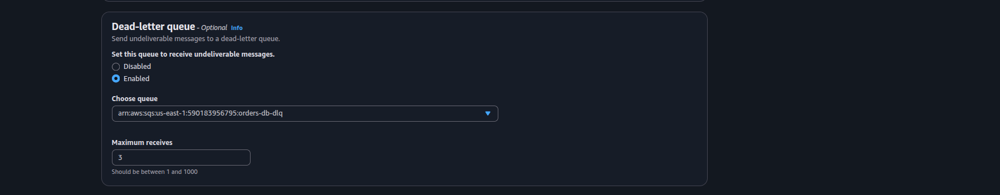
5. **Create Queue**.
  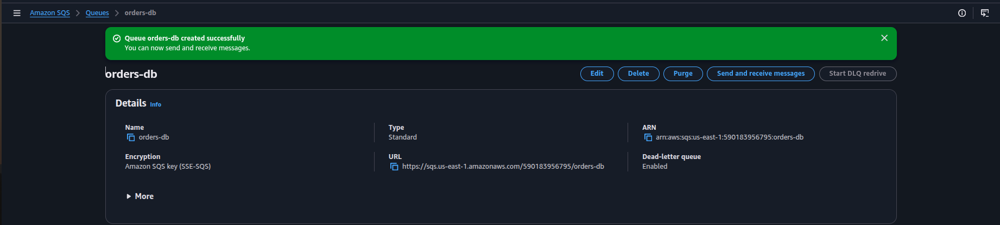

**Queue 2 — orders-email:**
1. **Create Queue** → Standard → Name: `orders-email`.
2. Enable DLQ → select ARN of `orders-email-dlq` → Max receives: `3`.
3. **Create Queue**.

**Queue 3 — orders-analytics:**
1. **Create Queue** → Standard → Name: `orders-analytics`.
2. Enable DLQ → select ARN of `orders-analytics-dlq` → Max receives: `3`.
3. **Create Queue**.

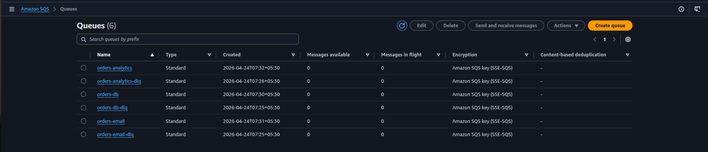

---

## Step 6: Subscribe SQS Queues to SNS (Fan-Out Wiring)

Do this for all 3 queues.

**For orders-db:**
1. Go to **SNS** → **Topics** → `order-events` → **Create Subscription**.
2. **Protocol**: Amazon SQS.
3. **Endpoint**: select the ARN of `orders-db` queue.
  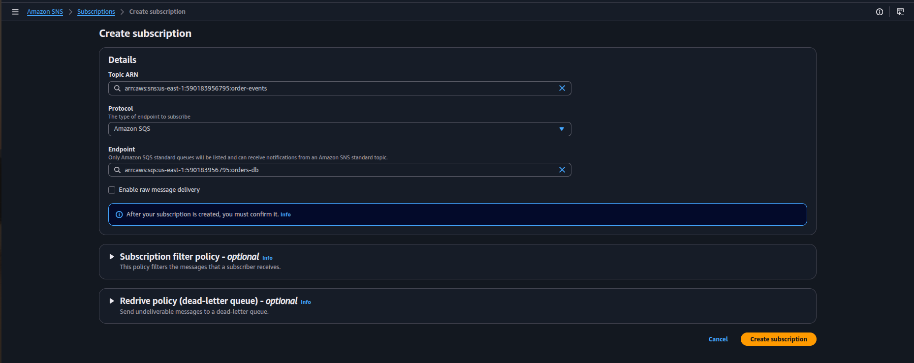
4. **Create Subscription**.
  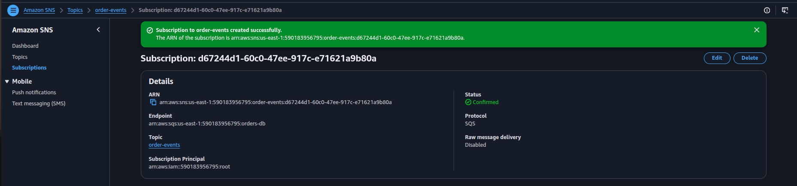

**For orders-email:** Same steps, endpoint = ARN of `orders-email`.

**For orders-analytics:** Same steps, endpoint = ARN of `orders-analytics`.

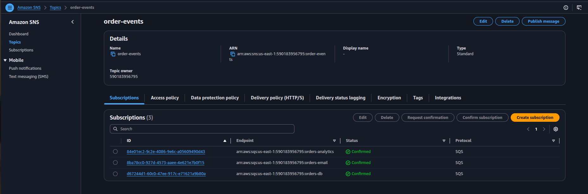

---

## Step 7: Create Lambda Functions

### 7.1 Intake Lambda

1. Go to **Lambda** → **Create Function** → Author from scratch.
2. **Name**: `order-intake`.
3. **Runtime**: Python 3.12.
4. **Execution role**: Use existing → `order-intake-role`.
  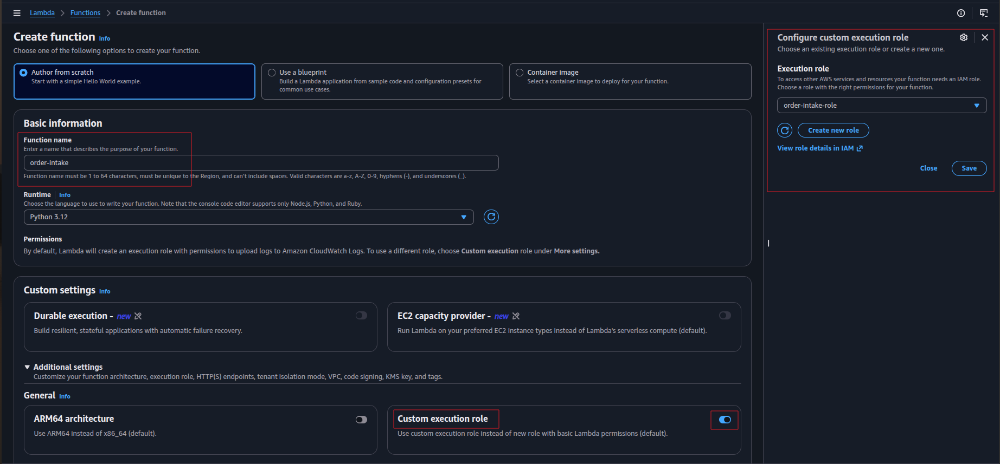
5. **Create Function**.
6. Replace the code with:
   ```python
   import json
   import boto3
   import uuid
   from datetime import datetime, timezone
   import os

   sns = boto3.client('sns')
   SNS_TOPIC_ARN = os.environ['SNS_TOPIC_ARN']

   def lambda_handler(event, context):
       body = json.loads(event.get('body', '{}'))

       required = ['customer_name', 'customer_email', 'items', 'total_amount']
       for field in required:
           if field not in body:
               return {'statusCode': 400, 'body': json.dumps({'error': f'Missing field: {field}'})}

       order = {
           'order_id': str(uuid.uuid4()),
           'status': 'RECEIVED',
           'created_at': datetime.now(timezone.utc).isoformat(),
           **body
       }

       sns.publish(
           TopicArn=SNS_TOPIC_ARN,
           Message=json.dumps(order),
           Subject='new-order'
       )

       return {
           'statusCode': 202,
           'body': json.dumps({'order_id': order['order_id'], 'status': 'RECEIVED'})
       }
   ```
7. Click **Deploy**.
8. Go to **Configuration** → **Environment Variables** → **Edit**.
9. Add: Key = `SNS_TOPIC_ARN`, Value = your SNS topic ARN.
  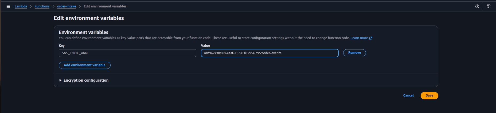
10. **Save**.
  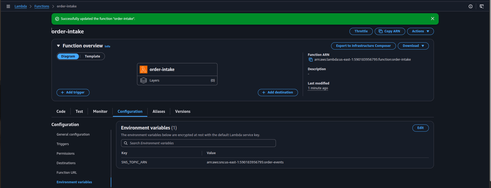

---

### 7.2 DB Writer Lambda

1. **Create Function** → Name: `order-db-writer` → Python 3.12 → Role: `order-db-writer-role`.
2. Replace code:
   ```python
   import json
   import boto3
   from boto3.dynamodb.conditions import Attr
   from boto3.dynamodb.types import TypeSerializer
   from decimal import Decimal

   dynamodb = boto3.resource('dynamodb')
   table = dynamodb.Table('orders')

   def float_to_decimal(obj):
       if isinstance(obj, float):
           return Decimal(str(obj))
       if isinstance(obj, list):
           return [float_to_decimal(i) for i in obj]
       if isinstance(obj, dict):
           return {k: float_to_decimal(v) for k, v in obj.items()}
       return obj

   def lambda_handler(event, context):
       for record in event['Records']:
           message = json.loads(json.loads(record['body'])['Message'])
           message = float_to_decimal(message)

           table.put_item(
               Item=message,
               ConditionExpression=Attr('order_id').not_exists()
           )
           print(f"Saved order: {message['order_id']}")
   ```
3. **Deploy**.

---

### 7.3 Email Sender Lambda

1. **Create Function** → Name: `order-email-sender` → Python 3.12 → Role: `order-email-sender-role`.
2. Replace code:
   ```python
   import json
   import boto3
   import os

   ses = boto3.client('ses')
   SENDER_EMAIL = os.environ['SENDER_EMAIL']

   def lambda_handler(event, context):
       for record in event['Records']:
           message = json.loads(json.loads(record['body'])['Message'])

           ses.send_email(
               Source=SENDER_EMAIL,
               Destination={'ToAddresses': [message['customer_email']]},
               Message={
                   'Subject': {'Data': f"Order Confirmed — #{message['order_id'][:8]}"},
                   'Body': {
                       'Text': {
                           'Data': (
                               f"Hi {message['customer_name']},\n\n"
                               f"Your order has been received!\n"
                               f"Order ID: {message['order_id']}\n"
                               f"Total: ${message['total_amount']}\n\n"
                               f"Thank you for your order."
                           )
                       }
                   }
               }
           )
           print(f"Email sent for order: {message['order_id']}")
   ```
3. **Deploy**.
4. **Configuration** → **Environment Variables** → Add: `SENDER_EMAIL` = your verified SES sender email.

---

### 7.4 Analytics Logger Lambda

1. **Create Function** → Name: `order-analytics-logger` → Python 3.12 → Role: `order-analytics-role`.
2. Replace code:
   ```python
   import json

   def lambda_handler(event, context):
       for record in event['Records']:
           message = json.loads(json.loads(record['body'])['Message'])
           print(json.dumps({
               'event': 'ORDER_RECEIVED',
               'order_id': message['order_id'],
               'total_amount': message['total_amount'],
               'item_count': len(message['items']),
               'created_at': message['created_at']
           }))
   ```
3. **Deploy**.

### All Lambdas created:
  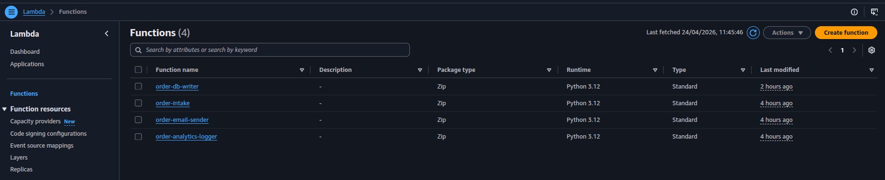

---

## Step 8: Wire SQS Triggers to Lambda

### 8.1 orders-db → order-db-writer

1. Go to **Lambda** → `order-db-writer` → **Configuration** → **Triggers** → **Add Trigger**.
2. **Source**: SQS.
3. **Queue**: select `orders-db`.
4. **Batch size**: 10.
  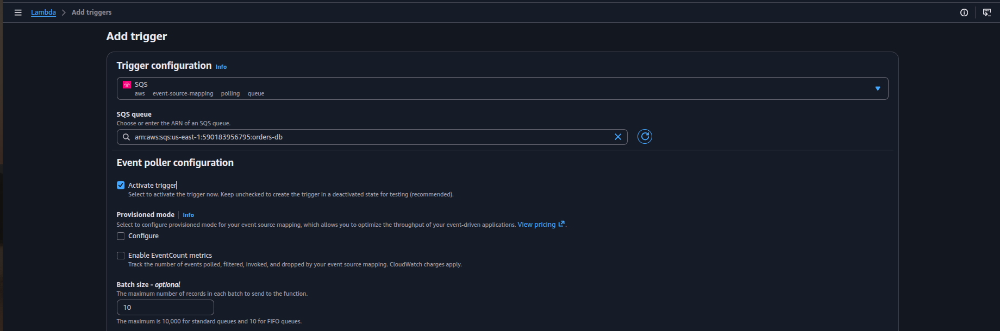
5. **Add**.
  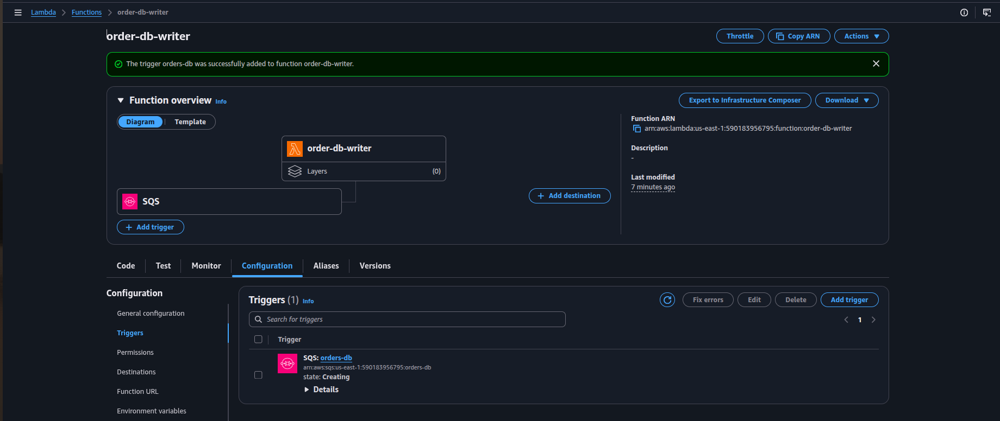

### 8.2 orders-email → order-email-sender

1. Go to `order-email-sender` → **Triggers** → **Add Trigger**.
2. **Source**: SQS → select `orders-email` → Batch size: 10 → **Add**.
  

### 8.3 orders-analytics → order-analytics-logger

1. Go to `order-analytics-logger` → **Triggers** → **Add Trigger**.
2. **Source**: SQS → select `orders-analytics` → Batch size: 10 → **Add**.
  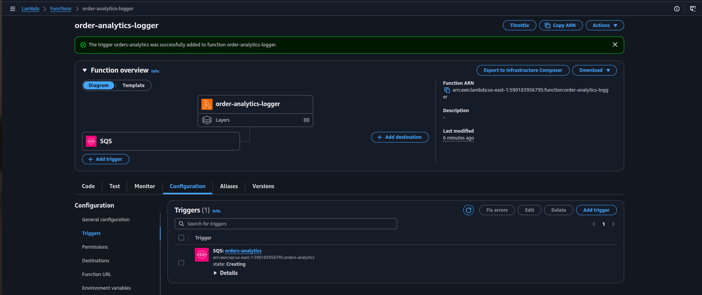

---

## Step 9: Create API Gateway

1. Go to **API Gateway** → **Create API** → **HTTP API** → **Build**.
2. **Integrations**: Add integration → Lambda → select `order-intake`.
3. **API Name**: `order-api` → **Next**.
  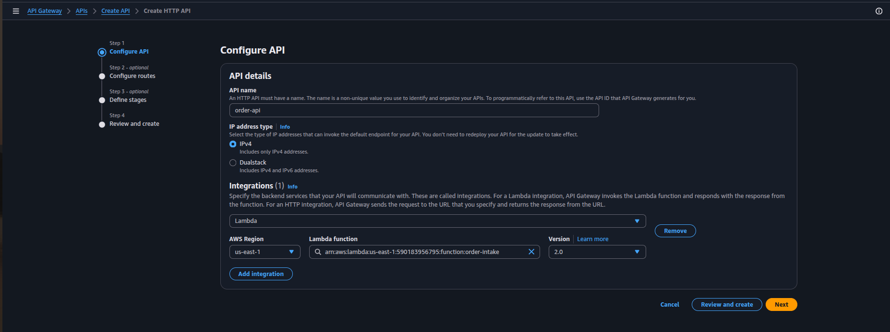
4. **Routes**: Configure route:
   - Method: `POST`
   - Path: `/orders`
   - Integration target: `order-intake`
   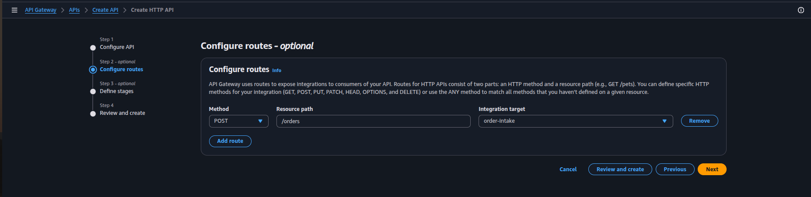
5. **Next** → Stage name: `prod`, enable **Auto-deploy**.
  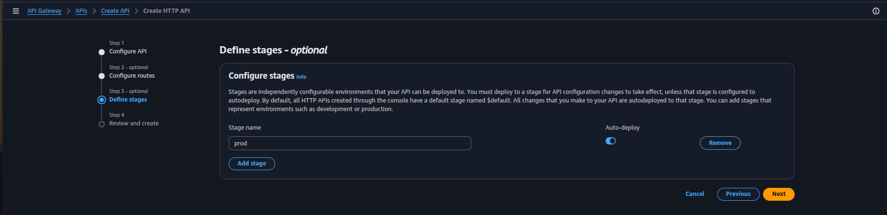
6. **Review & Create**.
  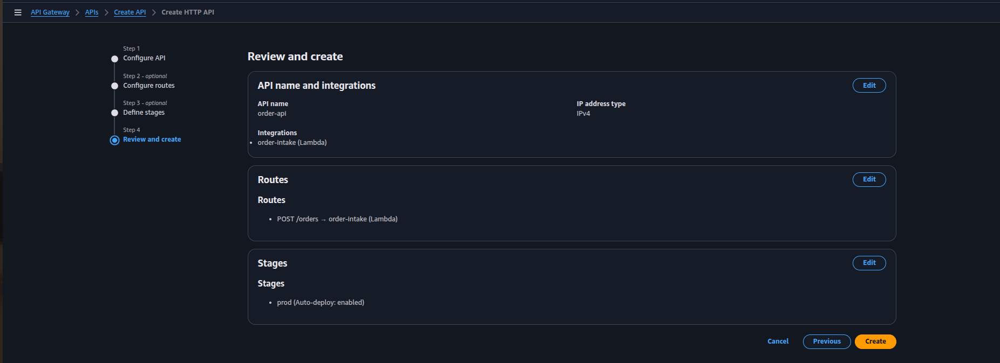
  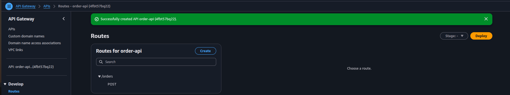

### Enable CORS

1. Go to your API → **CORS** → **Configure**.
2. **Access-Control-Allow-Origin**: `*`
3. **Access-Control-Allow-Methods**: `POST`
4. **Access-Control-Allow-Headers**: `content-type`
  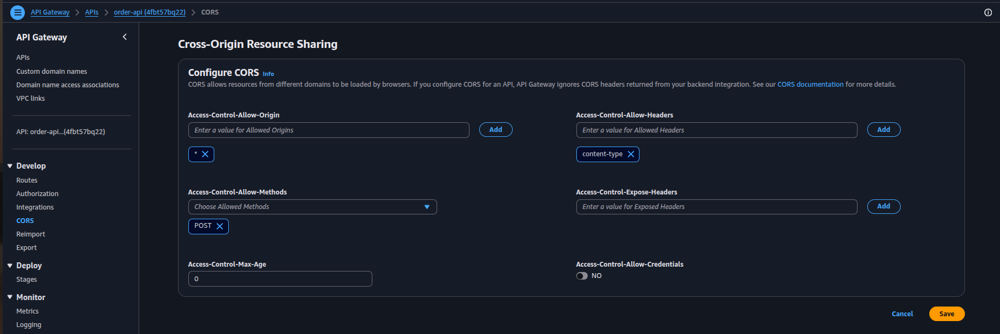
5. **Save**.
  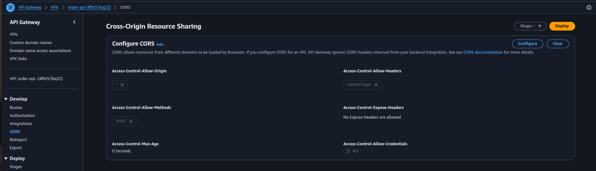

---

## Step 10: Set Up CloudWatch Alarms for DLQs

Set an alarm for each DLQ so you're notified when any message fails.

Repeat these steps for each of the 3 DLQs using the names and descriptions from the table above:

1. Go to **CloudWatch** → **Alarms** → **Create Alarm**.
2. **Select Metric** → SQS → Queue Metrics → find the DLQ → `ApproximateNumberOfMessagesVisible`.
  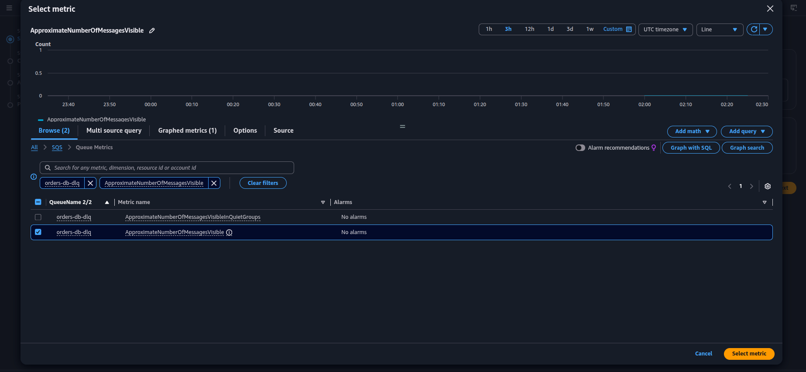
3. **Statistic**: Maximum, **Period**: 1 minute.
  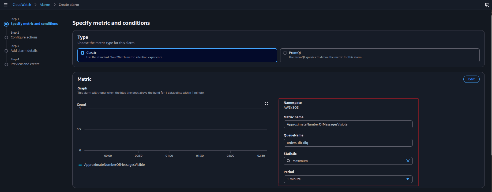
4. **Condition**: Greater than or equal to `1`.
  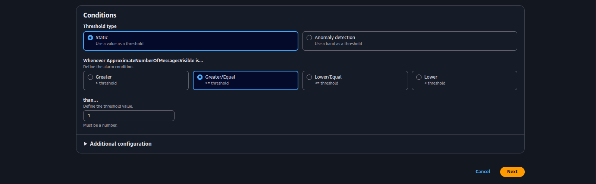
5. **Notification**: First alarm → create new SNS topic `dlq-alerts` → enter your email. Remaining alarms → select existing `dlq-alerts` topic.
  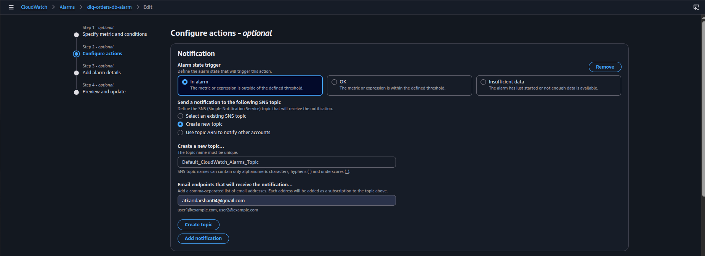
  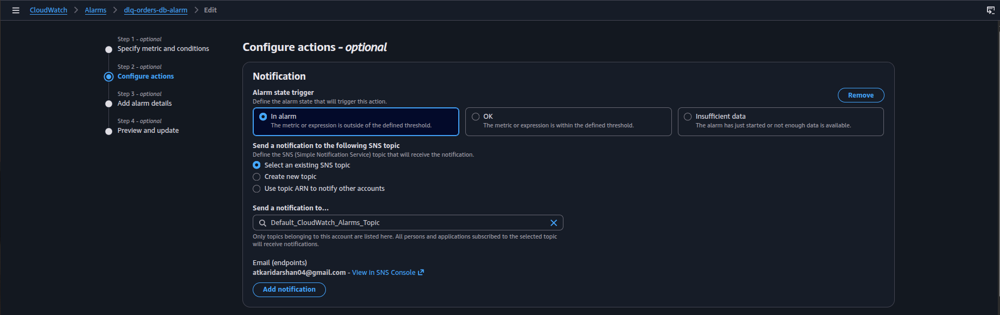
6. **Alarm name** and **Description**: use the table below.
  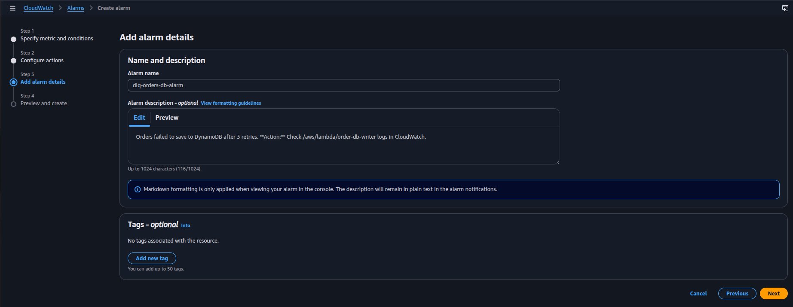
7. **Create Alarm**. On the first alarm, confirm the subscription email AWS sends you.


| Alarm Name | DLQ | Alarm Description (paste into console) |
|------------|-----|----------------------------------------|
| `dlq-orders-db-alarm` | `orders-db-dlq` | `Orders failed to save to DynamoDB after 3 retries. **Action:** Check /aws/lambda/order-db-writer logs in CloudWatch.` |
| `dlq-orders-email-alarm` | `orders-email-dlq` | `Order confirmation email failed to send after 3 retries. **Likely cause:** Unverified SES recipient or sandbox limit. **Action:** Check /aws/lambda/order-email-sender logs.` |
| `dlq-orders-analytics-alarm` | `orders-analytics-dlq` | `Order analytics logging failed after 3 retries. **Action:** Check /aws/lambda/order-analytics-logger logs in CloudWatch.` |

### All alarms created:
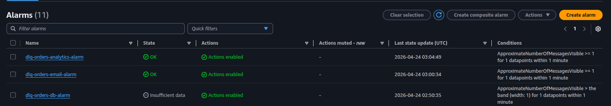

---

## Step 11: Test the Pipeline

### Send a Test Order

Use curl or any API client:

```bash
curl -X POST <your-api-gateway-invoke-url>/orders \
  -H "Content-Type: application/json" \
  -d '{
    "customer_name": "Jane Doe",
    "customer_email": "<your-verified-ses-email>",
    "items": [
      {"product_id": "PROD-001", "name": "Wireless Headphones", "qty": 1, "price": 79.99}
    ],
    "total_amount": 79.99
  }'
```

Expected response:
```json
{"order_id": "some-uuid", "status": "RECEIVED"}
```

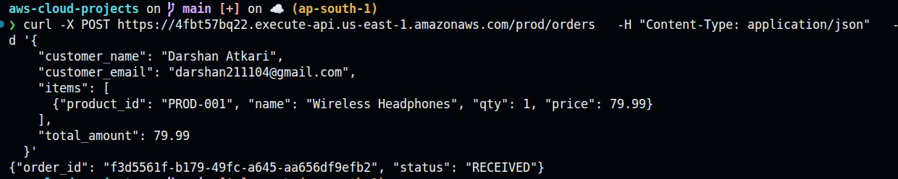

### Verify Each Step

| What to check | Where to look |
|--------------|---------------|
| Order saved | DynamoDB → `orders` table → **Explore items** |
| Email sent | Your inbox (check spam too) |
| Analytics logged | CloudWatch → Log Groups → `/aws/lambda/order-analytics-logger` |
| SNS delivered | SNS → Topics → `order-events` → **Monitoring** tab |
| SQS processed | SQS → each queue → **Monitoring** tab → Messages Received |

#### Dynamodb Entry:
  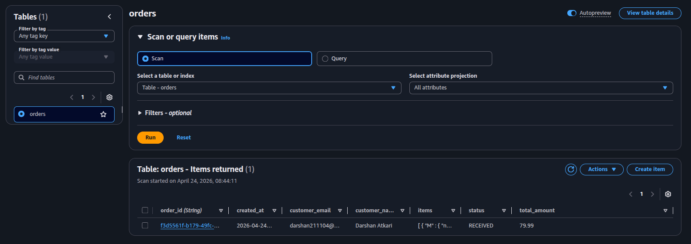


#### Email:
  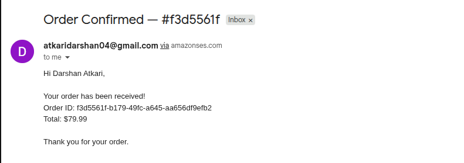


#### CloudWatch Log Groups:
  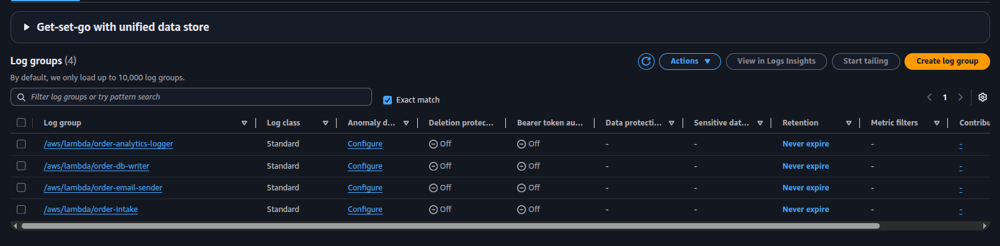

---

### Test DLQ (Optional)

**Step 1 — Break the DB writer Lambda**

Go to `order-db-writer` → code editor → change line:
```python
table = dynamodb.Table('orders')
```
to:
```python
table = dynamodb.Table('orders-wrong')
```
Click **Deploy**.

**Step 2 — Send a test order**

```bash
curl -X POST <your-api-gateway-invoke-url>/prod/orders \
  -H "Content-Type: application/json" \
  -d '{
    "customer_name": "Test User",
    "customer_email": "<your-verified-email>",
    "items": [{"product_id": "PROD-001", "name": "Test Item", "qty": 1, "price": 10.00}],
    "total_amount": 10.00
  }'
```

**Step 3 — Watch retries and DLQ**

- Go to **SQS** → `orders-db` → **Monitoring** tab — you'll see messages received, then disappearing after 3 failed retries
- Go to `orders-db-dlq` → **Messages Available** should show `1`
  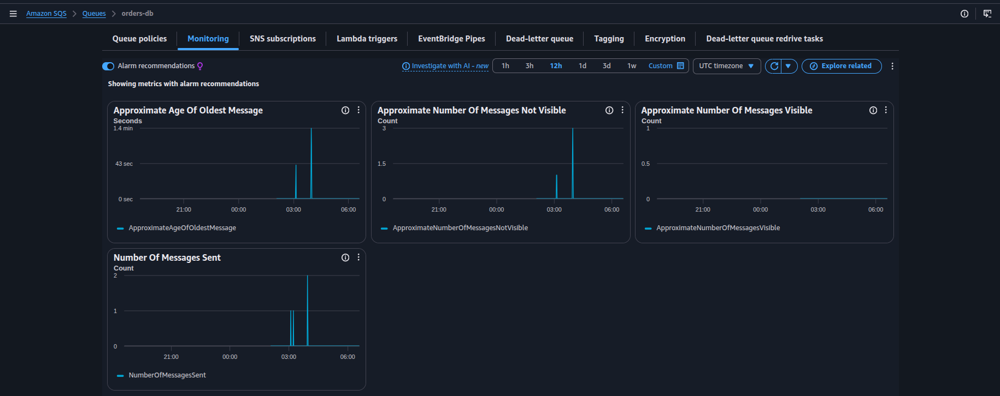
- Also check `orders-db-dlq` → **Monitoring** tab
  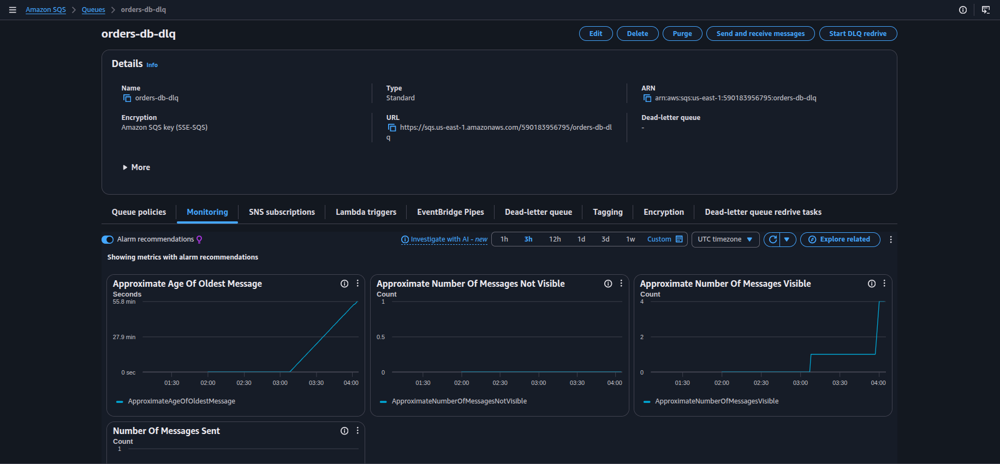
- Wait ~1 minute → **CloudWatch** → **Alarms** → `dlq-orders-db-alarm` goes **In alarm**
  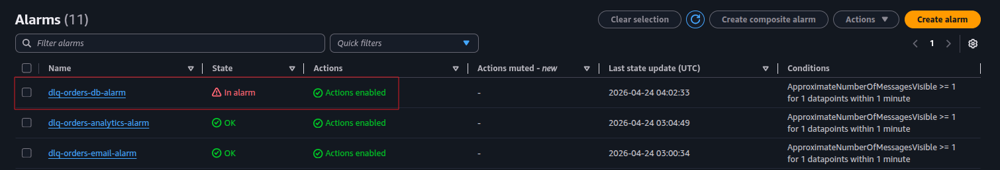
- You'll also receive an alert email from the `dlq-alerts` SNS topic
  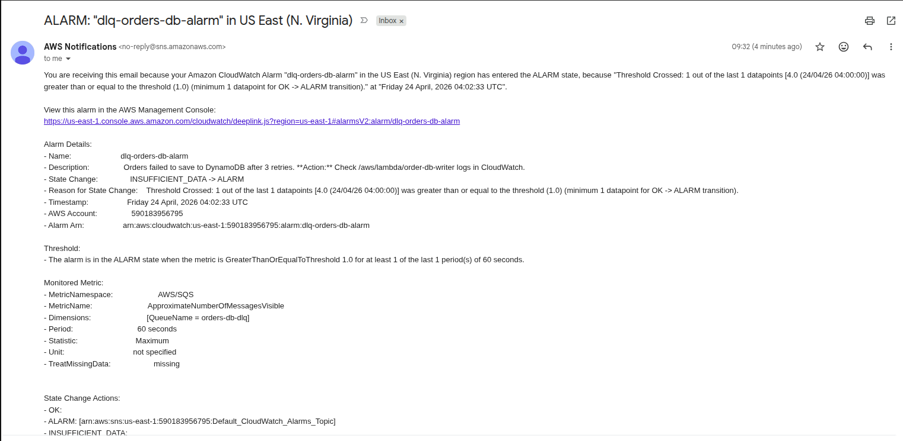

**Step 4 — Fix and redrive**

1. Go back to `order-db-writer` → revert table name back to `orders` → **Deploy**
2. Go to **SQS** → `orders-db-dlq` → **Start DLQ redrive** → select source queue `orders-db` → **Redrive**
3. The message gets reprocessed → check DynamoDB `orders` table — the order is now saved

---

## Cleanup

To avoid charges, delete in this order:

1. **API Gateway** → delete `order-api`
2. **Lambda** → delete all 4 functions
3. **SQS** → delete all 6 queues (3 main + 3 DLQs)
4. **SNS** → delete `order-events` topic
5. **DynamoDB** → delete `orders` table
6. **CloudWatch** → delete log groups and alarms
7. **IAM** → delete all 4 roles
8. **SES** → optionally remove verified identities
