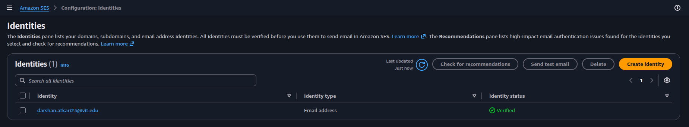
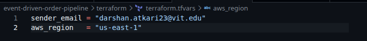
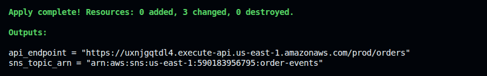
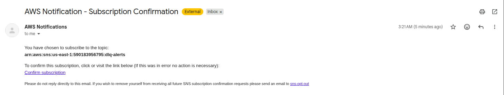
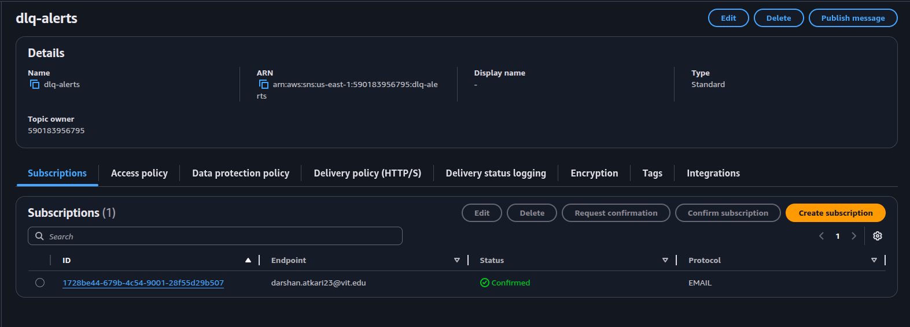
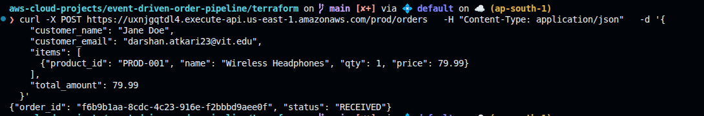
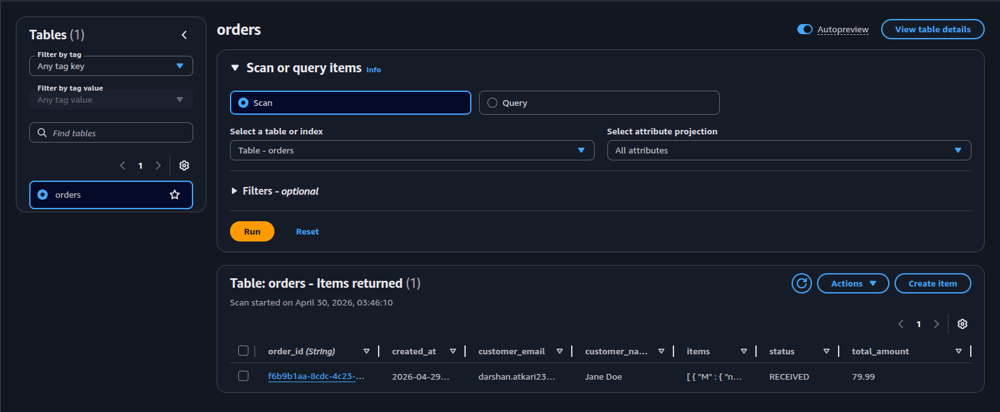
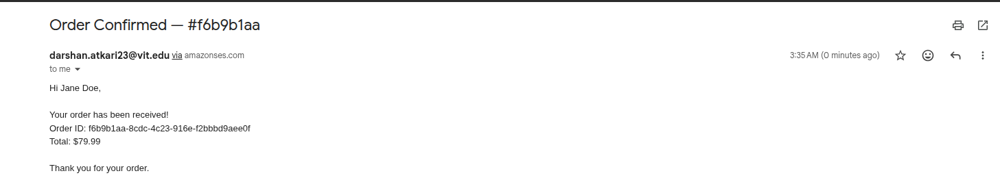
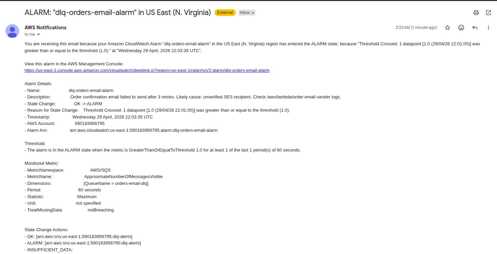

# 🚀 Deploying the Event-Driven Order Pipeline with Terraform

This guide provisions the entire pipeline — SNS, SQS, Lambda, DynamoDB, API Gateway, and CloudWatch alarms — with a single `terraform apply`.

---

## ✅ Prerequisites

- [AWS CLI](https://docs.aws.amazon.com/cli/latest/userguide/getting-started-install.html) installed and configured
- [Terraform](https://developer.hashicorp.com/terraform/install) installed
- A **SES-verified email address** — required before deploying (SES sandbox only allows sending to verified addresses)

### Configure AWS CLI

```bash
aws configure
```

Provide your Access Key ID, Secret Access Key, region (e.g., `us-east-1`), and output format (`json`).

### Verify your emails in SES

SES sandbox mode (default for all new AWS accounts) only allows sending to **verified addresses**. You must verify both:
1. Your **sender email** — used as `sender_email` in `terraform.tfvars`
2. Your **recipient email** — whatever you'll use as `customer_email` in test requests

> If both are the same address, one verification covers both.

Go to **AWS Console → SES → Identities → Create Identity**, enter the email, and click the verification link in your inbox. Repeat for each address. Both must show **Verified** status before deploying.



---

## 📁 File Structure

```
terraform/
├── providers.tf        # AWS provider + Terraform version
├── variables.tf        # Input variables (region, sender_email)
├── dynamodb.tf         # orders table
├── sns.tf              # order-events topic + SQS subscriptions
├── sqs.tf              # 3 main queues + 3 DLQs + queue policies
├── iam.tf              # 4 Lambda roles with least-privilege policies
├── lambda.tf           # 4 Lambda functions + SQS event source mappings
├── api_gateway.tf      # HTTP API + POST /orders route
├── cloudwatch.tf       # DLQ alarms + dlq-alerts SNS topic
├── outputs.tf          # API endpoint URL
└── lambda/
    ├── intake.py / intake.zip
    ├── db_writer.py / db_writer.zip
    ├── email_sender.py / email_sender.zip
    └── analytics_logger.py / analytics_logger.zip
```

---

## 🚀 Deployment Steps

### 1. Navigate to the Terraform directory

```bash
cd terraform
```

### 2. Set your variables

Copy the example file and fill in your values:

```bash
cp terraform.tfvars.example terraform.tfvars
```

```hcl
sender_email = "your-verified-email@example.com"
aws_region   = "us-east-1"
```



> `sender_email` must already be verified in SES. This is used both as the email sender and as the DLQ alert recipient.

### 3. Initialize Terraform

```bash
terraform init
```

Downloads the AWS provider plugin.

### 4. Plan

```bash
terraform plan
```

Review what will be created — 30+ resources across SNS, SQS, Lambda, DynamoDB, API Gateway, IAM, and CloudWatch.

### 5. Apply

```bash
terraform apply
```

Type `yes` when prompted. Takes ~30 seconds.



### 6. Confirm the SNS alert subscription

After apply, AWS sends a confirmation email to your `sender_email`. **Click the confirmation link** — otherwise DLQ alarm notifications won't be delivered.




---

## ✅ Testing the Pipeline

Copy the `api_endpoint` from the Terraform output and run:

```bash
curl -X POST <api_endpoint> \
  -H "Content-Type: application/json" \
  -d '{
    "customer_name": "Jane Doe",
    "customer_email": "<your-verified-ses-email>",
    "items": [
      {"product_id": "PROD-001", "name": "Wireless Headphones", "qty": 1, "price": 79.99}
    ],
    "total_amount": 79.99
  }'
```

Expected response:
```json
{"order_id": "some-uuid", "status": "RECEIVED"}
```




### Verify each step

| What to check | Where |
|---|---|
| Order saved | DynamoDB → `orders` table → Explore items |
| Email sent | Your inbox |
| Analytics logged | CloudWatch → Log Groups → `/aws/lambda/order-analytics-logger` |






### Test DLQ alarms

If something goes wrong in a Lambda (e.g., code error, timeout), the failed event goes to the corresponding DLQ. After 1 failure, the CloudWatch alarm triggers and sends a notification to your email.


---

## 🔥 Cleanup

```bash
terraform destroy --auto-approve
```

This removes all provisioned resources. Two things are **not** managed by Terraform and must be deleted manually:

- **SES email identities** — Go to AWS Console → SES → Identities → select each verified email → Delete
- **CloudWatch Log Groups** — created automatically by Lambda at runtime; go to CloudWatch → Log Groups → delete `/aws/lambda/order-intake`, `/aws/lambda/order-db-writer`, `/aws/lambda/order-email-sender`, `/aws/lambda/order-analytics-logger`
