# Deploying Using AWS Console

Complete step-by-step guide to manually set up the Infrastructure Drift Detection + Auto-Remediation pipeline.

---

## Overview of What We'll Create

1. SNS Topic — `compliance-alerts` with email subscription
2. IAM Role — `remediator-lambda-role` for the Lambda function
3. Lambda — `remediator-function` (receives violations, remediates, notifies)
4. AWS Config — enable recorder, delivery channel, and four managed rules
5. EventBridge Rule — routes Config NON_COMPLIANT events to the Lambda
6. End-to-end test — trigger a real violation and watch the pipeline fire

---

## Step 1: Create the SNS Topic and Email Subscription

The SNS topic is created first because the Lambda needs its ARN as an environment variable.

1. Go to **SNS** → **Topics** → **Create topic**.
2. **Type**: **Standard**.
3. **Name**: `compliance-alerts`.
4. Leave all other settings as default → **Create topic**.
  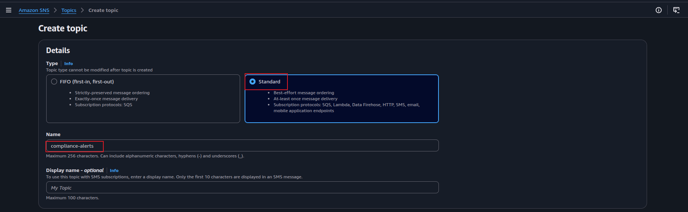
5. Copy the **Topic ARN** — you'll need it in Step 3.

### 1.1 Subscribe your email

1. Open the `compliance-alerts` topic → **Create subscription**.
2. **Protocol**: **Email**.
3. **Endpoint**: your email address.
  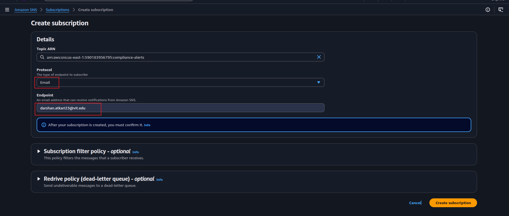
4. **Create subscription**.
5. Check your inbox — you'll receive a confirmation email from AWS. Click **Confirm subscription**.
  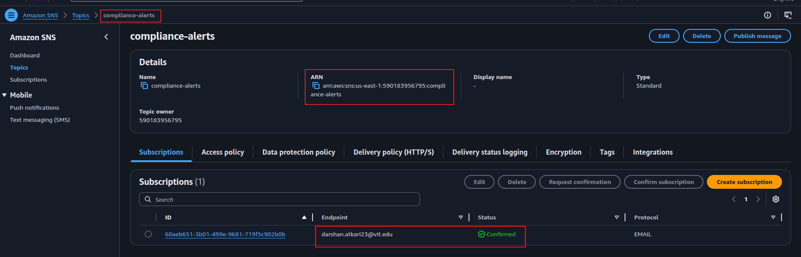

> The subscription must be confirmed before SNS can deliver messages to it.

---

## Step 2: Create the IAM Role for Lambda

1. Go to **IAM** → **Roles** → **Create role**.
2. **Trusted entity**: AWS service → **Lambda** → **Next**.
  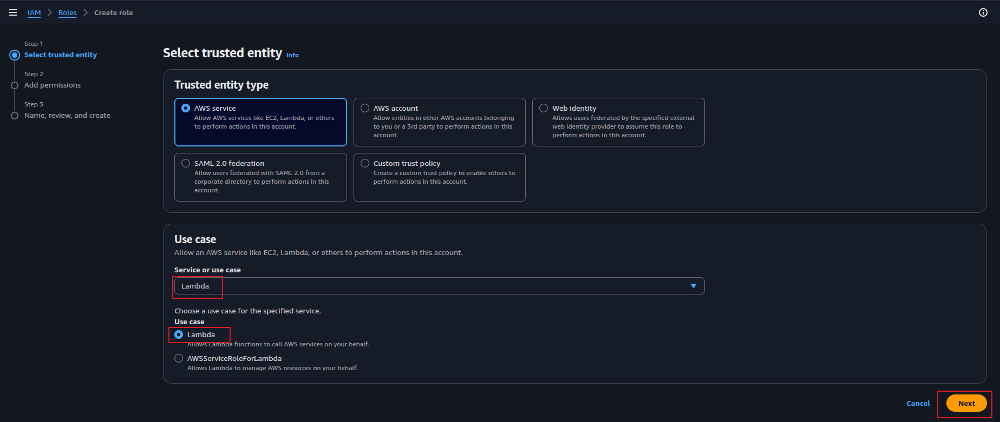
3. Attach managed policy: **AWSLambdaBasicExecutionRole** → **Next**.
  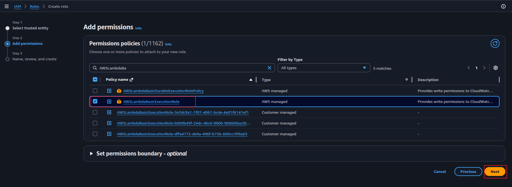
4. **Role name**: `remediator-lambda-role` → **Create role**.
5. Open the role → **Add permissions** → **Create inline policy** → **JSON** tab.
6. Paste the following policy:

```json
{
  "Version": "2012-10-17",
  "Statement": [
    {
      "Sid": "S3Remediation",
      "Effect": "Allow",
      "Action": [
        "s3:PutBucketVersioning",
        "s3:PutBucketPublicAccessBlock"
      ],
      "Resource": "arn:aws:s3:::*"
    },
    {
      "Sid": "EC2Remediation",
      "Effect": "Allow",
      "Action": [
        "ec2:DescribeSecurityGroups",
        "ec2:RevokeSecurityGroupIngress"
      ],
      "Resource": "*"
    },
    {
      "Sid": "SNSPublish",
      "Effect": "Allow",
      "Action": "sns:Publish",
      "Resource": "arn:aws:sns:<your-region>:<your-account-id>:compliance-alerts"
    }
  ]
}
```

> Replace `<your-region>` and `<your-account-id>` with your actual values.

7. **Policy name**: `remediator-lambda-policy` → **Create policy**.

  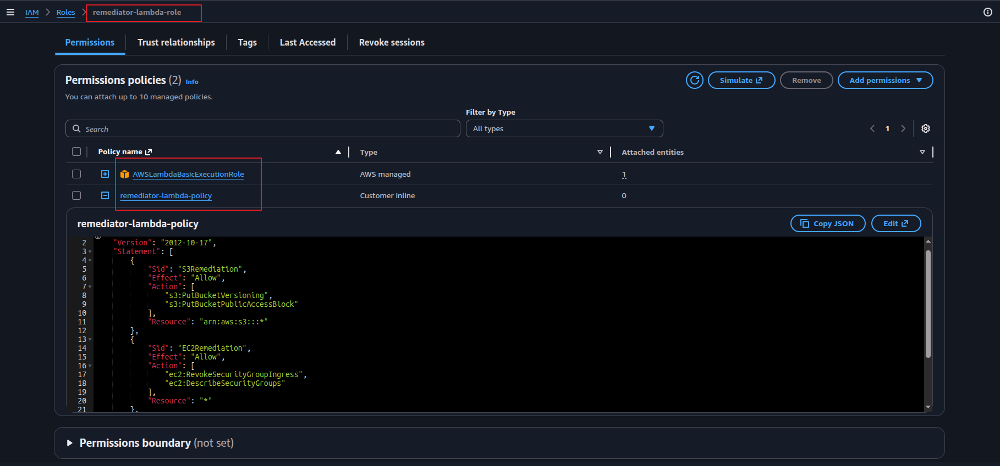

---

## Step 3: Create the Remediator Lambda

1. Go to **Lambda** → **Create function** → **Author from scratch**.
2. **Function name**: `remediator-function`.
3. **Runtime**: Python 3.12.
4. **Execution role**: use existing role → `remediator-lambda-role`.
  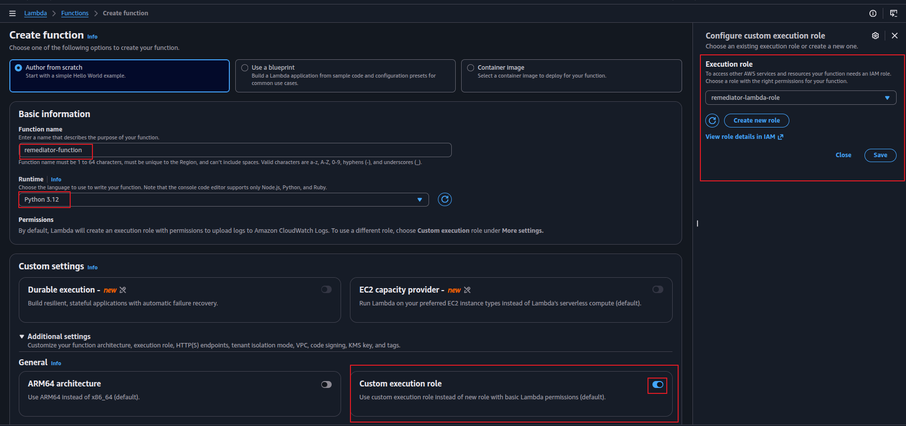
5. **Create function**.

### 3.1 Configure timeout

1. **Configuration** → **General configuration** → **Edit**.
2. **Timeout**: `30 sec` (remediation API calls are fast).
3. **Save**.

  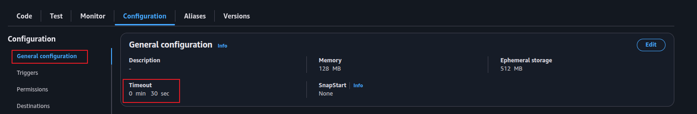

### 3.2 Add environment variables

1. **Configuration** → **Environment variables** → **Edit** → **Add environment variable**:
   - **Key**: `SNS_TOPIC_ARN`
   - **Value**: the Topic ARN you copied in Step 1
2. **Save**.

  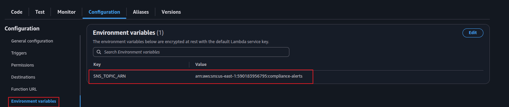

### 3.3 Deploy the function code

Replace the default code with the following, then click **Deploy**:

```python
import boto3
import os
import json
from datetime import datetime, timezone

sns = boto3.client('sns')
s3  = boto3.client('s3')
ec2 = boto3.client('ec2')

SNS_TOPIC_ARN = os.environ['SNS_TOPIC_ARN']


# ── Remediation handlers ──────────────────────────────────────────────────────

def remediate_s3_versioning(resource_id):
    s3.put_bucket_versioning(
        Bucket=resource_id,
        VersioningConfiguration={'Status': 'Enabled'}
    )
    return f"Versioning re-enabled on bucket '{resource_id}'."


def remediate_s3_public_access(resource_id):
    s3.put_public_access_block(
        Bucket=resource_id,
        PublicAccessBlockConfiguration={
            'BlockPublicAcls':       True,
            'IgnorePublicAcls':      True,
            'BlockPublicPolicy':     True,
            'RestrictPublicBuckets': True,
        }
    )
    return f"Public access block applied to bucket '{resource_id}'."


def remediate_ssh(resource_id):
    # Revoke any ingress rule on port 22 open to 0.0.0.0/0 or ::/0
    sg = ec2.describe_security_groups(GroupIds=[resource_id])['SecurityGroups'][0]
    revoked = []
    for rule in sg.get('IpPermissions', []):
        if rule.get('FromPort') == 22 and rule.get('ToPort') == 22:
            open_ipv4 = [r for r in rule.get('IpRanges', [])  if r['CidrIp']   == '0.0.0.0/0']
            open_ipv6 = [r for r in rule.get('Ipv6Ranges', []) if r['CidrIpv6'] == '::/0']
            if open_ipv4 or open_ipv6:
                permission = {'IpProtocol': rule['IpProtocol'], 'FromPort': 22, 'ToPort': 22}
                if open_ipv4:
                    permission['IpRanges'] = open_ipv4
                if open_ipv6:
                    permission['Ipv6Ranges'] = open_ipv6
                try:
                    ec2.revoke_security_group_ingress(GroupId=resource_id, IpPermissions=[permission])
                    revoked.append('0.0.0.0/0' if open_ipv4 else '::/0')
                except ec2.exceptions.ClientError as e:
                    if 'InvalidPermission.NotFound' not in str(e):
                        raise
    if revoked:
        return f"Revoked port 22 ingress from {', '.join(revoked)} on security group '{resource_id}'."
    return f"No open port 22 rules found on '{resource_id}' — already clean."


# ── Dispatch table ────────────────────────────────────────────────────────────

HANDLERS = {
    's3-bucket-versioning-enabled':     remediate_s3_versioning,
    's3-bucket-public-read-prohibited': remediate_s3_public_access,
    'restricted-ssh':                   remediate_ssh,
    'root-account-mfa-enabled':         None,  # cannot be automated
}


# ── Notification ──────────────────────────────────────────────────────────────

def notify(rule_name, resource_type, resource_id, region, action, auto_remediated):
    status  = 'AUTO-REMEDIATED' if auto_remediated else 'MANUAL ACTION REQUIRED'
    subject = f"[{status}] Config violation: {rule_name}"
    message = (
        f"COMPLIANCE VIOLATION — {status}\n\n"
        f"Rule:     {rule_name}\n"
        f"Resource: {resource_type} / {resource_id}\n"
        f"Region:   {region}\n"
        f"Action:   {action}\n"
        f"Time:     {datetime.now(timezone.utc).strftime('%Y-%m-%dT%H:%M:%SZ')}"
    )
    sns.publish(TopicArn=SNS_TOPIC_ARN, Subject=subject, Message=message)
    print(message)


# ── Handler ───────────────────────────────────────────────────────────────────

def lambda_handler(event, context):
    print("Event received:", json.dumps(event))

    detail        = event['detail']
    rule_name     = detail['configRuleName']
    resource_type = detail['resourceType']
    resource_id   = detail['resourceId']
    region        = event.get('region', 'unknown')

    handler = HANDLERS.get(rule_name)

    if handler is None and rule_name in HANDLERS:
        # Rule is known but has no auto-remediation
        action = "Cannot auto-remediate. Manual action required."
        notify(rule_name, resource_type, resource_id, region, action, auto_remediated=False)
        return

    if handler is None:
        # Unknown rule — log and alert
        action = f"Unknown rule '{rule_name}'. No remediation defined."
        notify(rule_name, resource_type, resource_id, region, action, auto_remediated=False)
        return

    # Auto-remediate
    action = handler(resource_id)
    notify(rule_name, resource_type, resource_id, region, action, auto_remediated=True)
```

---

## Step 4: Enable AWS Config

AWS Config must be enabled before you can create rules. This sets up the recorder (what to monitor) and the delivery channel (where to store configuration history).

### 4.1 Create the S3 delivery bucket and attach a bucket policy

Config requires explicit permission to write to the delivery bucket. Without a bucket policy granting `config.amazonaws.com` write access, the recorder creation will fail with an *"Insufficient delivery policy"* error.

1. Go to **S3** → **Create bucket**.
2. Select Regional Namespace -> **Bucket name**: `config-delivery`
  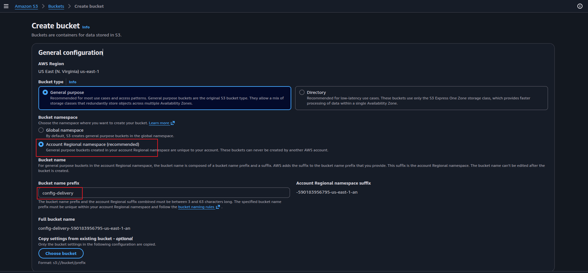
3. Leave all defaults → **Create bucket**.
4. Open the bucket → **Permissions** tab → **Bucket policy** → **Edit**.
5. Paste the following policy, replacing `<your-account-id>` and `<your-region>`:

```json
{
  "Version": "2012-10-17",
  "Statement": [
    {
      "Sid": "AWSConfigBucketPermissionsCheck",
      "Effect": "Allow",
      "Principal": {
        "Service": "config.amazonaws.com"
      },
      "Action": "s3:GetBucketAcl",
      "Resource": "arn:aws:s3:::<your-bucket-name>",
      "Condition": {
        "StringEquals": {
          "AWS:SourceAccount": "<your-account-id>"
        }
      }
    },
    {
      "Sid": "AWSConfigBucketDelivery",
      "Effect": "Allow",
      "Principal": {
        "Service": "config.amazonaws.com"
      },
      "Action": "s3:PutObject",
      "Resource": "arn:aws:s3:::<your-bucket-name>/AWSLogs/<your-account-id>/Config/*",
      "Condition": {
        "StringEquals": {
          "s3:x-amz-acl": "bucket-owner-full-control",
          "AWS:SourceAccount": "<your-account-id>"
        }
      }
    }
  ]
}
```

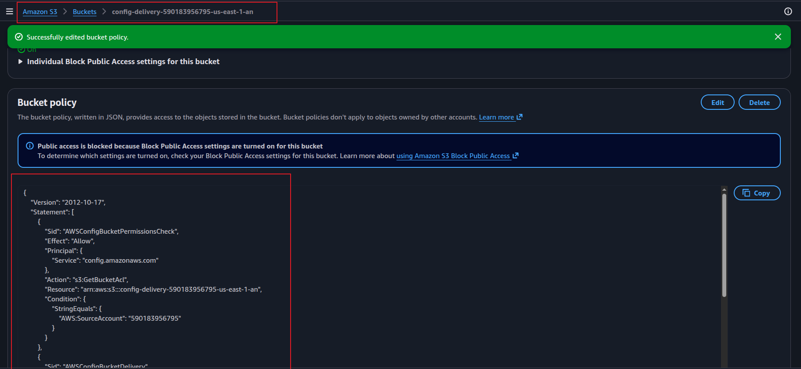

6. **Save changes**.

### 4.2 Enable Config via the Setup Wizard

1. Go to **AWS Config** → if this is your first time, you'll see a **Get started** button. Click it.

> If Config is already enabled, skip to Step 4.3.

2. **Settings**:
   - **Recording strategy**: **Specific resource types**.
   - **Frequency**: **Continuous** — records changes the moment they happen, enabling near-real-time detection and remediation. Daily (periodic) would introduce up to a 24-hour lag.
   - **Resource types to record**: add the following:
     - `AWS::S3::Bucket`
     - `AWS::EC2::SecurityGroup`
     - `AWS::IAM::User` *(needed for root MFA rule)*
   - **AWS Config role**: **Create AWS Config service-linked role** (or use existing if you have one).

      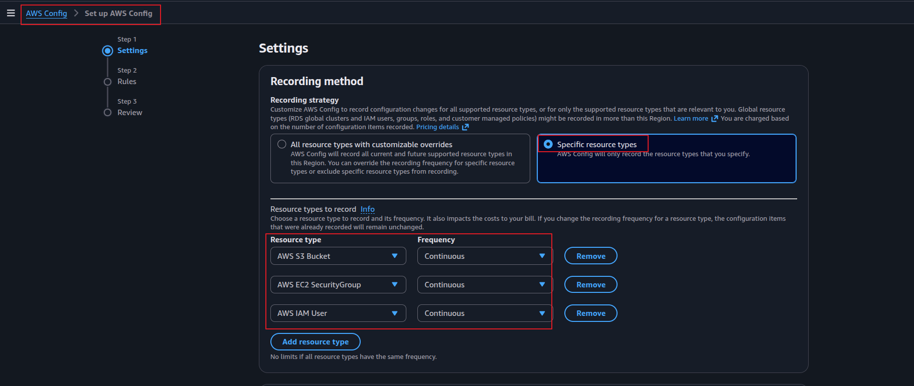

   - **Delivery channel**:
     - **S3 bucket**: select **Choose a bucket from your account** → `<your-bucket-name>`.
     - **SNS topic**: leave empty (we use EventBridge for routing, not SNS from Config directly).

      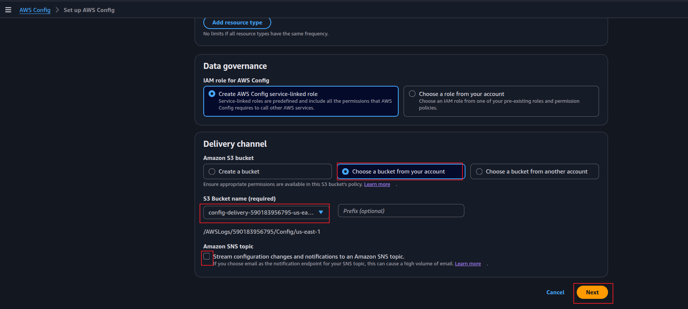
3. **Next** → **Save** (skip the rules page — we'll add rules in Step 4.4). 
    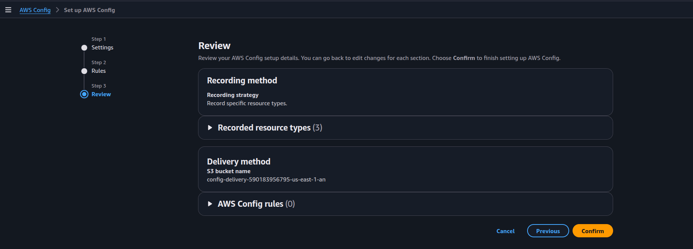

### 4.3 Verify Config is recording

1. Go to **AWS Config** → **Dashboard**.
2. You should see **Recording is on** and a count of resources being tracked.

### 4.4 Create Config Rules

#### Rule 1: `s3-bucket-versioning-enabled`

1. Go to **AWS Config** → **Rules** → **Add rule**.
2. **Rule type**: **AWS managed rule**.
3. Search for `s3-bucket-versioning-enabled` → select it → **Next**.
  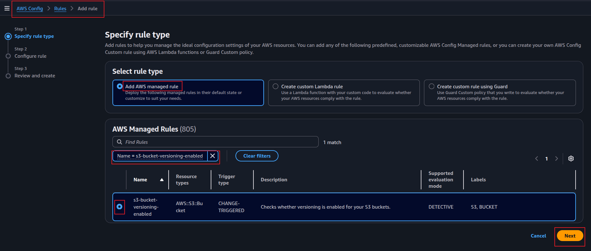
4. **Rule name**: leave as `s3-bucket-versioning-enabled`.
  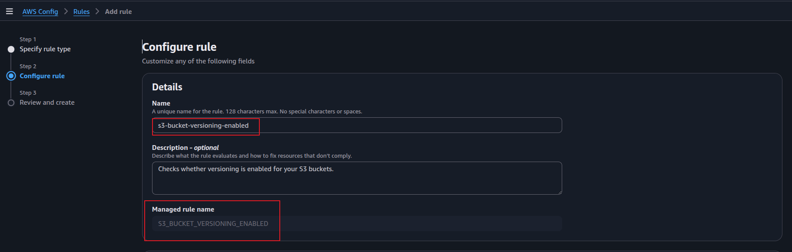
5. **Scope of changes**: **Resources** → **Resource type**: `AWS::S3::Bucket`.
  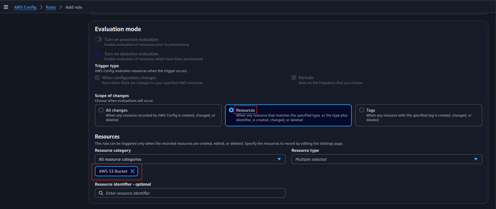
6. **Next** → **Save**.
  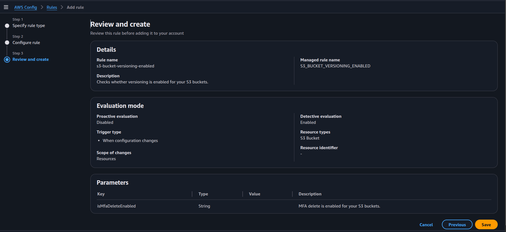

#### Rule 2: `s3-bucket-public-read-prohibited`

1. **Add rule** → search for `s3-bucket-public-read-prohibited` → select → **Next**.
2. **Rule name**: leave as `s3-bucket-public-read-prohibited`.
3. **Scope**: **Resources** → `AWS::S3::Bucket`.
4. **Next** → **Save**.

#### Rule 3: `restricted-ssh`

1. **Add rule** → search for `restricted-ssh` → select → **Next**.
2. **Rule name**: leave as `restricted-ssh`.
3. **Scope**: **Resources** → `AWS::EC2::SecurityGroup`.
4. **Next** → **Save**.

#### Rule 4: `root-account-mfa-enabled`

1. **Add rule** → search for `root-account-mfa-enabled` → select → **Next**.
2. **Rule name**: leave as `root-account-mfa-enabled`.
3. **Scope**: this rule evaluates the account itself — leave scope settings as default.
4. **Next** → **Save**.

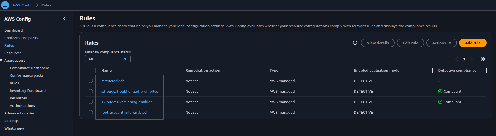

#### Verify initial evaluation

After saving each rule, Config runs an initial evaluation of all existing resources. This takes a few minutes.

1. Go to **AWS Config** → **Rules**.
2. Select each rule and verify its compliance status.
3. Any existing non-compliant resources will appear.

---

## Step 5: Create the EventBridge Rule

This rule listens for Config compliance change events and invokes the Lambda for every NON_COMPLIANT finding.

1. Go to **Amazon EventBridge** → **Rules** → **Create rule**.
2. **Name**: `config-noncompliant-to-lambda`.
3. **Event bus**: **default**.
  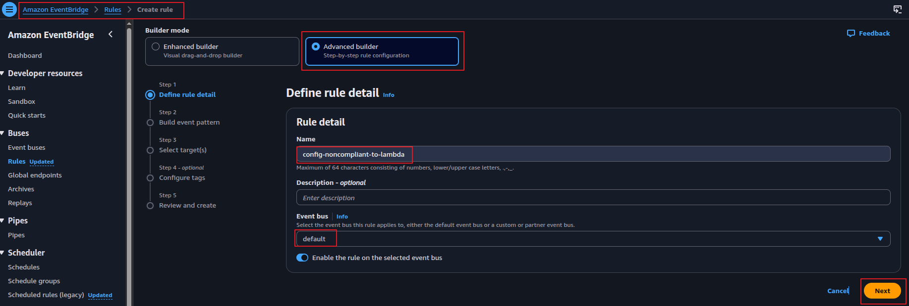
4. **Event source**: **AWS events or EventBridge partner events**.
  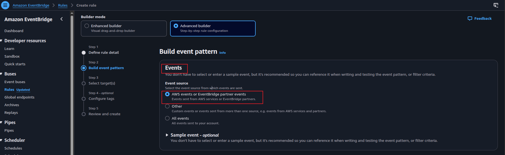
5. **Event pattern** — select **Custom pattern (JSON editor)** and paste:
6. The pattern should look like:
```json
{
  "source": ["aws.config"],
  "detail-type": ["Config Rules Compliance Change"],
  "detail": {
    "newEvaluationResult": {
      "complianceType": ["NON_COMPLIANT"]
    }
  }
}
```
  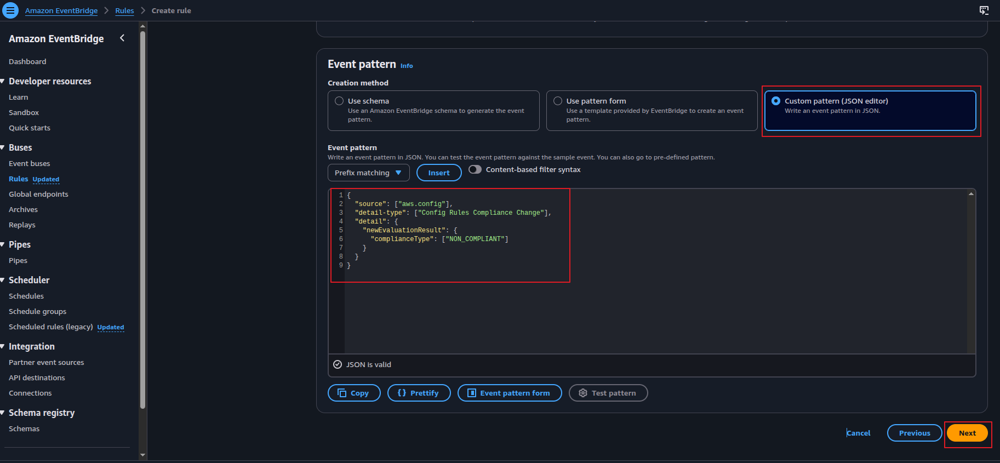
7. **Next**.
8. **Target**:
   - **Target types**: **AWS service**.
   - **Select a target**: **Lambda function**.
   - **Function**: `remediator-function`.
   - **Execution role**: **Create a new role for this specific resource** — EventBridge will auto-create a role with `lambda:InvokeFunction` scoped to this function.
   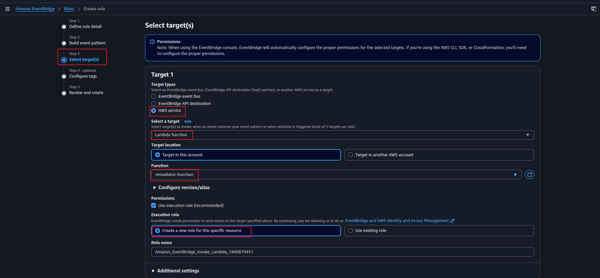
9. **Next** → Review 
  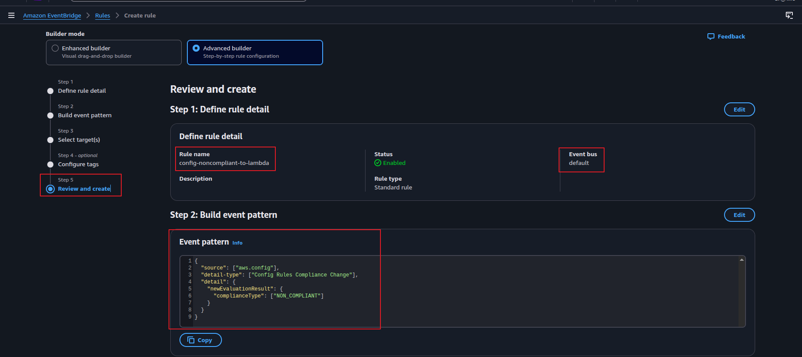
  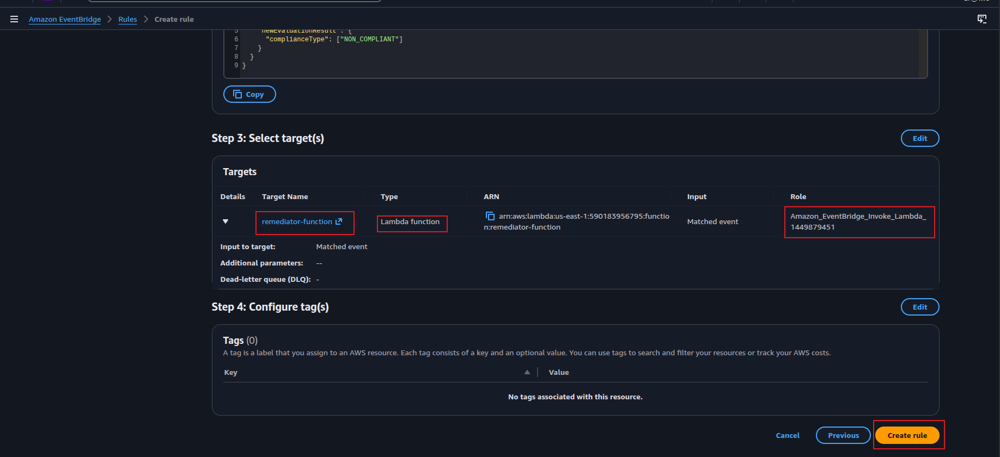
10. **Create rule**.
  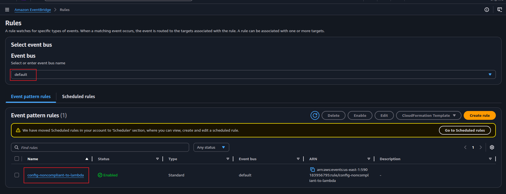


---

## Step 6: End-to-End Test

Now trigger real violations and watch the full pipeline fire.

### Test 1: S3 versioning violation

**Trigger the violation:**

1. Go to **S3** → create a new test bucket: `drift-test-bucket`.
2. Leave versioning disabled (the default).
  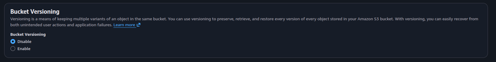

    After creation:
      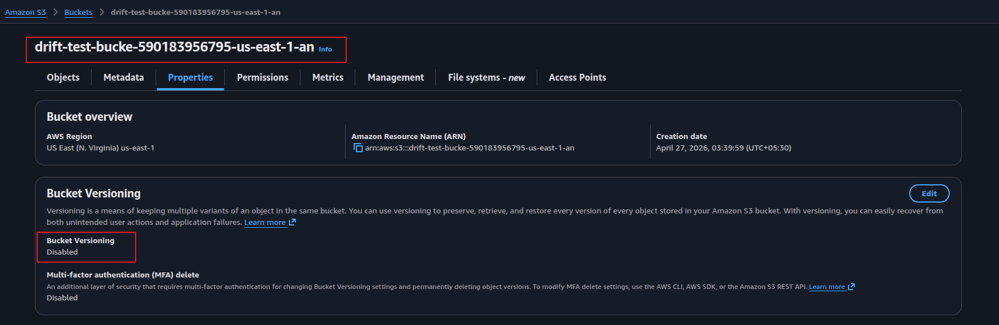
3. Wait 2–3 minutes for Config to detect the new bucket and evaluate it.

**Watch the pipeline:**

4. Go to **AWS Config** → **Rules** → `s3-bucket-versioning-enabled` → **Resources in scope**.
5. You should see `drift-test-bucket` listed as **Noncompliant**.
6. Go to **Lambda** → `remediator-function` → **Monitor** → **View CloudWatch logs**.
7. In the latest log stream, you should see:
   ```
   COMPLIANCE VIOLATION — AUTO-REMEDIATED
   Rule:     s3-bucket-versioning-enabled
   Resource: AWS::S3::Bucket / drift-test-bucket
   Action:   Versioning re-enabled on bucket 'drift-test-bucket'.
   ```
   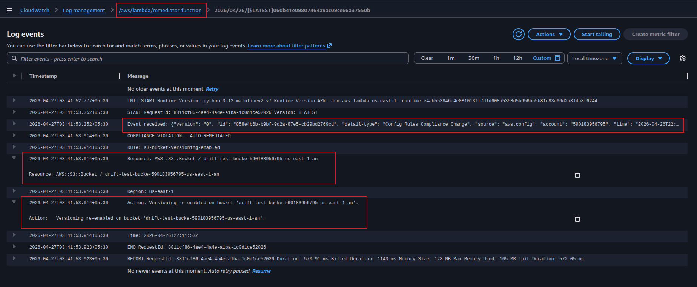
8. Check your email — you should have received the SNS notification.
    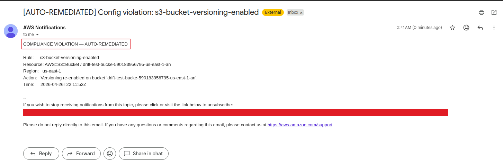
9. Go to **S3** → `drift-test-bucket` → **Properties** → **Bucket Versioning** — it should now show **Enabled**.
  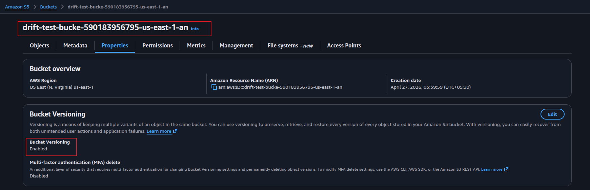
10. Check the compliance status in Config again — it should now be **Compliant**.
  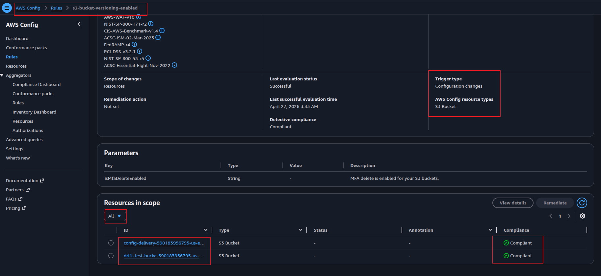

---

### Test 2: S3 public access violation

**Trigger the violation:**

1. Go to **S3** → `drift-test-bucket` → **Permissions** → **Block public access (bucket settings)** → **Edit**.
2. **Uncheck** all four checkboxes → **Save changes** → type `confirm` → **Confirm**.

**Watch the pipeline:**

3. Wait 2–3 minutes.
4. Check **CloudWatch logs** for `remediator-function` — you should see:
   ```
   COMPLIANCE VIOLATION — AUTO-REMEDIATED
   Rule:     s3-bucket-public-read-prohibited
   Resource: AWS::S3::Bucket / drift-test-bucket
   Action:   Public access block applied to bucket 'drift-test-bucket'.
   ```
5. Check your email for the SNS notification.
6. Go to **S3** → **Permissions** → **Block public access** — all four settings should be re-enabled.

---

### Test 3: Unrestricted SSH violation

**Trigger the violation:**

1. Go to **EC2** → **Security Groups** → **Create security group**.
2. **Security group name**: `drift-test-sg`.
3. **Description**: `Drift test`.
4. **VPC**: select your default VPC.
5. **Inbound rules** → **Add rule**:
   - **Type**: SSH
   - **Source**: Anywhere-IPv4 (`0.0.0.0/0`)
   
   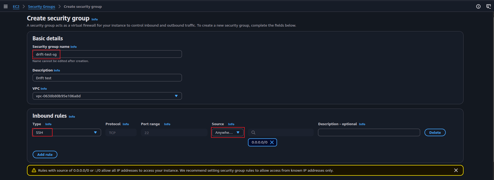
6. **Create security group**.
  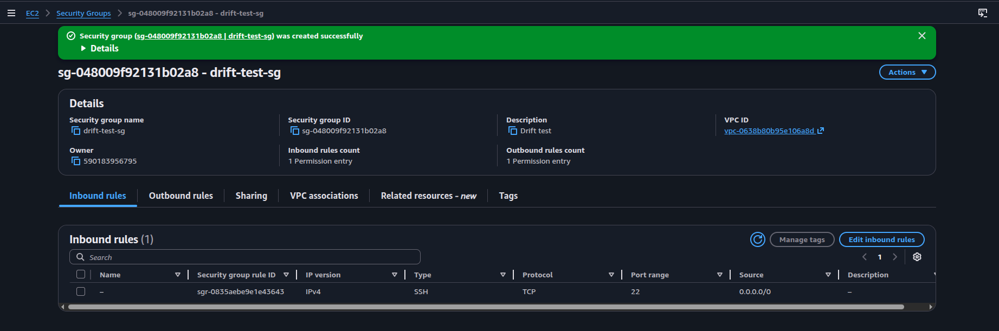

**Watch the pipeline:**

7. Wait 2–3 minutes for Config to detect and evaluate the new security group.
8. Check **CloudWatch logs** — you should see:
   ```
   COMPLIANCE VIOLATION — AUTO-REMEDIATED
   Rule:     restricted-ssh
   Resource: AWS::EC2::SecurityGroup / sg-xxxxxxxxxxxxxxxxx
   Action:   Revoked port 22 ingress from 0.0.0.0/0 on security group 'sg-xxxxxxxxxxxxxxxxx'.
   ```
   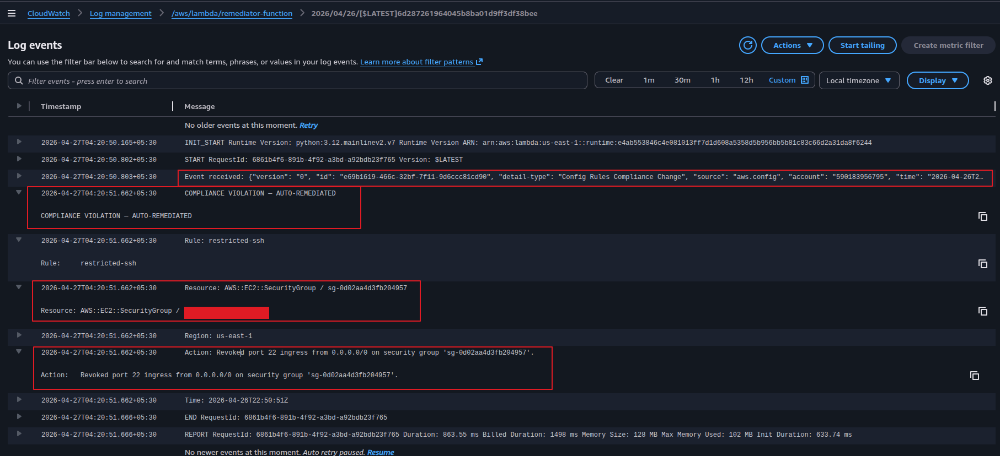
9. Check your email for the SNS notification.
  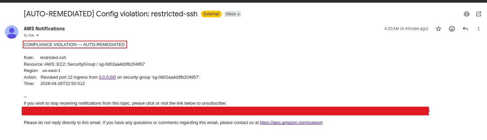
10. Go to **EC2** → **Security Groups** → `drift-test-sg` → **Inbound rules** — the SSH rule should be gone.
  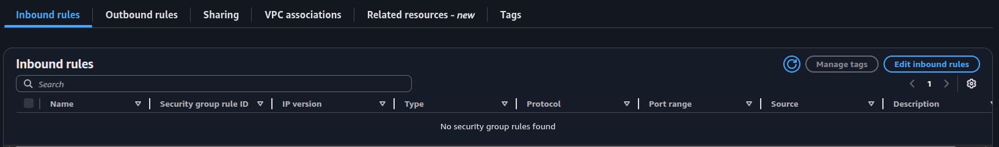

---

### Test 4: Root MFA alert (alert-only)

**Check current status:**

1. Go to **AWS Config** → **Rules** → `root-account-mfa-enabled`.
2. If your root account does not have MFA enabled, it will show as **Noncompliant**.
3. The Lambda will have published an SNS alert: `MANUAL ACTION REQUIRED`.
4. Check your email — you should see the alert with instructions to enable MFA manually.

> If your root account already has MFA enabled, this rule will show as **Compliant** — no event is emitted and no Lambda invocation occurs. This is correct behavior.

---

## Step 7: Verify the Audit Trail in CloudWatch

1. Go to **CloudWatch** → **Log groups** → `/aws/lambda/remediator-function`.
  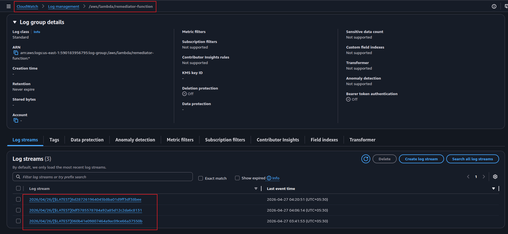
2. Open the log streams — each Lambda invocation has its own stream.
3. Each stream contains the full event received from EventBridge and the action taken.

This log group is your audit trail — it records every compliance violation and every remediation action with timestamps. For compliance frameworks, this is the evidence you present to auditors.


---

## Cleanup

Delete in this order to avoid dependency errors:

1. **EventBridge** → **Rules** → delete `config-noncompliant-to-lambda`
2. **Lambda** → delete `remediator-function`
3. **AWS Config** → **Rules** → delete all four rules
4. **AWS Config** → **Settings** → **Recording** → turn off the recorder
5. **S3** → empty and delete `drift-test-bucket-<your-account-id>`
6. **S3** → empty and delete `<your-bucket-name>`
7. **EC2** → **Security Groups** → delete `drift-test-sg`
8. **SNS** → delete `compliance-alerts` topic (this also removes the email subscription)
9. **CloudWatch** → delete log group `/aws/lambda/remediator-function`
10. **IAM** → delete `remediator-lambda-role`

> **Note on Config:** Disabling the Config recorder stops new recordings but does not delete existing configuration history. The history remains in the S3 delivery bucket until you empty and delete it.
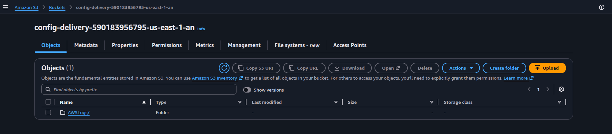
