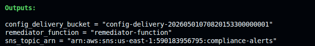
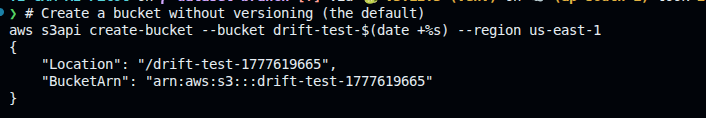
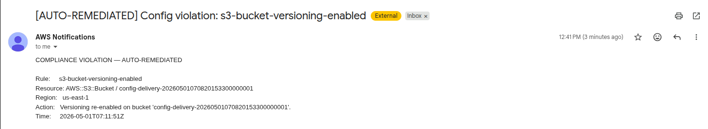

# 🚀 Deploying the Infra Drift Detection Pipeline with Terraform

This guide provisions the entire pipeline — SNS, Lambda, AWS Config recorder + four managed rules, EventBridge rule, and the S3 delivery bucket — with a single `terraform apply`.

---

## ✅ Prerequisites

- [AWS CLI](https://docs.aws.amazon.com/cli/latest/userguide/getting-started-install.html) installed and configured
- [Terraform](https://developer.hashicorp.com/terraform/install) installed
- An email address to receive compliance alerts

### Configure AWS CLI

```bash
aws configure
```

Provide your Access Key ID, Secret Access Key, region (e.g., `us-east-1`), and output format (`json`).

> **Note on AWS Config service-linked role:** The `AWSServiceRoleForConfig` role is created once per account and cannot be recreated. If it already exists (Config was ever enabled before), import it before applying:
> ```bash
> ACCOUNT_ID=$(aws sts get-caller-identity --query Account --output text)
> terraform import aws_iam_service_linked_role.config \
>   arn:aws:iam::${ACCOUNT_ID}:role/aws-service-role/config.amazonaws.com/AWSServiceRoleForConfig
> ```
> If Config recorder/channel already exist too:
> ```bash
> terraform import aws_config_configuration_recorder.main default
> terraform import aws_config_delivery_channel.main default
> terraform import aws_config_configuration_recorder_status.main default
> ```

---

## 📁 File Structure

```
terraform/
├── providers.tf          # AWS provider + Terraform version
├── variables.tf          # aws_region, alert_email
├── sns.tf                # compliance-alerts topic + email subscription
├── iam.tf                # remediator-lambda-role + Config service-linked role
├── config.tf             # S3 delivery bucket, Config recorder, 4 managed rules
├── lambda.tf             # remediator-function + EventBridge invoke permission
├── eventbridge.tf        # NON_COMPLIANT routing rule → Lambda
├── outputs.tf            # sns_topic_arn, config_delivery_bucket, remediator_function
├── terraform.tfvars.example
└── lambda/
    ├── remediator.py
    └── remediator.zip
```

---

## 🚀 Deployment Steps

### 1. Navigate to the Terraform directory

```bash
cd terraform
```

### 2. Set your variables

```bash
cp terraform.tfvars.example terraform.tfvars
```

Edit `terraform.tfvars`:

```hcl
aws_region  = "us-east-1"
alert_email = "your-email@example.com"
```

### 3. Initialize Terraform

```bash
terraform init
```

### 4. Plan

```bash
terraform plan
```

Review what will be created — SNS topic, Lambda, IAM role, S3 bucket, Config recorder + 4 rules, EventBridge rule.

### 5. Apply

```bash
terraform apply
```

Type `yes` when prompted. Takes ~30 seconds.

Outputs:
```
config_delivery_bucket = "config-delivery-<random>"
remediator_function    = "remediator-function"
sns_topic_arn          = "arn:aws:sns:us-east-1:<account>:compliance-alerts"
```



### 6. Confirm the SNS email subscription

After apply, AWS sends a confirmation email to your `alert_email`. **Click the confirmation link** — otherwise compliance alert emails won't be delivered.

---

## ✅ Testing the Pipeline

Config evaluates resources within a few minutes of a change. Each test below triggers a real violation and lets you watch the full pipeline fire.

### Test 1: S3 versioning violation

```bash
# Create a bucket without versioning (the default)
aws s3api create-bucket --bucket drift-test-$(date +%s) --region us-east-1
```



Wait 2–3 minutes. Config detects the new bucket, evaluates it as NON_COMPLIANT, EventBridge fires the Lambda, Lambda re-enables versioning and sends an SNS email.

Check CloudWatch logs:
```
COMPLIANCE VIOLATION — AUTO-REMEDIATED
Rule:     s3-bucket-versioning-enabled
Resource: AWS::S3::Bucket / drift-test-...
Action:   Versioning re-enabled on bucket 'drift-test-...'.
```

Check the Email alert:


### Test 2: S3 public access violation

```bash
aws s3api put-public-access-block \
  --bucket <your-test-bucket> \
  --public-access-block-configuration "BlockPublicAcls=false,IgnorePublicAcls=false,BlockPublicPolicy=false,RestrictPublicBuckets=false"
```

Lambda re-applies the full public access block automatically.

### Test 3: Unrestricted SSH

```bash
# Create a security group with port 22 open to the world
VPC_ID=$(aws ec2 describe-vpcs --filters Name=isDefault,Values=true --query 'Vpcs[0].VpcId' --output text)
SG_ID=$(aws ec2 create-security-group --group-name drift-test-sg --description "Drift test" --vpc-id $VPC_ID --query GroupId --output text)
aws ec2 authorize-security-group-ingress --group-id $SG_ID --protocol tcp --port 22 --cidr 0.0.0.0/0
echo "Security group: $SG_ID"
```

Wait 2–3 minutes. Lambda revokes the port 22 rule automatically.

### Verify each step

| What to check | Where |
|---|---|
| Config rule compliance | AWS Config → Rules → select rule → Resources in scope |
| Lambda invocation + action | CloudWatch → Log Groups → `/aws/lambda/remediator-function` |
| Email alert | Your inbox |
| S3 versioning restored | S3 → bucket → Properties → Bucket Versioning |
| SSH rule revoked | EC2 → Security Groups → drift-test-sg → Inbound rules |

---

## 🔥 Cleanup

```bash
terraform destroy --auto-approve
```

Then clean up the test resources created during testing:

```bash
# Delete test S3 bucket
aws s3 rb s3://drift-test-<suffix> --force

# Delete test security group
aws ec2 delete-security-group --group-id <sg-id>
```

Two things are **not** managed by Terraform and must be deleted manually:

- **CloudWatch Log Group** — go to CloudWatch → Log Groups → delete `/aws/lambda/remediator-function`
- **Config service-linked role** — only if you want to fully remove Config from the account; go to IAM → Roles → delete `AWSServiceRoleForConfig`
