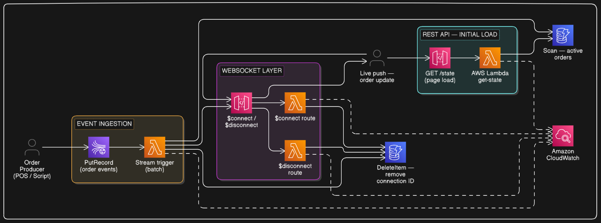

# 📊 Real-Time Streaming Dashboard

*Live data pipeline using Kinesis Data Streams, Lambda, DynamoDB, and WebSocket API Gateway*


---

## 🧩 Problem Statement

Most data systems are batch-oriented — you query a database and get data from minutes or hours ago. For use cases like live order tracking, IoT sensor monitoring, fraud detection, or operational dashboards, that's not good enough. You need data to appear on a screen **the moment it's generated**.

The real-world problems:

- **Polling is wasteful** — clients repeatedly asking "anything new?" generates millions of empty requests under load, and updates are always delayed by the poll interval
- **Direct DB writes don't scale** — under high event volume, writing every event directly to a database causes throttling and data loss
- **No push mechanism** — traditional REST APIs are request-response only; the server can't push data to clients without being asked
- **Traffic spikes drop events** — a sudden burst of events overwhelms downstream systems with no buffer to absorb the load

**The solution:** a streaming pipeline where events flow into Kinesis (absorbing any volume), Lambda processes them at a controlled rate, and WebSocket connections push updates to every connected client the moment new data arrives — no polling, no delay, no dropped events.

This pattern is used across industries — restaurant kitchen displays, live sports dashboards, IoT monitoring, e-commerce ops, fraud detection. The infrastructure is identical across all of them; only the event schema and business logic changes.

---

## 🎯 What We're Building

We implement this pattern as a **restaurant kitchen display system** — a concrete, easy-to-understand use case that demonstrates every part of the architecture.

A restaurant receives orders from multiple channels simultaneously. The kitchen needs to see every new order the moment it's placed, and track status as orders move through preparation. Without real-time streaming:

- Kitchen staff refresh a screen manually — orders are delayed or missed
- No visibility into which orders are being prepared vs waiting
- During lunch rush, a flood of simultaneous orders overwhelms a polling-based system

**Our pipeline:**

1. An **order producer** (simulated script) publishes order events to **Kinesis Data Streams**
2. **Lambda** is triggered by the Kinesis stream — processes each event and writes the latest order state to **DynamoDB**
3. Lambda pushes the update to all connected kitchen screens via **WebSocket API Gateway**
4. Kitchen screens connect once via WebSocket and receive live order updates instantly — new orders appear, statuses update, no refresh needed
5. On screen load, the kitchen fetches all current active orders via a **REST endpoint**

---

## 🏗️ Architecture



<!-- ```
Order Producer (POS / delivery app / script)
        │
        ▼
Kinesis Data Streams
        │  stream trigger (batch)
        ▼
Lambda — Stream Processor
   - Processes each order event
   - Writes/updates order state in DynamoDB
   - Pushes update to all connected kitchen screens
        │
        ├──────────────────────────────────┐
        ▼                                  ▼
    DynamoDB                    WebSocket API Gateway
  (active orders)                (connected screens)
        ▲                                  │
        │                                  ▼
REST API (GET /state)            Kitchen Display Screen
  (initial screen load)          (receives live pushes)
``` -->

---

## ✅ How Our Solution Solves the Problem

| Problem | Our Solution |
|---------|-------------|
| Kitchen misses orders — manual refresh | WebSocket push — every screen updates the moment an order is placed |
| Status updates are manual | Each status change is an event in Kinesis — pushed to all screens instantly |
| Lunch rush overwhelms the system | Kinesis buffers all incoming order events — Lambda processes at a controlled rate, nothing is lost |
| No push mechanism in REST | WebSocket API Gateway — persistent connection, server pushes without being asked |
| Screen loads slowly during rush | REST `GET /state` returns current snapshot instantly on load — WebSocket handles all updates after |

> 📖 For deep notes on Kinesis, WebSocket API Gateway, the streaming pattern, and how this scales to Hotstar-level traffic — see [`docs/concepts.md`](./docs/concepts.md)

---

## ☁️ AWS Services Used

| Service | Role |
|---------|------|
| **Kinesis Data Streams** | Ingests order events — buffers them, guarantees ordering per order ID |
| **Lambda (stream processor)** | Triggered by Kinesis — processes order events, updates DynamoDB, pushes to kitchen screens |
| **DynamoDB** | Stores active order state — queried on initial screen load |
| **WebSocket API Gateway** | Manages persistent kitchen screen connections — Lambda posts updates through it |
| **API Gateway (REST)** | `GET /state` endpoint — returns all active orders for initial screen load |
| **IAM** | Least-privilege roles — each Lambda gets only the permissions it needs |
| **CloudWatch** | Logs, metrics, and Kinesis iterator age monitoring |

---

## 🔄 Data Flow (Step by Step)

**New order placed:**

1. POS or delivery app publishes an order event to Kinesis
2. Kinesis buffers the record in the appropriate shard (partition key = `order_id`)
3. Lambda is triggered with a batch of records
4. Lambda processes each event — writes order state to DynamoDB (`PutItem` with `order_id` as key)
5. Lambda fetches all active WebSocket connection IDs from DynamoDB
6. Lambda posts the update to each connection via the API Gateway Management API
7. Every connected kitchen screen receives the new order instantly

**Order status update (e.g. NEW → PREPARING → READY):**

Same flow — producer sends a status update event, Lambda updates DynamoDB, pushes to all screens.

**Initial screen load:**

1. Screen opens WebSocket connection → connection ID stored in DynamoDB
2. Screen calls `GET /state` → Lambda scans DynamoDB for active orders → returns to screen
3. From this point, all new orders and status changes arrive via WebSocket push

**Screen disconnects:**

1. Screen closes or loses connection → `$disconnect` route fires
2. Lambda removes the connection ID from DynamoDB

---

## 📄 DynamoDB Tables

**`connections` table** — tracks active kitchen screen connections:
```json
{
  "connection_id": "abc123==",
  "connected_at": "2026-04-26T08:00:00Z"
}
```

**`stream-state` table** — stores current state of each active order:
```json
{
  "entity_id": "ORD-0042",
  "table_no": "T7",
  "items": ["Butter Chicken", "Naan x2", "Dal Makhani"],
  "status": "PREPARING",
  "placed_at": "2026-04-26T12:34:00Z",
  "last_updated": "2026-04-26T12:35:10Z"
}
```

---

## 🛡️ Design Decisions

| Decision | Reasoning |
|----------|-----------|
| Kinesis over SQS | Kinesis preserves event ordering per order ID (partition key) and supports multiple consumers. SQS deletes messages on consumption — no replay, no ordering guarantee |
| WebSocket over polling | Polling adds latency equal to the poll interval. During lunch rush, a 5-second poll means 5-second-old order data. WebSocket gives sub-second push |
| Store connection IDs in DynamoDB | Lambda is stateless — it needs a persistent store to know which screens are connected to push updates to |
| Lambda triggered by Kinesis | Decouples the POS from the kitchen display. Orders flow into Kinesis at any rate; Lambda processes at its own pace. Kinesis absorbs lunch rush spikes |
| Separate REST endpoint for initial load | WebSocket is for live updates only. A REST call on screen load gives the kitchen the current active orders before live updates begin |

---

## 🖥️ Frontend

A minimal single-file kitchen display (`frontend/dashboard.html`) that:

- Fetches all active orders on load via the REST endpoint
- Connects to WebSocket and receives live order pushes
- Displays orders in three columns: NEW → PREPARING → READY
- New orders animate in, status changes move cards between columns — no refresh
- Color-coded by status: yellow (NEW), blue (PREPARING), green (READY)
- Auto-reconnects if the WebSocket connection drops

Open the file, set `WS_URL` and `REST_URL` at the top of the script, then open in any browser. No build step, no dependencies.

---

## 🎬 Demo

<video src="./docs/assets/demo-video/realtime-streaming-demo-video.mp4" controls width="100%">
  Your browser does not support the video tag.
</video>

---

## 🚀 Deployment Options

- **Console** — follow [docs/console.md](./docs/console.md) for manual step-by-step setup
