# Deploying Using AWS Console

Complete step-by-step guide to manually set up the Real-Time Streaming Dashboard.

---

## Overview of What We'll Create

1. DynamoDB Tables — `connections` (WebSocket clients) and `stream-state` (latest data)
2. Kinesis Data Stream — event ingestion buffer
3. IAM Roles — one per Lambda (least privilege)
4. Lambda — `ws-connect` (save connection)
5. Lambda — `ws-disconnect` (remove connection)
6. Lambda — `stream-processor` (Kinesis trigger → DynamoDB + WebSocket push)
7. Lambda — `get-state` (REST endpoint for initial page load)
8. WebSocket API Gateway — manages persistent client connections
9. REST API Gateway — exposes `GET /state`
10. Wire Kinesis trigger to `stream-processor`
11. Producer script — simulates live event data
12. Frontend — `dashboard.html` kitchen order display

---

## Step 1: Create DynamoDB Tables

### 1.1 `connections` table

1. Go to **DynamoDB** → **Tables** → **Create table**.
2. Set:
   - **Table name**: `connections`
   - **Partition key**: `connection_id` (String)
3. **Table settings**: **Customize settings** → **Capacity mode**: **On-demand**.
4. **Create table**.

---

### 1.2 `stream-state` table

1. **Create table**.
2. Set:
   - **Table name**: `stream-state`
   - **Partition key**: `entity_id` (String)
3. **Capacity mode**: **On-demand**.
4. **Create table**.


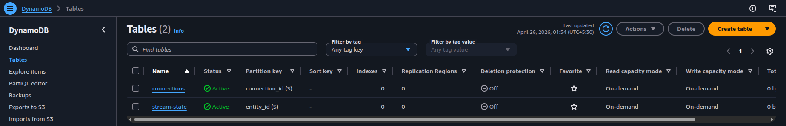

---

## Step 2: Create Kinesis Data Stream

1. Go to **Kinesis** → **Data streams** → **Create data stream**.
2. **Data stream name**: `dashboard-stream`.
3. **Capacity mode**: select **On-demand**.
4. **Create data stream**.

> **Why On-demand?** On-demand automatically scales shard capacity based on traffic — no need to pre-provision shards for a demo workload. For production with predictable throughput, Provisioned mode is more cost-effective.

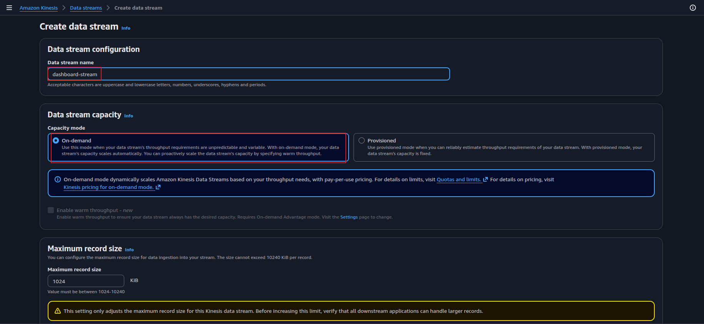

5. Once created, copy the **Stream ARN** — needed for the IAM policy.

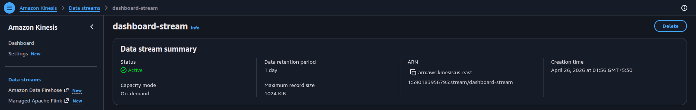

---

## Step 3: Create IAM Roles

### 3.1 Role: `stream-processor-role`

This role is for the `stream-processor` Lambda — it needs to read from Kinesis, read/write DynamoDB, and post to WebSocket connections.

1. Go to **IAM** → **Roles** → **Create role**.
2. **Trusted entity**: AWS service → **Lambda** → **Next**.
  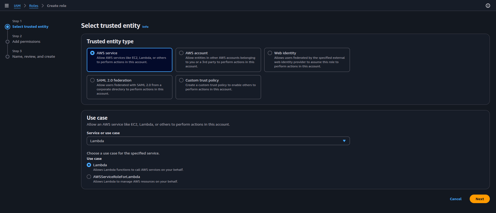
3. Attach managed policy: **AWSLambdaBasicExecutionRole** → **Next**.
  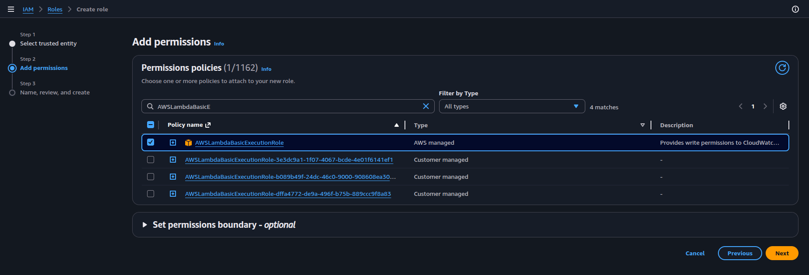
4. **Role name**: `stream-processor-role` → **Create role**.
5. Open the role → **Add permissions** → **Create inline policy** → **JSON** tab:

```json
{
  "Version": "2012-10-17",
  "Statement": [
    {
      "Sid": "ReadKinesis",
      "Effect": "Allow",
      "Action": [
        "kinesis:GetRecords",
        "kinesis:GetShardIterator",
        "kinesis:DescribeStream",
        "kinesis:ListShards"
      ],
      "Resource": "arn:aws:kinesis:<your-region>:<your-account-id>:stream/dashboard-stream"
    },
    {
      "Sid": "ListKinesisStreams",
      "Effect": "Allow",
      "Action": "kinesis:ListStreams",
      "Resource": "*"
    },
    {
      "Sid": "ReadWriteDynamoDB",
      "Effect": "Allow",
      "Action": [
        "dynamodb:PutItem",
        "dynamodb:Scan",
        "dynamodb:DeleteItem"
      ],
      "Resource": [
        "arn:aws:dynamodb:<your-region>:*:table/stream-state",
        "arn:aws:dynamodb:<your-region>:*:table/connections"
      ]
    },
    {
      "Sid": "PostToWebSocket",
      "Effect": "Allow",
      "Action": "execute-api:ManageConnections",
      "Resource": "arn:aws:execute-api:<your-region>:<your-account-id>:*/*/@connections/*"
    }
  ]
}
```

> Replace `<your-region>` and `<your-account-id>` with your actual values. The `execute-api:ManageConnections` permission is what allows Lambda to push messages to connected WebSocket clients.

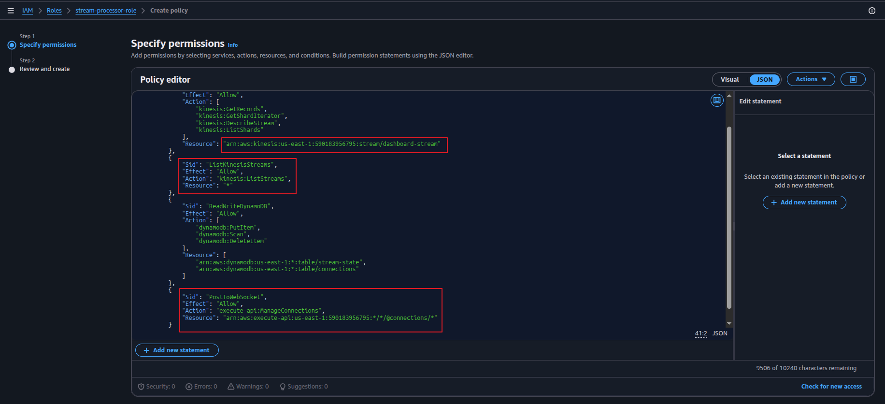

6. **Policy name**: `stream-processor-policy` → **Create policy**.

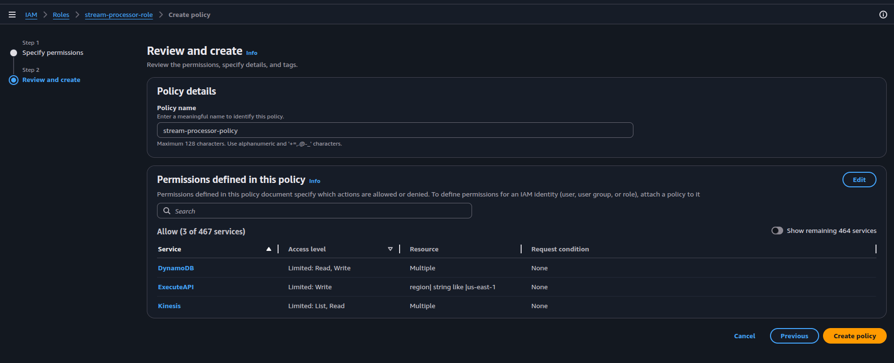

---

### 3.2 Role: `ws-connect-role`

1. **Create role** → Lambda → attach **AWSLambdaBasicExecutionRole** → **Next**.
2. **Role name**: `ws-connect-role` → **Create role**.
3. Add inline policy:

```json
{
  "Version": "2012-10-17",
  "Statement": [
    {
      "Sid": "SaveConnection",
      "Effect": "Allow",
      "Action": "dynamodb:PutItem",
      "Resource": "arn:aws:dynamodb:<your-region>:*:table/connections"
    }
  ]
}
```

4. **Policy name**: `ws-connect-policy` → **Create policy**.

---

### 3.3 Role: `ws-disconnect-role`

1. **Create role** → Lambda → attach **AWSLambdaBasicExecutionRole** → **Next**.
2. **Role name**: `ws-disconnect-role` → **Create role**.
3. Add inline policy:

```json
{
  "Version": "2012-10-17",
  "Statement": [
    {
      "Sid": "DeleteConnection",
      "Effect": "Allow",
      "Action": "dynamodb:DeleteItem",
      "Resource": "arn:aws:dynamodb:<your-region>:*:table/connections"
    }
  ]
}
```

4. **Policy name**: `ws-disconnect-policy` → **Create policy**.

---

### 3.4 Role: `get-state-role`

1. **Create role** → Lambda → attach **AWSLambdaBasicExecutionRole** → **Next**.
2. **Role name**: `get-state-role` → **Create role**.
3. Add inline policy:

```json
{
  "Version": "2012-10-17",
  "Statement": [
    {
      "Sid": "ReadState",
      "Effect": "Allow",
      "Action": "dynamodb:Scan",
      "Resource": "arn:aws:dynamodb:<your-region>:*:table/stream-state"
    }
  ]
}
```

4. **Policy name**: `get-state-policy` → **Create policy**.

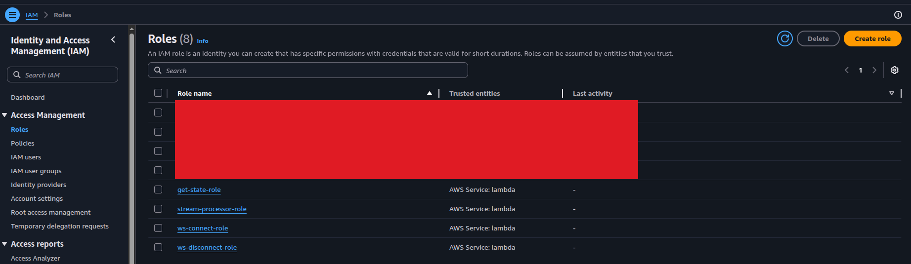

---

## Step 4: Create Lambda Functions

### 4.1 `ws-connect` Lambda

> **Purpose:** Fires when a browser opens a WebSocket connection. Saves the connection ID to DynamoDB so `stream-processor` knows who to push updates to.

1. Go to **Lambda** → **Create function** → **Author from scratch**.
2. **Function name**: `ws-connect` → **Runtime**: Python 3.12 → **Role**: `ws-connect-role`.
  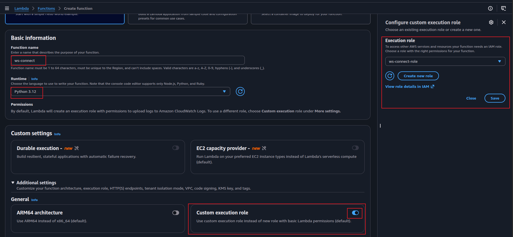
3. **Create function**. Replace code:

```python
import boto3
import json
from datetime import datetime, timezone

dynamodb = boto3.resource('dynamodb')
table = dynamodb.Table('connections')

def lambda_handler(event, context):
    connection_id = event['requestContext']['connectionId']
    table.put_item(Item={
        'connection_id': connection_id,
        'connected_at': datetime.now(timezone.utc).isoformat()
    })
    return {'statusCode': 200}
```

4. **Deploy**.

---

### 4.2 `ws-disconnect` Lambda

> **Purpose:** Fires when a browser closes the WebSocket connection. Removes the connection ID from DynamoDB.

1. **Create function** → `ws-disconnect` → Python 3.12 → `ws-disconnect-role`.
2. Replace code:

```python
import boto3

dynamodb = boto3.resource('dynamodb')
table = dynamodb.Table('connections')

def lambda_handler(event, context):
    connection_id = event['requestContext']['connectionId']
    table.delete_item(Key={'connection_id': connection_id})
    return {'statusCode': 200}
```

3. **Deploy**.

---

### 4.3 `stream-processor` Lambda

> **Purpose:** Triggered by Kinesis. Processes each event batch, writes latest state to DynamoDB, then pushes the update to every connected WebSocket client. Handles stale connections automatically.

1. **Create function** → `stream-processor` → Python 3.12 → `stream-processor-role`.
2. Replace code:

```python
import boto3
import json
import base64
import os
from datetime import datetime, timezone

dynamodb = boto3.resource('dynamodb')
state_table = dynamodb.Table('stream-state')
connections_table = dynamodb.Table('connections')

def lambda_handler(event, context):
    latest = None

    # Process all records in the batch — keep only the last state
    for record in event['Records']:
        payload = json.loads(
            base64.b64decode(record['kinesis']['data']).decode('utf-8')
        )
        latest = payload

    if not latest:
        return

    # Write latest state to DynamoDB (overwrites previous)
    latest['last_updated'] = datetime.now(timezone.utc).isoformat()
    state_table.put_item(Item=latest)

    # Push to all connected WebSocket clients
    api_id = os.environ['WEBSOCKET_API_ID']
    stage = os.environ['WEBSOCKET_STAGE']
    region = os.environ['AWS_REGION'] # Lambda provides this by default in the environment

    apigw = boto3.client(
        'apigatewaymanagementapi',
        endpoint_url=f"https://{api_id}.execute-api.{region}.amazonaws.com/{stage}"
    )

    connections = connections_table.scan().get('Items', [])
    message = json.dumps(latest).encode('utf-8')

    for conn in connections:
        conn_id = conn['connection_id']
        try:
            apigw.post_to_connection(ConnectionId=conn_id, Data=message)
        except apigw.exceptions.GoneException:
            # Client disconnected without $disconnect firing — clean up
            connections_table.delete_item(Key={'connection_id': conn_id})
```

3. **Deploy**.
4. Go to **Configuration** → **Environment variables** → **Edit** → Add:
   - `WEBSOCKET_API_ID` — fill in after creating the WebSocket API in Step 8
   - `WEBSOCKET_STAGE` — `production`

   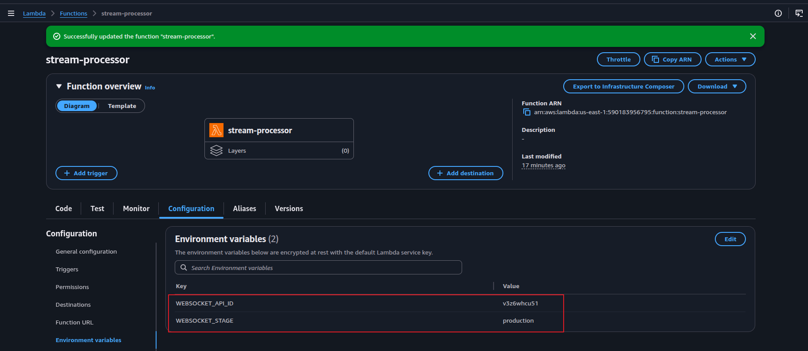
5. Go to **Configuration** → **General configuration** → **Edit** → **Timeout**: `1 min` → **Save**.
  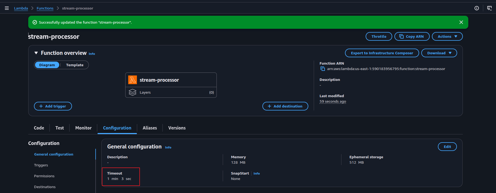

---

### 4.4 `get-state` Lambda

> **Purpose:** Called by the browser on initial page load via REST API. Returns the current state from DynamoDB so the dashboard has data before the first WebSocket push arrives.

1. **Create function** → `get-state` → Python 3.12 → `get-state-role`.
2. Replace code:

```python
import boto3
import json

dynamodb = boto3.resource('dynamodb')
table = dynamodb.Table('stream-state')

def lambda_handler(event, context):
    response = table.scan()
    items = response.get('Items', [])
    return {
        'statusCode': 200,
        'headers': {'Access-Control-Allow-Origin': '*'},
        'body': json.dumps(items, default=str)
    }
```

3. **Deploy**.

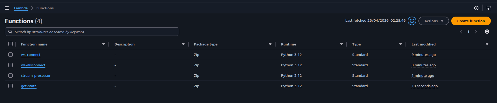

---

## Step 5: Create WebSocket API Gateway

1. Go to **API Gateway** → **Create API** → **WebSocket API** → **Build**.
2. **API name**: `dashboard-ws`.
3. **Route selection expression**: `$request.body.action`.
   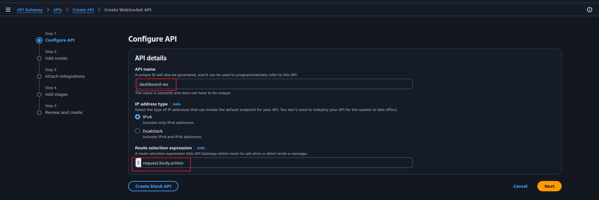
4. Click **Next** → **Add routes**:
   - Click **Add `$connect` route**
   - Click **Add `$disconnect` route**
   - Do **not** add `$default` — the kitchen screen only receives pushes, it never sends messages to the server
   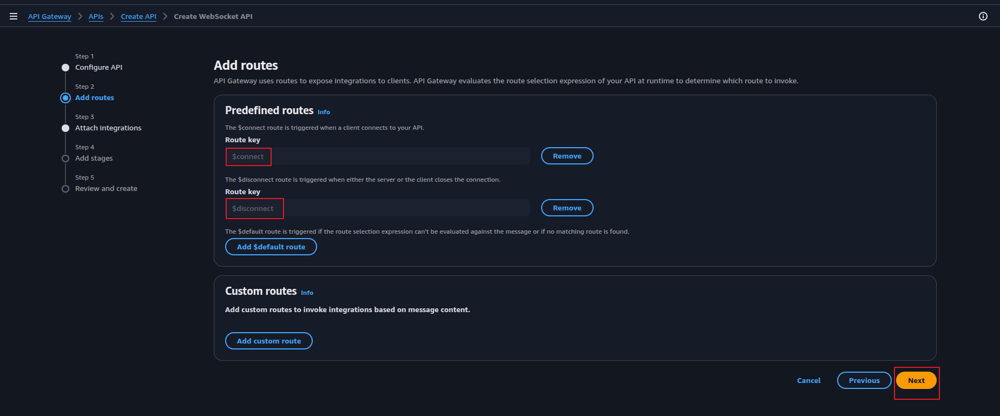
5. Click **Next** → **Attach integrations**:
   - For `$connect` → **Create and attach an integration** → Integration type: Lambda → select `ws-connect`
   - For `$disconnect` → **Create and attach an integration** → Integration type: Lambda → select `ws-disconnect`
   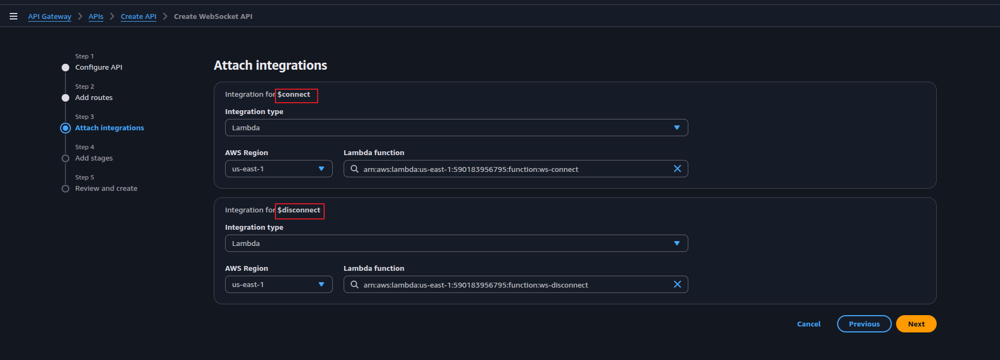
6. Click **Next** → **Next** → **Stage name**: `production` → **Create and deploy**.
   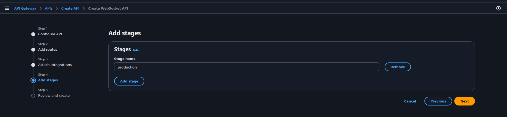
   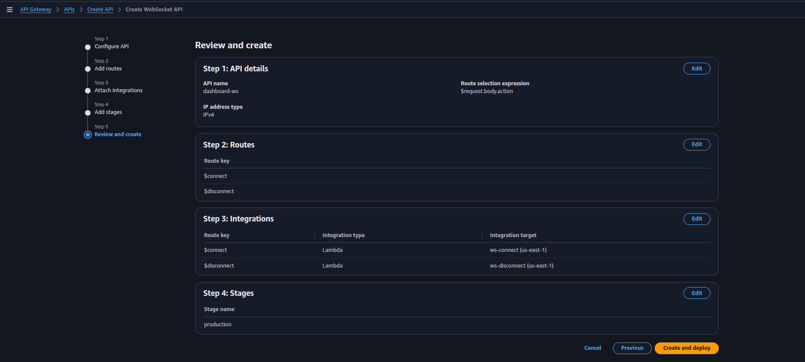
7. From the API settings, copy:
   - **API ID** (e.g., `abc123xyz`) → this is your `WEBSOCKET_API_ID`
   - **WebSocket URL** (e.g., `wss://abc123xyz.execute-api.us-east-1.amazonaws.com/production`)
   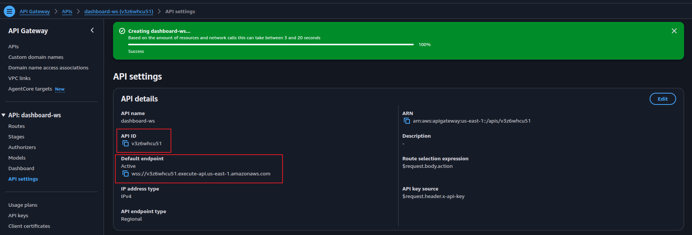

8. Go back to the `stream-processor` Lambda → **Configuration** → **Environment variables** → set `WEBSOCKET_API_ID` to the API ID you just copied.

---

## Step 6: Create REST API Gateway

1. Go to **API Gateway** → **Create API** → **HTTP API** → **Build**.
2. **API name**: `dashboard-rest`.
3. **Add integration** → Lambda → `get-state`.
  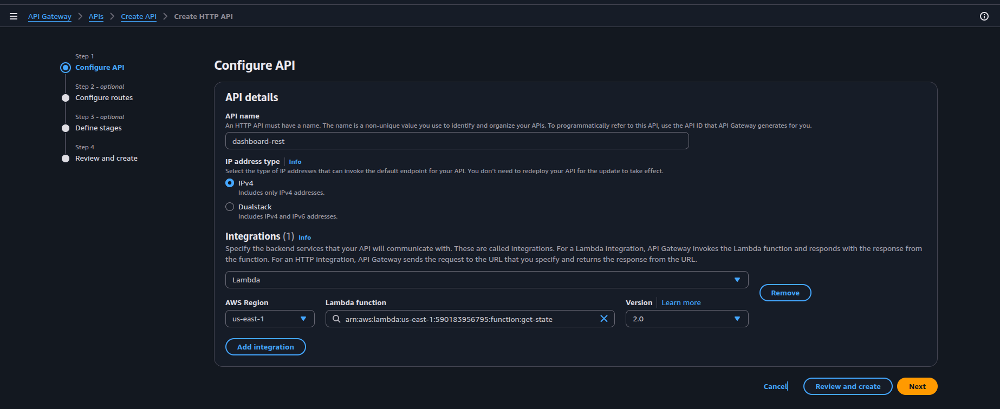
4. **Configure routes**:
    - **Method**: `GET`
    - **Resource path**: `/state`
    - **Integration target**: `get-state`
  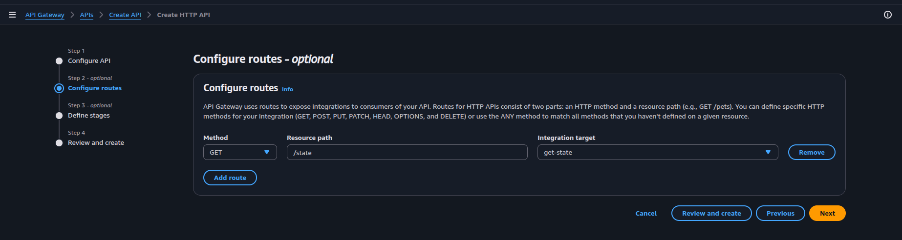
5. **Stage**: `$default`, **Auto-deploy** enabled → **Create**.
  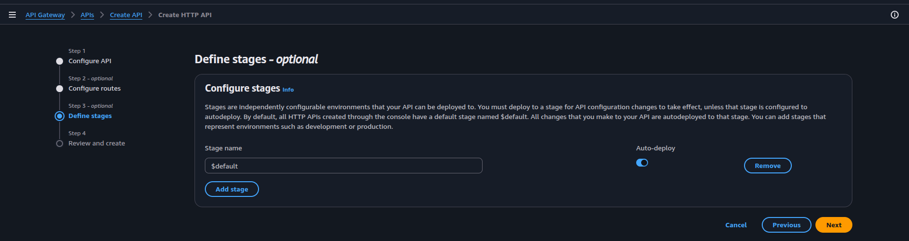
  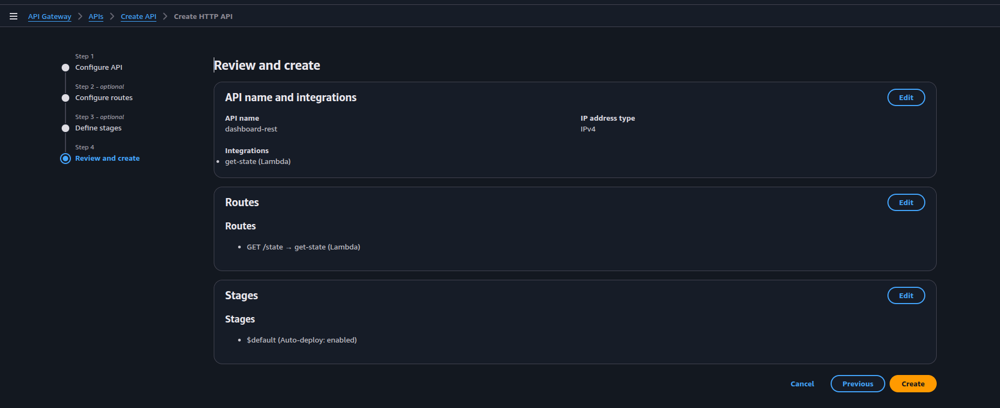
6. Copy the **Invoke URL** — used in the producer script and browser client.
  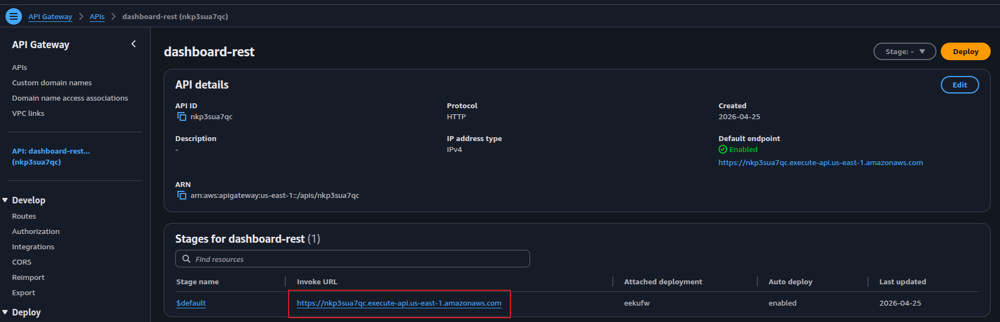

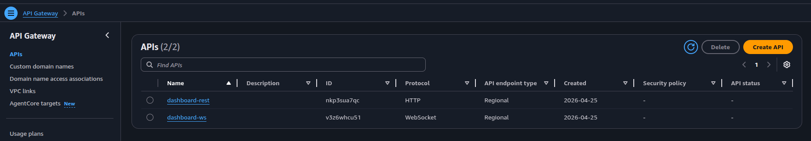

---

## Step 7: Add Kinesis Trigger to `stream-processor`

1. Open `stream-processor` Lambda → **Configuration** → **Triggers** → **Add trigger**.
2. **Trigger source**: Kinesis.
3. **Kinesis stream**: `dashboard-stream`.
4. **Batch size**: `10` — Lambda receives up to 10 records per invocation.
5. **Starting position**: **Latest** — process only new records, not historical.
  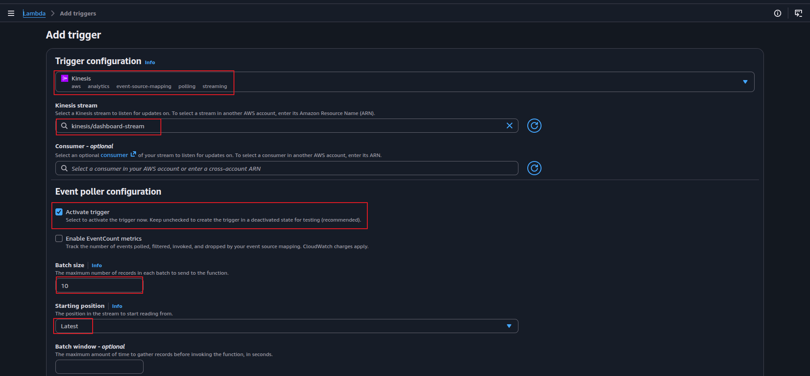
6. **Enable trigger** → **Add**.
  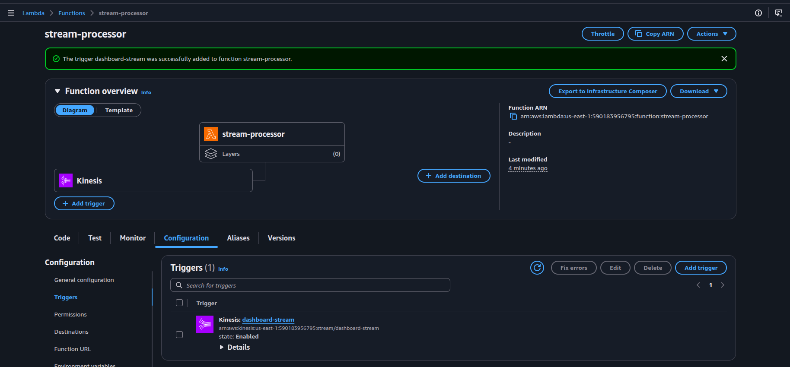

---

## Step 8: Run the Producer Script

The producer simulates a restaurant POS — new orders arriving and their status updating as the kitchen works through them.

Save this as `producer.py` locally and run it:

```python
import boto3
import json
import time
import random
import uuid
from datetime import datetime, timezone

kinesis = boto3.client('kinesis', region_name='<your-region>')
STREAM_NAME = 'dashboard-stream'

MENU_ITEMS = [
    'Butter Chicken', 'Naan', 'Dal Makhani', 'Paneer Tikka',
    'Biryani', 'Garlic Bread', 'Lassi', 'Gulab Jamun'
]

STATUSES = ['NEW', 'PREPARING', 'READY']

active_orders = {}

def send_event(order):
    kinesis.put_record(
        StreamName=STREAM_NAME,
        Data=json.dumps(order),
        PartitionKey=order['entity_id']  # same order always goes to same shard
    )
    print(f"Sent: {order['entity_id']} | Table {order['table_no']} | {order['status']}")

print("Kitchen producer started...")

for i in range(20):
    # Every iteration: place a new order
    order_id = f"ORD-{str(uuid.uuid4())[:6].upper()}"
    order = {
        'entity_id': order_id,
        'table_no': f"T{random.randint(1, 12)}",
        'items': random.sample(MENU_ITEMS, random.randint(1, 3)),
        'status': 'NEW',
        'placed_at': datetime.now(timezone.utc).isoformat(),
        'last_updated': datetime.now(timezone.utc).isoformat()
    }
    active_orders[order_id] = order
    send_event(order)
    time.sleep(3)

    # Randomly advance some existing orders through statuses
    for oid, o in list(active_orders.items()):
        current_idx = STATUSES.index(o['status'])
        if current_idx < len(STATUSES) - 1 and random.random() > 0.4:
            o['status'] = STATUSES[current_idx + 1]
            o['last_updated'] = datetime.now(timezone.utc).isoformat()
            send_event(o)
            if o['status'] == 'READY':
                del active_orders[oid]  # remove from active once ready

print("Producer finished.")
```

Update the `region_name` in the `boto3.client` call to match your AWS region. This script will run for about a minute, placing new orders every 3 seconds and randomly updating existing orders' statuses.

Run it:
```bash
pip install boto3
python producer.py
```

---

## Step 9: Test the Full Flow

### 9.1 Verify Kinesis is receiving events

1. Go to **Kinesis** → `dashboard-stream` → **Monitoring** tab.
2. You should see **Put records** metrics rising as the producer runs.

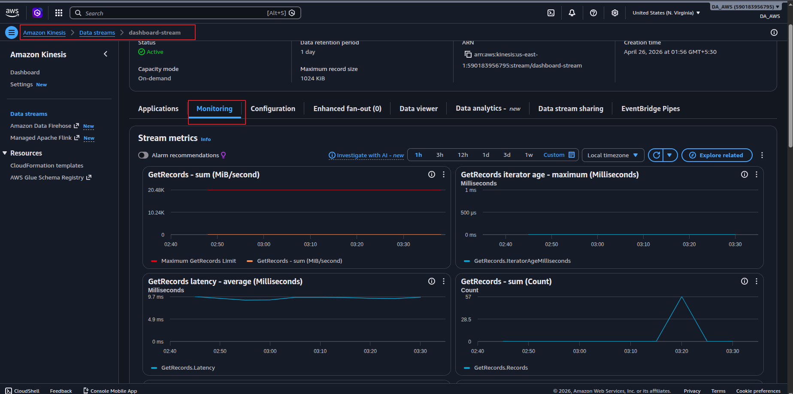

---

### 9.2 Verify Lambda is processing

1. Go to **Lambda** → `stream-processor` → **Monitor** → **View CloudWatch logs**.
2. You should see invocations appearing as Kinesis delivers batches.

---

### 9.3 Verify DynamoDB state is updating

1. Go to **DynamoDB** → `stream-state` → **Explore table items**.
2. You should see order items appearing with `status: NEW`, then updating to `PREPARING` and `READY` as the producer runs.

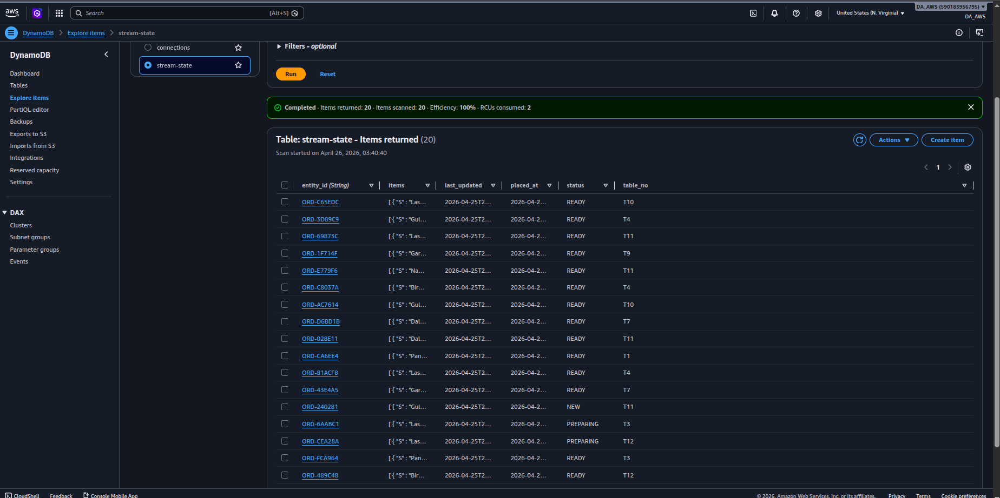

---

### 9.4 Open the Live Kitchen Dashboard

1. Open `frontend/dashboard.html` in a text editor.
2. At the top of the `<script>` block, replace the two config values:
   ```javascript
   const WS_URL   = 'wss://<your-api-id>.execute-api.<region>.amazonaws.com/production';
   const REST_URL = 'https://<your-rest-invoke-url>/state';
   ```

   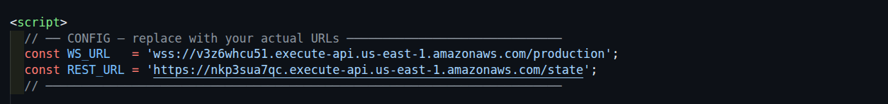

3. Save the file and open it in your browser.
    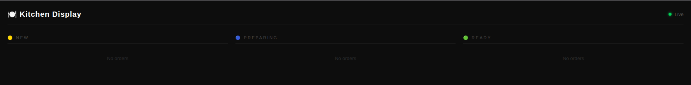

4. Check the connection in the AWS Dynamodb `connections` table — a new item should appear when you open the dashboard, and disappear when you close it.
    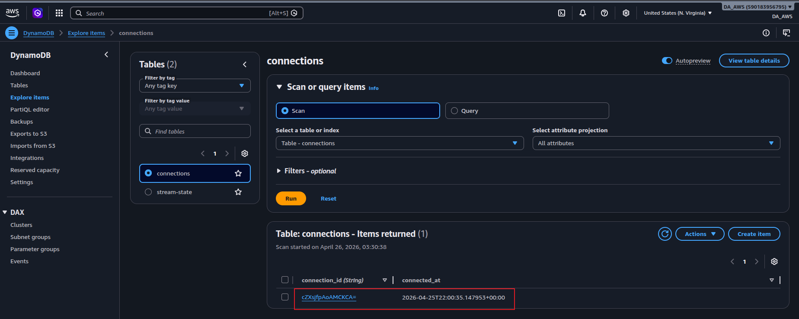

4. The dashboard loads all current active orders from the REST endpoint immediately.

5. Start the producer script — new orders appear in the NEW column, then move to PREPARING and READY as the producer advances their status. All updates happen live with no refresh.

The status indicator turns green and shows **Live** when the WebSocket connection is active. If the connection drops, it automatically reconnects every 3 seconds.

---

### 9.5 Test initial state REST endpoint

```bash
curl https://<rest-invoke-url>/state | python3 -m json.tool
```

Expected:
```json
[
  {
    "entity_id": "ORD-A3F9C1",
    "table_no": "T7",
    "items": ["Butter Chicken", "Naan", "Dal Makhani"],
    "status": "PREPARING",
    "placed_at": "2026-04-26T...",
    "last_updated": "2026-04-26T..."
  }
]
```

---

## Demo Video

https://github.com/user-attachments/assets/dc9b8d95-fe6a-4d7f-9783-b092786a6b48

---

## Cleanup

Delete in this order:

1. **API Gateway** → delete `dashboard-ws` and `dashboard-rest`
2. **Lambda** → delete `ws-connect`, `ws-disconnect`, `stream-processor`, `get-state`
3. **Kinesis** → delete `dashboard-stream`
4. **DynamoDB** → delete `connections` and `stream-state` tables
5. **CloudWatch** → delete log groups for all four Lambdas
6. **IAM** → delete all four roles
