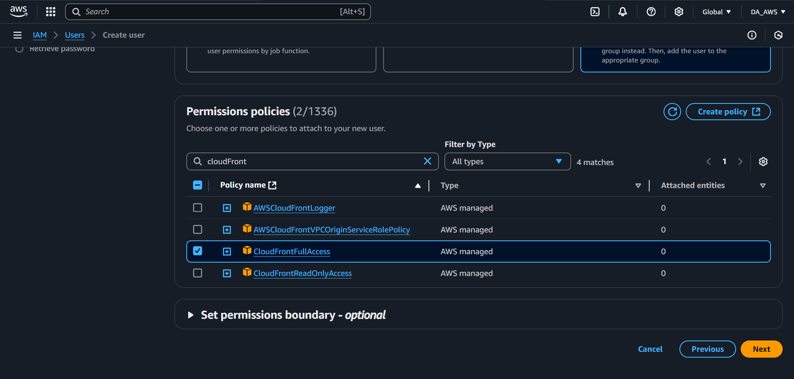
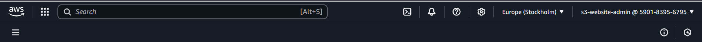
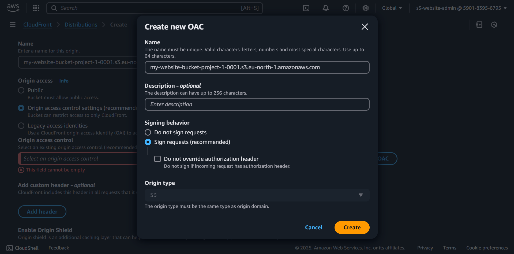
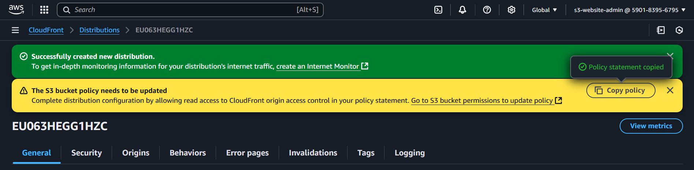
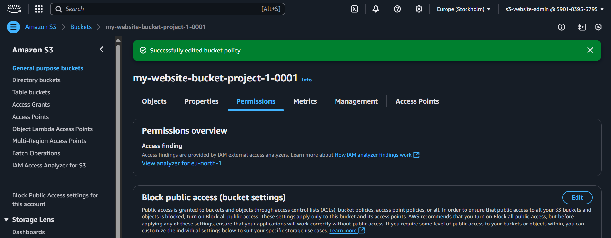
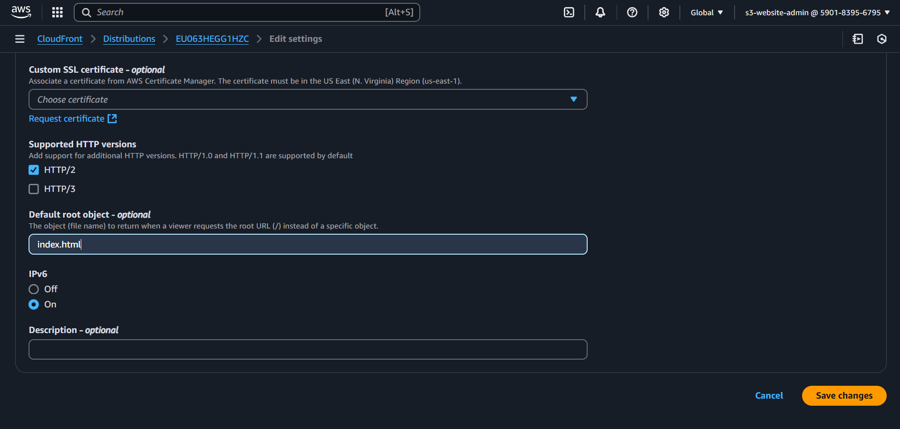

# Deploying using AWS Console

## Implementation Steps
### Step 1: Create IAM User & Role
1. Sign in to the **AWS Management Console**.
2. Navigate to **IAM (Identity and Access Management)**.
3. Click **Users** → **Add User**.
4. Set the user name (e.g., `s3-website-admin`).
5. Choose **Programmatic Access**.
   
6. Attach the following policies:
   - `AmazonS3FullAccess`
   - `CloudFrontFullAccess`
   - `AWSWAFFullAccess`
   
   
   
   
7. Click **Create User** and note down the Access Key ID and Secret Access Key.
   
8. **Log in with this IAM user** to continue the setup.
   

### Step 2: Create an S3 Bucket & Upload Website Files
1. Go to the **S3 Console**.
2. Click **Create Bucket**.
3. Enter a unique **bucket name** (e.g., `my-static-website-project-1-0001`).
4. **Keep Block Public Access enabled** to ensure the bucket remains private.
5. Click **Create Bucket**.
   
6. Upload the website files (HTML, CSS, JS) to the bucket.
   

### Step 3: Set Up a CloudFront Distribution
1. Navigate to **CloudFront Console**.
2. Click **Create Distribution**.
3. Under **Origin**, select the **S3 bucket** (not the static website endpoint).
   
4. Under **Origin access**, select **Origin access control settings (recommended)**.
   - Click **Create Control Setting**, name it **S3-OAC**, and save.

   
   
   - **Note:** S3-OAC (Origin Access Control) ensures that only CloudFront can access the S3 bucket, keeping it private and secure. This eliminates the need to make S3 objects publicly accessible while still allowing seamless content delivery.
5. Scroll down to **Settings** and select **Firewall Protection**.
6. Click **Create Distribution** and wait for it to deploy.
   

### Step 4: Allow CloudFront to Access S3
1. Copy the **S3 Buck Policy**
2. And just paste it:  
   Example:
   ```json
   {
      "Version": "2008-10-17",
      "Id": "PolicyForCloudFrontPrivateContent",
      "Statement": [
         {
            "Sid": "AllowCloudFrontServicePrincipal",
            "Effect": "Allow",
            "Principal": {
            "Service": "cloudfront.amazonaws.com"
            },
            "Action": "s3:GetObject",
            "Resource": "arn:aws:s3:::my-website-bucket-project-1-0001/*",
            "Condition": {
            "StringEquals": {
               "AWS:SourceArn": "arn:aws:cloudfront::AWS_ACCOUNT_ID:distribution/CLOUDFRONT_DISTRIBUTION_ID"
               }
            }
         }
      ]
   }
   ```
   
3. Click **Save Changes**.
   

### Step 5: Configure CloudFront to Serve index.html
1. In the **CloudFront Console**, go to the **Distributions** list.
2. Click on your **Distribution ID**.
3. Navigate to the **General** tab.
4. Scroll to **Settings** -> Click **Edit**.
5. In the **Default Root Object** field, enter `index.html`.
   
6. Click **Save Changes**.
   

### Step 6: Test the Website
- Open the **CloudFront Distribution Domain Name** in a browser to verify the website loads correctly.
   

## Cleanup: Delete All Resources to Avoid Charges
1. **Delete CloudFront Distribution**: 
   - Disable the distribution.
   - Wait for status to change to **Disabled**, then delete it.
2. **Delete S3 Bucket**:
   - Empty the bucket.
   - Delete the bucket.
3. **Remove IAM User**:
   - Go to IAM and delete the user.

By following these steps, you can securely host a static website on AWS using CloudFront while keeping the S3 bucket private. 🚀
