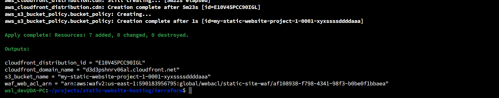

# 🚀 Static Website Deployment on AWS using Terraform

This project automates the deployment of a **secure and scalable static website** hosted on **AWS S3**, delivered via **CloudFront CDN**, and protected using **AWS WAF** — all provisioned using **Terraform**.

## ✅ Prerequisites

Ensure you have the following installed **before proceeding**:

- 📦 [Install AWS CLI](https://docs.aws.amazon.com/cli/latest/userguide/getting-started-install.html)
- 🛠️ [Install Terraform](https://developer.hashicorp.com/terraform/install)

### Configure AWS CLI with your credentials

```bash
aws configure
```

Provide:

- **AWS Access Key ID**
- **AWS Secret Access Key**
- **Default region name** (e.g., `us-east-1`)
- **Default output format** (e.g., `json`)


## 🚀 Deployment Steps

Navigate to the Terraform directory:

```bash
cd terraform
```

### 1. Initialize Terraform

```bash
terraform init
```

This sets up the backend and downloads the required providers.

---

### 2. Set Variables (Optional)

You can customize values in `terraform/variables.tf` or create a `terraform.tfvars` file to override them.

---

### 3. Plan Infrastructure

```bash
terraform plan
```

This shows the execution plan without applying any changes.

---

### 4. Apply and Deploy

```bash
terraform apply
```

Review the plan and confirm with `yes` when prompted.



---

### 5. Upload Static Files to S3

After Terraform provisions resources, use the provided script to upload your static website files:

```bash
sh ./upload_to_s3.sh <bucket-name>
```

Replace `<bucket-name>` with the actual name used (check the `outputs.tf` or `terraform apply` output).


## 🔍 Verifying the Deployment

- Open the **CloudFront domain name** (output from `terraform apply`) in your browser.
- You should see your deployed static site.

To retrieve outputs again:

```bash
terraform output
```

Copy the CDN domain and open it in your browser.


## Clean Up Resources

To destroy all provisioned AWS resources:

```bash
terraform destroy --auto-approve
```

---

Happy Deploying! 🌐🚀

