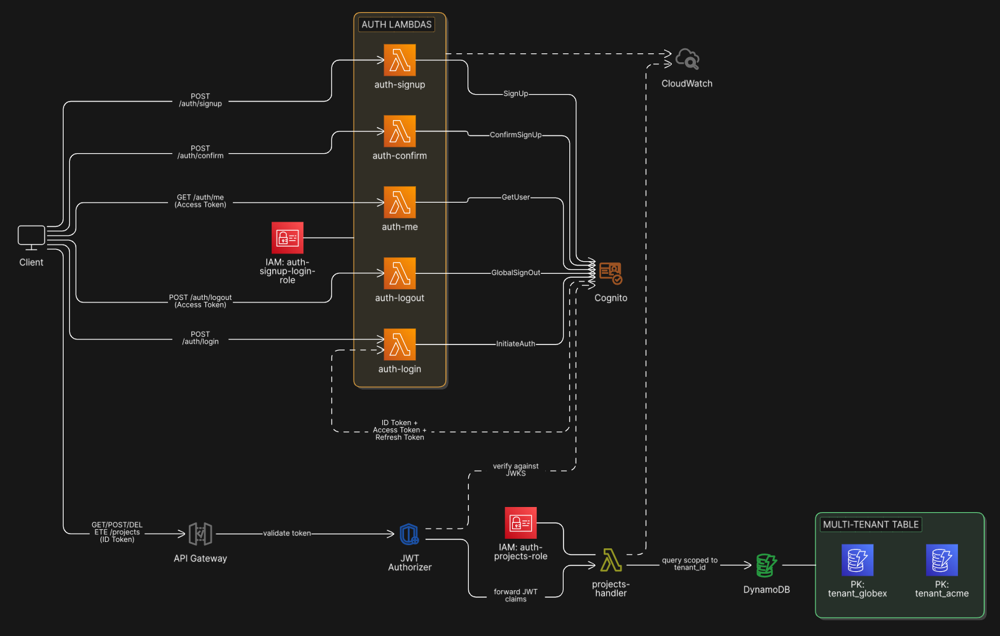

# 🔐 Serverless Auth + Multi-Tenant API

*JWT-based authentication and tenant-isolated data access using Cognito, API Gateway, Lambda, and DynamoDB*

---

## 🧩 Problem Statement

Imagine you're building a SaaS product — a project management tool, a CRM, a helpdesk platform. Multiple companies sign up and use it. Each company has its own users, its own data, and expects complete isolation from every other company on the platform.

In a traditional setup, you'd have to build all of this yourself:

- **Auth from scratch** — user registration, password hashing, login, token generation, token expiry, refresh tokens, forgot password, email verification — weeks of work, massive security surface area
- **No tenant isolation** — without deliberate design, a bug or a missing filter means Company A can accidentally read Company B's data
- **Reinventing JWT** — validating tokens, checking expiry, extracting claims, handling key rotation — all custom code that needs to be correct every time
- **Scaling auth** — as users grow, your auth layer needs to scale too, and it needs to stay secure under load

**The solution:** use Cognito as a fully managed auth service, issue JWTs that carry tenant identity, validate them natively at the API Gateway layer (no extra Lambda needed), and enforce tenant isolation at the data layer in DynamoDB — so no business logic Lambda ever has to think about auth.

---

## 🎯 What We're Building

A serverless multi-tenant API backend where:

1. Users **sign up and log in** via Cognito User Pool
2. Cognito issues three tokens — **ID Token** (identity), **Access Token** (Cognito API calls), **Refresh Token** (silent renewal)
3. Every API call to our API carries the **ID Token** in the `Authorization` header
4. **API Gateway HTTP API** validates the JWT natively — no Lambda Authorizer needed, AWS handles it internally
5. JWT claims (`tenant_id`, `role`) are automatically forwarded to the **business logic Lambda**
6. The **business logic Lambda** reads `tenant_id` from the verified context — never from user input
7. **DynamoDB** queries are always scoped to that `tenant_id` — cross-tenant data access is structurally impossible
8. The **Access Token** is used for user-facing Cognito operations — `GET /auth/me` (get profile), `POST /auth/logout` (sign out). These routes have no gateway-level JWT authorizer because the Access Token's audience differs from the ID Token's — Cognito validates the Access Token directly inside the Lambda.

---

## 🏗️ Architecture



<!-- ```
User (browser / mobile / curl)
        │
        ├── POST /auth/signup   →  Lambda → Cognito (create user, set tenant_id; role hardcoded to 'member')
        ├── POST /auth/confirm  →  Lambda → Cognito (confirm email with code)
        ├── POST /auth/login    →  Lambda → Cognito (verify credentials → return ID + Access + Refresh tokens)
        │
        ├── GET  /auth/me       →  Lambda → Cognito GetUser API  (Access Token validated by Cognito inside Lambda)
        ├── POST /auth/logout   →  Lambda → Cognito GlobalSignOut (Access Token validated by Cognito inside Lambda)
        │
        └── GET/POST /projects  →  API Gateway HTTP API
                                     (Authorization: Bearer <ID Token>)
                                          │
                                          ▼
                                   Native JWT Authorizer
                                     - Built into API Gateway — no Lambda needed
                                     - Validates ID Token against Cognito User Pool
                                     - Checks signature, exp, iss, aud automatically
                                     - Forwards all JWT claims to Lambda
                                          │
                                          ▼
                                   Business Logic Lambda
                                     - Reads tenant_id from JWT claims context
                                     - Never touches raw token
                                          │
                                          ▼
                                       DynamoDB
                                     - Query scoped to tenant_id from JWT
``` -->

---

## ✅ How Our Solution Solves the Problem

| Problem | Our Solution |
|---------|-------------|
| Building auth from scratch | Cognito User Pool handles signup, login, password policies, email verification, token issuance — zero custom auth code |
| JWT validation complexity | API Gateway HTTP API native JWT authorizer — point it at Cognito, AWS validates every token automatically, no code needed |
| Tenant data leaking across companies | `tenant_id` comes from the verified JWT claims (not user input) and is always part of the DynamoDB query — structurally enforced |
| Auth logic scattered across Lambdas | JWT validation is centralized at API Gateway — business Lambdas only receive verified, trusted claims |
| Scaling auth under load | Native JWT authorizer has no cold start, no extra Lambda invocation — validation happens inside API Gateway itself |
| Role-based access control | JWT carries `role` claim (admin/member) — business Lambda reads it from verified context per route |

> 📖 For deep notes on each service and pattern, see [`docs/concepts.md`](./docs/concepts.md)

---

## ☁️ AWS Services Used

| Service | Role |
|---------|------|
| **Cognito User Pool** | Managed user directory — handles signup, login, password policies, email verification, JWT issuance |
| **API Gateway HTTP API** | HTTP entry point — routes requests, validates JWT natively before invoking business Lambda |
| **Lambda (auth)** | Proxies signup, confirm, login, and `GetUser`/`GlobalSignOut` calls to Cognito |
| **Lambda (business logic)** | Handles API operations — receives verified JWT claims as context, never touches raw tokens |
| **DynamoDB** | NoSQL store — all items keyed with `tenant_id` for pool-model multi-tenancy |
| **IAM** | Least-privilege execution roles for each Lambda |
| **CloudWatch** | Logs and metrics across all Lambdas and API Gateway |

---

## 🔑 Key Concepts

### Authentication vs Authorization
- **Authentication** — *who are you?* Cognito handles this. User provides credentials → Cognito verifies → issues JWT.
- **Authorization** — *what are you allowed to do?* API Gateway native JWT authorizer validates the token and forwards claims. Business Lambda enforces tenant scoping on data.

### JWT Token Flow
When a user logs in, Cognito returns three tokens:
- **ID Token** — contains `email`, `sub`, `custom:tenant_id`, `custom:role`. Sent to your API on every request as `Authorization: Bearer`.
- **Access Token** — used to call Cognito's own management APIs (`GetUser`, `GlobalSignOut`). Sent to `/auth/me` and `/auth/logout`.
- **Refresh Token** — silently renews ID + Access tokens when they expire (1 hour), without re-login.

### JWT Validation — Native Authorizer
API Gateway HTTP API validates the JWT internally — no Lambda needed. Configured with just the Cognito issuer URL and App Client ID. Applied only to the `/projects` routes (which use the ID Token). If the token is invalid or expired, API Gateway returns `401` before your Lambda ever runs. All JWT claims are automatically forwarded to the business Lambda.

`/auth/me` and `/auth/logout` do **not** use the gateway JWT authorizer — they receive the Access Token, whose `aud` claim doesn't match the App Client ID. Instead, those Lambdas pass the Access Token directly to Cognito's APIs, which perform the validation internally.

### Multi-Tenancy — Pool Model
All tenants share one DynamoDB table. Every item has `tenant_id` as the partition key. The business Lambda always reads `tenant_id` from the verified JWT claims context — never from the request body. A user structurally cannot access another tenant's data because the DynamoDB query is physically scoped to their partition.

> 📖 For deep notes on every service, pattern, and design decision — see [`docs/concepts.md`](./docs/concepts.md)

**Signup:**
1. Client sends `POST /auth/signup` with `email`, `password`, `tenant_id`
2. Cognito creates the user, sets `custom:tenant_id`, sends verification email
3. User verifies email → account confirmed

**Login:**
1. Client sends `POST /auth/login` with `email`, `password`
2. Cognito validates credentials → returns ID Token, Access Token, Refresh Token
3. Client stores all three tokens

**Authenticated API call (ID Token):**
1. Client sends `GET /projects` with `Authorization: Bearer <ID Token>`
2. API Gateway HTTP API native JWT authorizer validates the token against Cognito
3. JWT claims (`tenant_id`, `role`) automatically forwarded to business Lambda
4. Lambda queries DynamoDB: `tenant_id = <from JWT claims context>`
5. Returns only that tenant's projects

**Get current user profile (Access Token):**
1. Client sends `GET /auth/me` with `Authorization: Bearer <Access Token>`
2. Lambda calls Cognito's `GetUser` API passing the Access Token
3. Cognito validates the Access Token and returns the user's attributes
4. Lambda returns `email`, `tenant_id`, `role` to the client

> This is the correct use of the Access Token — calling Cognito's own APIs, not your business routes.

**Silent token refresh:**
1. ID Token expires (1 hour) → API returns 401
2. Client calls Cognito with the Refresh Token (`InitiateAuth` with `REFRESH_TOKEN_AUTH` flow)
3. Cognito returns a fresh ID Token + Access Token
4. Client retries the original request — user never sees a login prompt

**Logout:**
1. Client calls `POST /auth/logout` with the Access Token
2. Lambda calls Cognito's `GlobalSignOut` — invalidates all tokens for that user across all devices
3. Client discards stored tokens locally

---

## 🛡️ Security Design

| Concern | How It's Handled |
|---------|-----------------|
| Password storage | Cognito — passwords never touch your code or database |
| Token forgery | JWT signed by Cognito's private key — verified against public JWKS |
| Tenant ID spoofing | `tenant_id` comes from verified JWT context, never from request input |
| Role escalation | `role` is hardcoded to `'member'` at signup — client cannot self-assign `admin` |
| Token expiry | ID Token expires in 1 hour — client uses Refresh Token to rotate |
| Least privilege | Each Lambda has only the IAM permissions it needs — Cognito auth actions use `"*"` because AWS doesn't support resource-level scoping for user-context operations; DynamoDB is scoped to the specific table ARN |
| Cross-tenant data access | DynamoDB queries always include `tenant_id` from JWT — structurally impossible to cross |

---

## 🚀 Deployment Options

- **Console** — follow [docs/console.md](./docs/console.md) for manual step-by-step setup
<!-- - **Terraform** — follow [docs/terraform.md](./docs/terraform.md) for full IaC deployment -->
