# Deploying Using AWS Console

Complete step-by-step guide to manually set up the Serverless Auth + Multi-Tenant API.

---

## Overview of What We'll Create

1. Cognito User Pool — user directory with custom attributes
2. Cognito App Client — for programmatic auth
3. DynamoDB — projects table (tenant-isolated)
4. IAM Roles — one per Lambda (least privilege)
5. Lambda Functions — signup, confirm, login, me, logout, projects CRUD
6. API Gateway HTTP API — with native JWT authorizer (no Lambda Authorizer needed)
7. Wire routes and deploy

---

## Step 1: Create Cognito User Pool

### 1.1 Create the User Pool

1. Go to **Amazon Cognito** → **User pools** → **Create user pool**.
2. Under **Define your application**:
   - **Application type**: select **Single-page application (SPA)** — this creates a public client (no client secret), which is correct for our Lambda-based flow where credentials are never exposed to a browser.
   - **Name your application**: enter `saas-app-client`.

   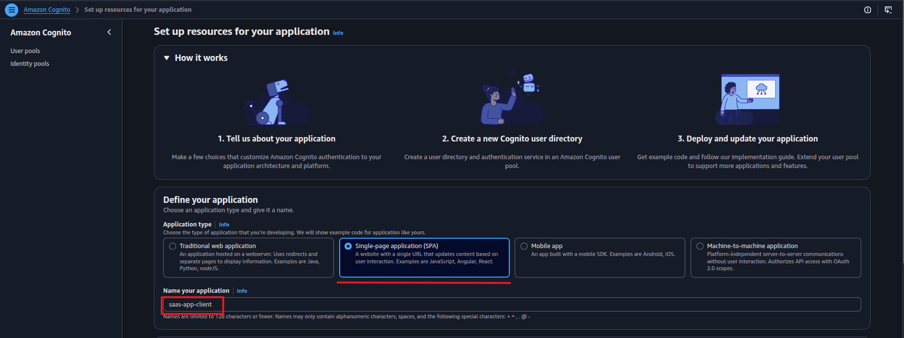
3. Under **Configure options**:
   - **Options for sign-in identifiers**: select **Email**.
   - **Self-registration**: leave **enabled** (users can call `POST /auth/signup` publicly — that's intentional).
   - **Required attributes for sign-up**: leave `email` selected.

   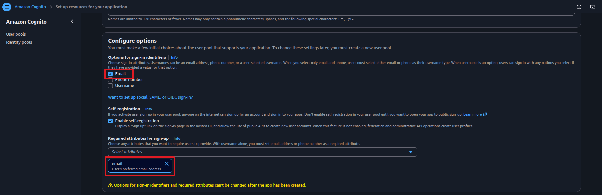
4. **Add a return URL**: enter `https://localhost:3000/callback` as a placeholder — this is required by the wizard but unused in our API-only setup.
  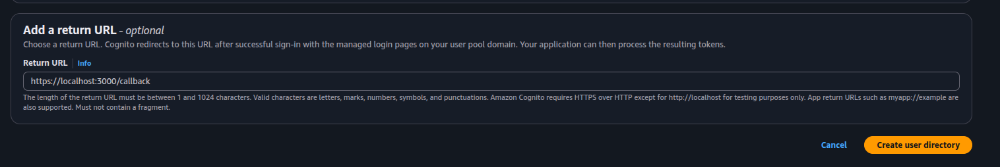
5. Click **Create your application**.
6. AWS creates both the user pool and app client together.
  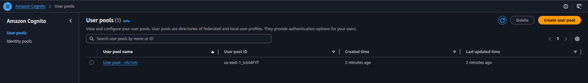
---

### 1.2 Add Custom Attributes

Custom attributes must be added after the user pool is created.

1. Open your user pool → left sidebar click **Sign-up** → scroll down to the **Custom attributes** section → click **Add custom attributes**.
2. Add two attributes:

   | Name | Type | Mutable |
   |------|------|---------|
   | `tenant_id` | String | No |
   | `role` | String | Yes |

   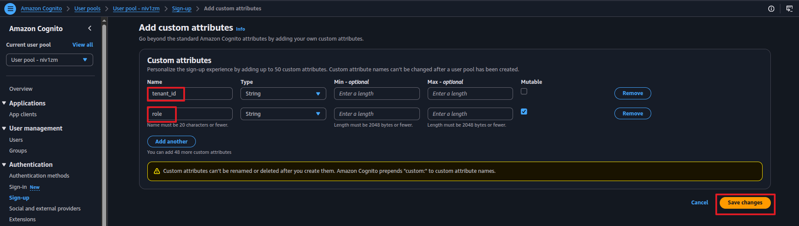

3. Click **Save changes**.
  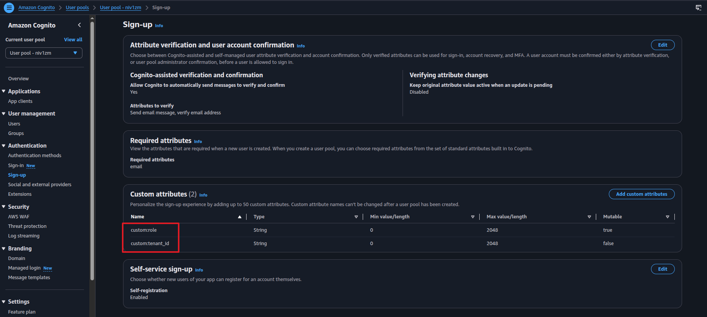

> `tenant_id` is immutable — once assigned at signup, it cannot be changed. This is a security requirement: a user can never move themselves to a different tenant.

---

### 1.3 Configure the App Client

The app client was created automatically in step 1.1. We need to enable the correct auth flows.

1. Go to your user pool → **App clients** tab → click the app client created in step 1.1 (`saas-app-client`).
2. Click **Edit** on the **Authentication flows** section.
3. Enable **ALLOW_USER_PASSWORD_AUTH** and **ALLOW_REFRESH_TOKEN_AUTH**.
4. **Save changes**.
5. **Copy the Client ID** — needed for Lambda environment variables and the JWT authorizer.

  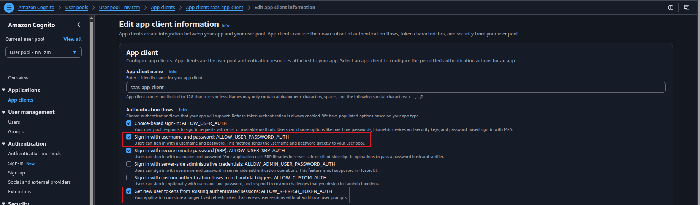

> **Why `USER_PASSWORD_AUTH`?** This flow sends credentials from our Lambda directly to Cognito over TLS — the password never reaches the client. It's appropriate for server-side Lambda flows. The alternative, `USER_SRP_AUTH` (Secure Remote Password), is preferred for client-side apps (browser/mobile) because the password never leaves the device at all. For this project, since the Lambda is the client calling Cognito, `USER_PASSWORD_AUTH` is acceptable.

---

## Step 2: Create DynamoDB Table

1. Go to **DynamoDB** → **Tables** → **Create Table**.
2. Set:
   - **Table Name**: `projects`
   - **Partition Key**: `tenant_id` (String)
   - **Sort Key**: `project_id` (String)
3. **Table settings**: Select **Customize settings**.
4. **Capacity mode**: Choose **Provisioned** → set Read/Write to `1` (stays in free tier).
  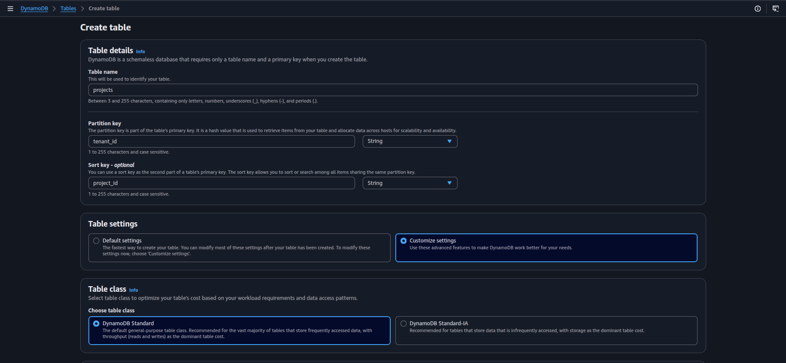
5. Leave everything else default → **Create Table**.
  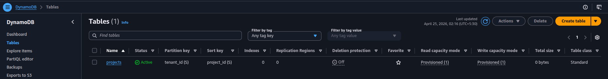

---

## Step 3: Create IAM Roles for Lambda

### 3.1 Role: `auth-signup-login-role`

1. Go to **IAM** → **Roles** → **Create Role**.
2. **Trusted entity**: AWS Service → **Lambda** → Next.
  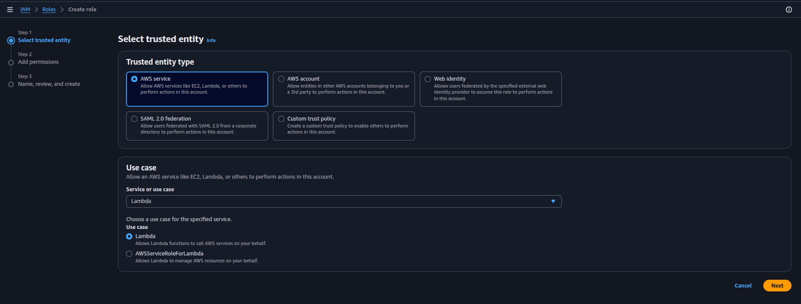
3. Attach policy: **AWSLambdaBasicExecutionRole** → Next.
  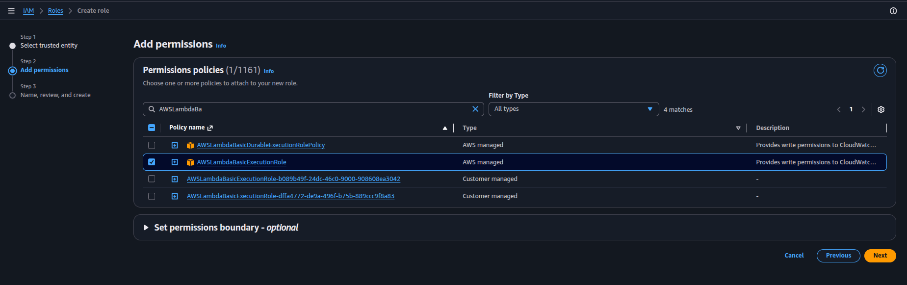
4. Name it `auth-signup-login-role` → **Create Role**.
  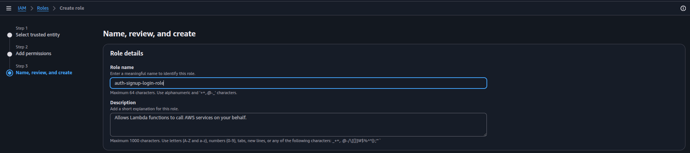
5. Open the role → **Add permissions** → **Create inline policy** → JSON tab:
   ```json
   {
     "Version": "2012-10-17",
     "Statement": [
       {
         "Effect": "Allow",
         "Action": [
           "cognito-idp:SignUp",
           "cognito-idp:ConfirmSignUp",
           "cognito-idp:InitiateAuth",
           "cognito-idp:GetUser",
           "cognito-idp:GlobalSignOut"
         ],
         "Resource": "*"
       }
     ]
   }
   ```
   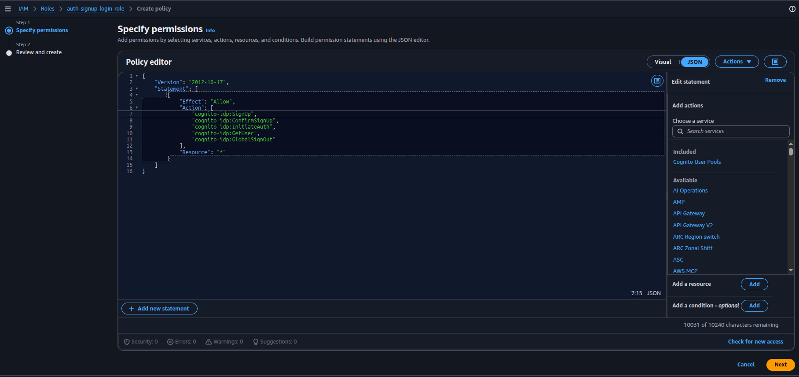
   > These five Cognito actions are user-context operations (the user authenticates themselves). AWS does not support resource-level scoping for them — the IAM reference lists no resource type for any of them. `"Resource": "*"` is the correct and only valid value here, not a shortcut.
6. Name it `allow-cognito-auth` → **Create policy**.
  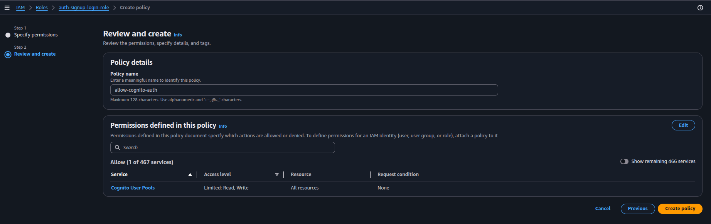

---

### 3.2 Role: `auth-projects-role`

1. **Create Role** → Lambda → attach **AWSLambdaBasicExecutionRole** → name `auth-projects-role`.
2. Add inline policy:
   ```json
   {
     "Version": "2012-10-17",
     "Statement": [
       {
         "Effect": "Allow",
         "Action": [
           "dynamodb:PutItem",
           "dynamodb:Query",
           "dynamodb:GetItem",
           "dynamodb:DeleteItem"
         ],
         "Resource": "arn:aws:dynamodb:*:*:table/projects"
       }
     ]
   }
   ```
3. Name it `allow-dynamodb-projects` → **Create policy**.

---

### All roles created:
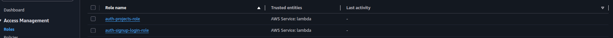

---

## Step 4: Create Lambda Functions

### 4.1 Signup Lambda

> **Purpose:** Registers a new user in Cognito. This is the only auth operation that must go through our Lambda — it controls what `tenant_id` and `role` get assigned to the user. The client cannot be trusted to set these themselves: `tenant_id` comes from the request body (the user knows which company they belong to), but `role` is **always hardcoded to `'member'`** — a client cannot self-promote to `admin`. Admin promotion must be done out-of-band (e.g., via an admin-only API or directly in the Cognito console).

1. Go to **Lambda** → **Create Function** → Author from scratch.
2. **Name**: `auth-signup` → **Runtime**: Python 3.12 → **Role**: `auth-signup-login-role`.
  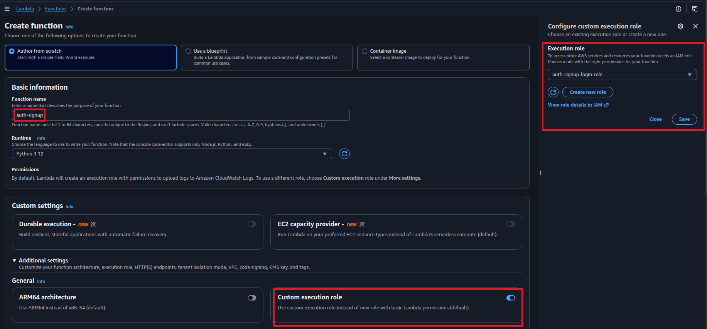
3. **Create Function**. Replace code:

```python
import json
import boto3
import os

cognito = boto3.client('cognito-idp')
CLIENT_ID = os.environ['APP_CLIENT_ID']

def lambda_handler(event, context):
    body = json.loads(event.get('body', '{}'))

    for field in ['email', 'password', 'tenant_id']:
        if field not in body:
            return {'statusCode': 400, 'body': json.dumps({'error': f'Missing: {field}'})}

    try:
        cognito.sign_up(
            ClientId=CLIENT_ID,
            Username=body['email'],
            Password=body['password'],
            UserAttributes=[
                {'Name': 'email',            'Value': body['email']},
                {'Name': 'custom:tenant_id', 'Value': body['tenant_id']},
                {'Name': 'custom:role',      'Value': 'member'}  # always 'member' — never trust client input
            ]
        )
        return {'statusCode': 201, 'body': json.dumps({'message': 'User created. Check email to verify account.'})}
    except cognito.exceptions.UsernameExistsException:
        return {'statusCode': 409, 'body': json.dumps({'error': 'User already exists'})}
    except Exception as e:
        return {'statusCode': 500, 'body': json.dumps({'error': str(e)})}
```

4. **Deploy** → **Configuration** → **Environment Variables** → Add `APP_CLIENT_ID` = your App Client ID.
  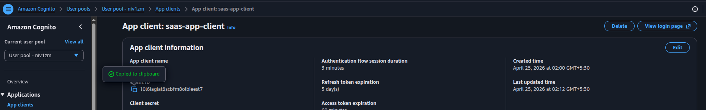
  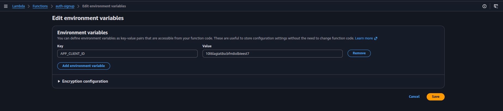

---

### 4.2 Confirm Signup Lambda

> **Purpose:** Confirms a user's email address using the verification code Cognito sends after signup. Until confirmed, the account exists but cannot log in. Proxies Cognito's `ConfirmSignUp` API.

1. **Create Function** → Name: `auth-confirm` → Python 3.12 → Role: `auth-signup-login-role`.
2. Replace code:

```python
import json
import boto3
import os

cognito = boto3.client('cognito-idp')
CLIENT_ID = os.environ['APP_CLIENT_ID']

def lambda_handler(event, context):
    body = json.loads(event.get('body', '{}'))
    try:
        cognito.confirm_sign_up(
            ClientId=CLIENT_ID,
            Username=body['email'],
            ConfirmationCode=body['code']
        )
        return {'statusCode': 200, 'body': json.dumps({'message': 'Account confirmed. You can now log in.'})}
    except Exception as e:
        return {'statusCode': 400, 'body': json.dumps({'error': str(e)})}
```

3. **Deploy** → **Environment Variables**: Add `APP_CLIENT_ID`.

---

### 4.3 Login Lambda

> **Purpose:** Authenticates the user with Cognito and returns all three tokens — ID Token, Access Token, and Refresh Token. The client stores these and uses them for all subsequent requests. Proxies Cognito's `InitiateAuth` API.

1. **Create Function** → Name: `auth-login` → Python 3.12 → Role: `auth-signup-login-role`.
2. Replace code:

```python
import json
import boto3
import os

cognito = boto3.client('cognito-idp')
CLIENT_ID = os.environ['APP_CLIENT_ID']

def lambda_handler(event, context):
    body = json.loads(event.get('body', '{}'))
    try:
        response = cognito.initiate_auth(
            ClientId=CLIENT_ID,
            AuthFlow='USER_PASSWORD_AUTH',
            AuthParameters={'USERNAME': body['email'], 'PASSWORD': body['password']}
        )
        tokens = response['AuthenticationResult']
        return {
            'statusCode': 200,
            'body': json.dumps({
                'id_token':      tokens['IdToken'],
                'access_token':  tokens['AccessToken'],
                'refresh_token': tokens['RefreshToken'],
                'expires_in':    tokens['ExpiresIn']
            })
        }
    except cognito.exceptions.NotAuthorizedException:
        return {'statusCode': 401, 'body': json.dumps({'error': 'Invalid credentials'})}
    except Exception as e:
        return {'statusCode': 500, 'body': json.dumps({'error': str(e)})}
```

3. **Deploy** → **Environment Variables**: Add `APP_CLIENT_ID`.

---

### 4.4 Me Lambda (get current user profile)

> **Purpose:** Returns the currently logged-in user's profile — email, tenant_id, role. Uses the **Access Token** (not ID Token) to call Cognito's `GetUser` API. This is the correct use of the Access Token — calling Cognito's own management APIs to retrieve user attributes.

1. **Create Function** → Name: `auth-me` → Python 3.12 → Role: `auth-signup-login-role`.
2. Replace code:

```python
import json
import boto3

cognito = boto3.client('cognito-idp')

def lambda_handler(event, context):
    # Access Token comes from Authorization header
    access_token = event['headers'].get('authorization', '').replace('Bearer ', '')
    try:
        response = cognito.get_user(AccessToken=access_token)
        attrs = {a['Name']: a['Value'] for a in response['UserAttributes']}
        return {
            'statusCode': 200,
            'body': json.dumps({
                'user_id':   response['Username'],
                'email':     attrs.get('email'),
                'tenant_id': attrs.get('custom:tenant_id'),
                'role':      attrs.get('custom:role')
            })
        }
    except Exception as e:
        return {'statusCode': 401, 'body': json.dumps({'error': str(e)})}
```

3. **Deploy**.

> No env vars needed — `GetUser` takes the Access Token directly, no Client ID required.

---

### 4.5 Logout Lambda

> **Purpose:** Signs the user out from all devices by invalidating all their tokens server-side in Cognito. Uses the **Access Token** to call Cognito's `GlobalSignOut` API. After this, any stored tokens become invalid — the client must log in again to get new ones.

1. **Create Function** → Name: `auth-logout` → Python 3.12 → Role: `auth-signup-login-role`.
2. Replace code:

```python
import json
import boto3

cognito = boto3.client('cognito-idp')

def lambda_handler(event, context):
    access_token = event['headers'].get('authorization', '').replace('Bearer ', '')
    try:
        cognito.global_sign_out(AccessToken=access_token)
        return {'statusCode': 200, 'body': json.dumps({'message': 'Logged out from all devices.'})}
    except Exception as e:
        return {'statusCode': 400, 'body': json.dumps({'error': str(e)})}
```

3. **Deploy**.

---

### 4.6 Projects Lambda (tenant-scoped CRUD)

> **Purpose:** Handles all project operations — list, create, delete. This is the core business logic Lambda. It reads `tenant_id` from the verified JWT claims forwarded by API Gateway's native JWT authorizer — never from the request body. Every DynamoDB query is scoped to that `tenant_id`, making cross-tenant data access structurally impossible.

1. **Create Function** → Name: `projects-handler` → Python 3.12 → Role: `auth-projects-role`.
2. Replace code:

```python
import json
import boto3
import uuid
from datetime import datetime, timezone
from boto3.dynamodb.conditions import Key

dynamodb = boto3.resource('dynamodb')
table = dynamodb.Table('projects')

def lambda_handler(event, context):
    # JWT claims forwarded automatically by API Gateway HTTP API native JWT authorizer
    # tenant_id comes from the verified token — never from request input
    claims = event['requestContext']['authorizer']['jwt']['claims']
    tenant_id = claims['custom:tenant_id']
    method = event['requestContext']['http']['method']

    if method == 'GET':
        response = table.query(
            KeyConditionExpression=Key('tenant_id').eq(tenant_id)
        )
        return {'statusCode': 200, 'body': json.dumps(response['Items'])}

    elif method == 'POST':
        body = json.loads(event.get('body', '{}'))
        if not body.get('name'):
            return {'statusCode': 400, 'body': json.dumps({'error': 'Missing: name'})}
        item = {
            'tenant_id':   tenant_id,
            'project_id':  str(uuid.uuid4()),
            'name':        body['name'],
            'description': body.get('description', ''),
            'created_at':  datetime.now(timezone.utc).isoformat()
        }
        table.put_item(Item=item)
        return {'statusCode': 201, 'body': json.dumps(item)}

    elif method == 'DELETE':
        project_id = event['pathParameters']['project_id']
        table.delete_item(Key={'tenant_id': tenant_id, 'project_id': project_id})
        return {'statusCode': 200, 'body': json.dumps({'message': 'Deleted'})}

    return {'statusCode': 405, 'body': json.dumps({'error': 'Method not allowed'})}
```

3. **Deploy**.

> Notice `event['requestContext']['authorizer']['jwt']['claims']` — this is the HTTP API path for JWT claims, different from REST API's `event['requestContext']['authorizer']`.

---

### ALl Lambdas created:
  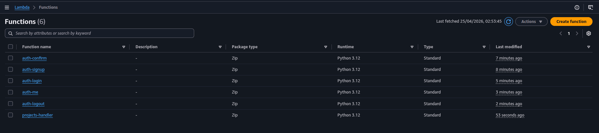

---

## Step 5: Create API Gateway HTTP API

We use **HTTP API** (not REST API) because it has a built-in native JWT authorizer — no Lambda Authorizer needed.

### 5.1 Create the API with Routes and Integrations

1. Go to **API Gateway** → **Create API** → **HTTP API** → **Build**.
2. **API name**: `saas-api`.
3. Under **Integrations**, click **Add integration** and add all 6 Lambda functions one by one:
   - Select **Lambda** → choose `auth-signup` → **Add**.
   - Repeat for `auth-confirm`, `auth-login`, `auth-me`, `auth-logout`, `projects-handler`.
   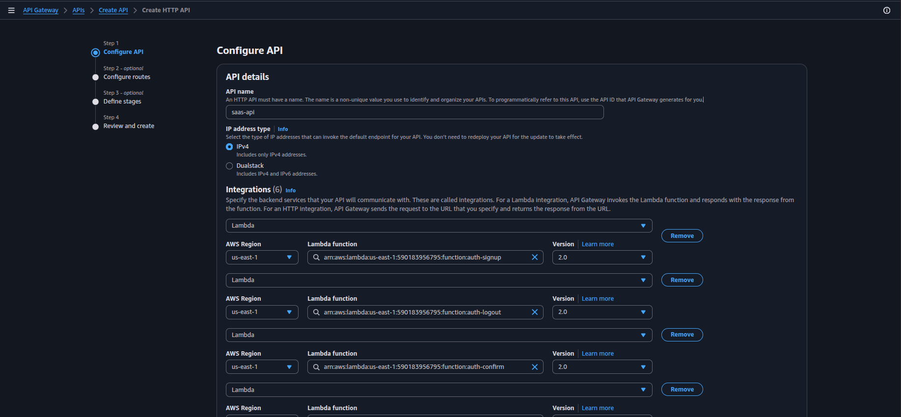
4. Click **Next** to go to **Configure routes**. Add all 8 routes here:

   | Method | Path | Integration target |
   |--------|------|--------------------|
   | POST | `/auth/signup` | `auth-signup` |
   | POST | `/auth/confirm` | `auth-confirm` |
   | POST | `/auth/login` | `auth-login` |
   | GET | `/auth/me` | `auth-me` |
   | POST | `/auth/logout` | `auth-logout` |
   | GET | `/projects` | `projects-handler` |
   | POST | `/projects` | `projects-handler` |
   | DELETE | `/projects/{project_id}` | `projects-handler` |

   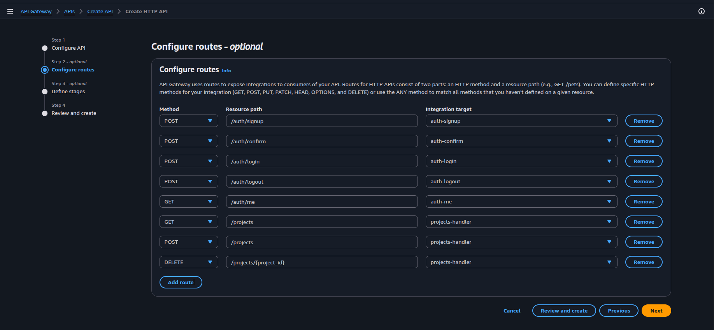

5. Click **Next** → **Stage**: leave `$default`, enable **Auto-deploy** → **Next** → **Create**.
  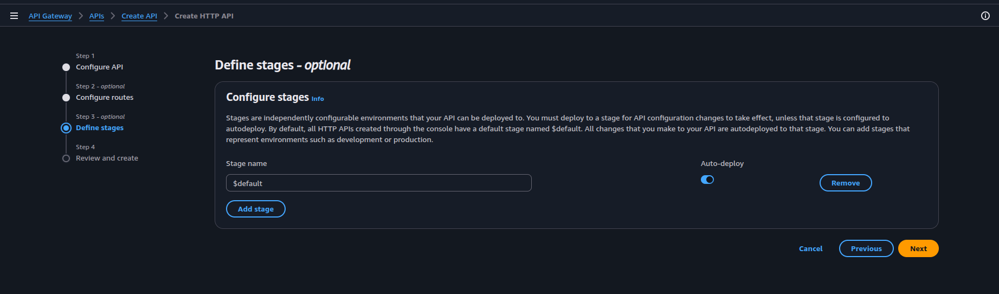
6. **Copy the Invoke URL** from the API overview.

---

### 5.2 Create the JWT Authorizer

1. Go to your API → **Authorization** (left sidebar) → **Manage authorizers** → **Create**.
2. **Authorizer type**: JWT.
3. **Name**: `cognito-jwt-authorizer`.
4. **Identity source**: `$request.header.Authorization`.
5. **Issuer URL**: `https://cognito-idp.<your-region>.amazonaws.com/<your-user-pool-id>`
   - Example: `https://cognito-idp.us-east-1.amazonaws.com/us-east-1_ABC123XYZ`
6. **Audience**: your App Client ID (e.g., `3abc123def456ghi789`).
  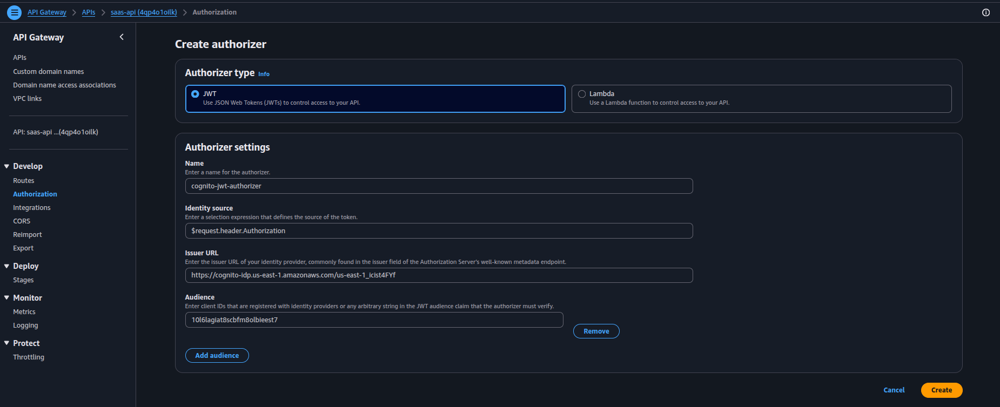
7. **Create**.
  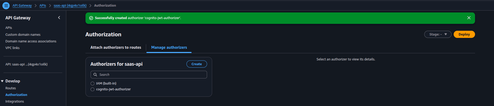

> No Lambda, no code, no library. API Gateway validates every JWT against your Cognito User Pool automatically.

---

### 5.3 Attach the JWT Authorizer to `/projects` Routes

The JWT authorizer must be attached **only to the three `/projects` routes** — not to the `/auth/*` routes.

For each of `GET /projects`, `POST /projects`, `DELETE /projects/{project_id}`:
1. Go to **Routes** → click the route → **Attach authorizer** → select `cognito-jwt-authorizer` → **Attach authorizer**.
  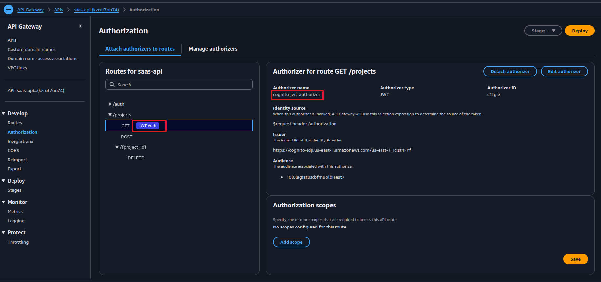

  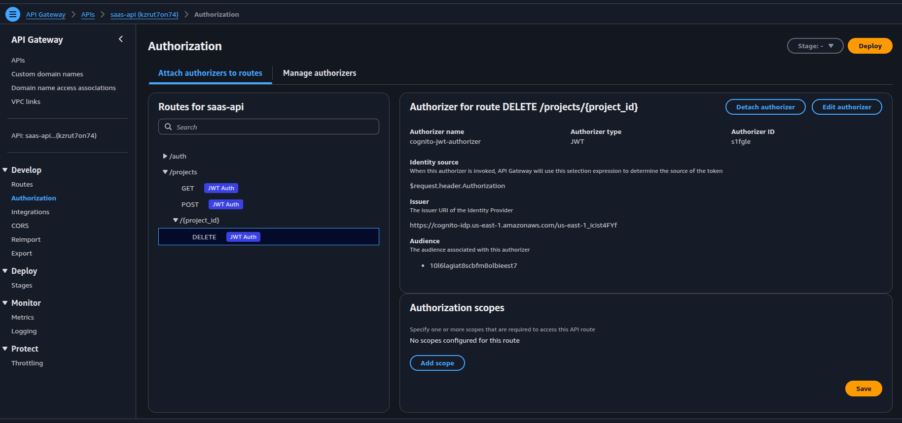

> **Why not attach the authorizer to `/auth/me` and `/auth/logout`?**
> These routes receive the **Access Token**, not the ID Token. The JWT authorizer is configured with the App Client ID as audience — this matches the ID Token's `aud` claim but **not** the Access Token's `aud` (which Cognito sets to the Cognito endpoint). Attaching it to these routes would return `401` on every call.
>
> They're still secure: the Lambda passes the Access Token directly to Cognito's `GetUser` / `GlobalSignOut` APIs, and Cognito validates it internally. An invalid token causes Cognito to reject the call and the Lambda returns `401`.

---

## Step 6: Test the Full Flow

### 6.1 Sign Up

```bash
curl -X POST <invoke-url>/auth/signup \
  -H "Content-Type: application/json" \
  -d '{
    "email": "alice@acme.com",
    "password": "Password123!",
    "tenant_id": "tenant_acme"
  }'
```

Expected: `{"message": "User created. Check email to verify account."}`

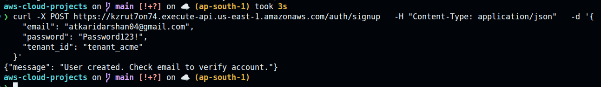

> `role` is not accepted from the client — all new users are assigned `member` by the Lambda. To promote a user to `admin`, update the `custom:role` attribute directly in the Cognito console or via an admin-only API.

---

### 6.2 Confirm Account

Check your email for the verification code from Cognito:
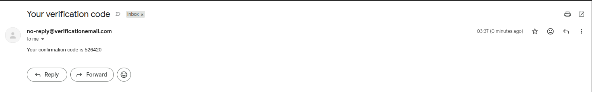

```bash
curl -X POST <invoke-url>/auth/confirm \
  -H "Content-Type: application/json" \
  -d '{"email": "alice@acme.com", "code": "123456"}'
```

Expected: `{"message": "Account confirmed. You can now log in."}`

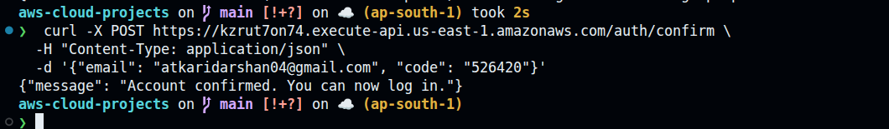

---

### 6.3 Log In — Get Tokens

```bash
curl -s -X POST <invoke-url>/auth/login \
  -H "Content-Type: application/json" \
  -d '{"email": "alice@acme.com", "password": "Password123!"}' | jq
```

Expected:
```json
{
  "id_token": "eyJ...",
  "access_token": "eyJ...",
  "refresh_token": "eyJ...",
  "expires_in": 3600
}
```

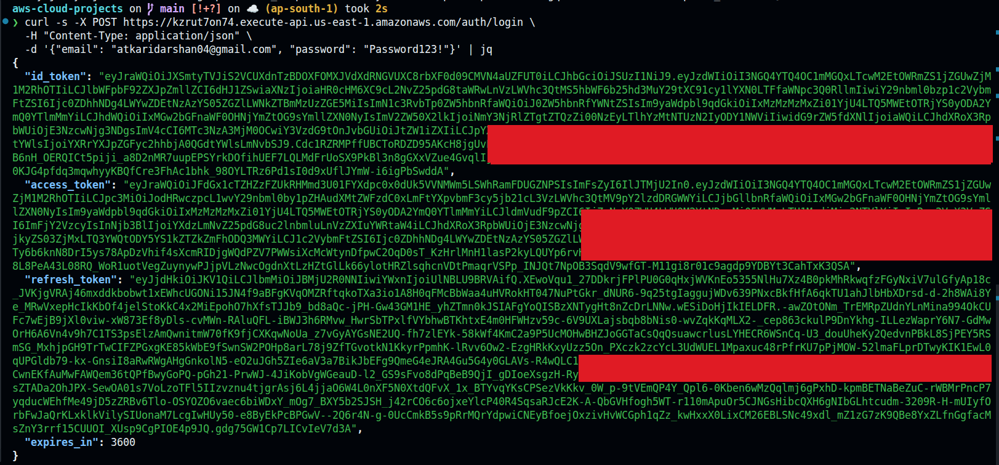

Save both `id_token` and `access_token`.

---

### 6.4 Get User Profile (Access Token)

```bash
curl -X GET <invoke-url>/auth/me \
  -H "Authorization: Bearer <access_token>"
```


Expected:
```json
{
  "user_id": "alice@acme.com",
  "email": "alice@acme.com",
  "tenant_id": "tenant_acme",
  "role": "member"
}
```

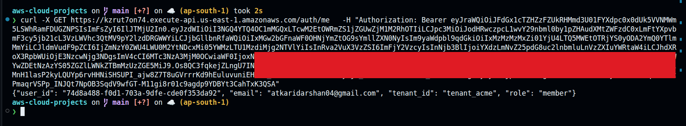

> This uses the **Access Token** — calling Cognito's `GetUser` API. Role shows `member` because all new signups are assigned `member` by the Lambda.

---

### 6.5 Create a Project (ID Token)

```bash
curl -X POST <invoke-url>/projects \
  -H "Content-Type: application/json" \
  -H "Authorization: Bearer <id_token>" \
  -d '{"name": "Website Redesign", "description": "Q3 overhaul"}'
```

Expected: the created project with `tenant_id = "tenant_acme"` set automatically from the JWT.

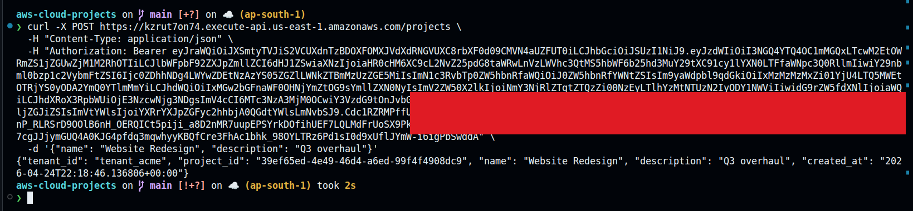

---

### 6.6 List Projects (ID Token)

```bash
curl -X GET <invoke-url>/projects \
  -H "Authorization: Bearer <id_token>"
```

Expected: only `tenant_acme`'s projects.

---

### 6.7 Test Tenant Isolation

Sign up a second user with a different tenant:

```bash
curl -X POST <invoke-url>/auth/signup \
  -H "Content-Type: application/json" \
  -d '{"email": "john@globex.com", "password": "Password123!", "tenant_id": "tenant_globex"}'
```

Confirm, login, get John's `id_token`. Call `GET /projects` with John's token — returns empty (or only Globex's projects). Alice's data is structurally unreachable.

---

### 6.8 Test Unauthorized Access

No token:
```bash
curl -X GET <invoke-url>/projects
```
Expected: `{"message": "Unauthorized"}` — API Gateway rejects before Lambda runs.

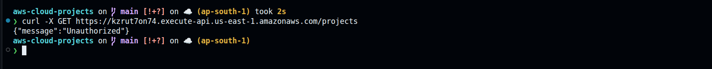

Invalid token:
```bash
curl -X GET <invoke-url>/projects -H "Authorization: Bearer invalid.token"
```
Expected: `{"message": "Unauthorized"}`.

---

### 6.9 Logout (Access Token)

```bash
curl -X POST <invoke-url>/auth/logout \
  -H "Authorization: Bearer <access_token>"
```

Expected: `{"message": "Logged out from all devices."}`

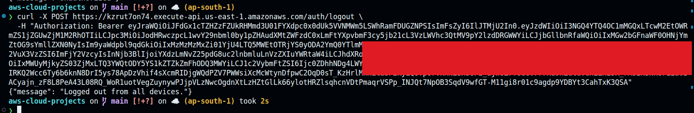

After this, the tokens are invalidated server-side in Cognito. Any further API calls with the old tokens will return 401.

---

## Cleanup

Delete in this order:

1. **API Gateway** → delete `saas-api`
2. **Lambda** → delete `auth-signup`, `auth-confirm`, `auth-login`, `auth-me`, `auth-logout`, `projects-handler`
3. **Cognito** → delete `saas-user-pool` (deletes app client and all users)
4. **DynamoDB** → delete `projects` table
5. **CloudWatch** → delete log groups for all Lambdas
6. **IAM** → delete `auth-signup-login-role`, `auth-projects-role`
