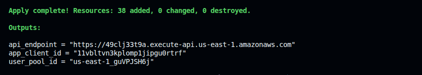

# 🚀 Deploying the Serverless Auth + Multi-Tenant API with Terraform

This guide provisions the entire stack — Cognito User Pool, DynamoDB, 6 Lambda functions, API Gateway HTTP API with native JWT authorizer — with a single `terraform apply`.

---

## ✅ Prerequisites

- [AWS CLI](https://docs.aws.amazon.com/cli/latest/userguide/getting-started-install.html) installed and configured
- [Terraform](https://developer.hashicorp.com/terraform/install) installed

```bash
aws configure
```

---

## 📁 File Structure

```
terraform/
├── providers.tf        # AWS provider
├── variables.tf        # aws_region
├── cognito.tf          # User Pool + App Client + custom attributes
├── dynamodb.tf         # projects table (tenant_id + project_id)
├── iam.tf              # 2 Lambda roles with least-privilege policies
├── lambda.tf           # 6 Lambda functions + API Gateway permissions
├── api_gateway.tf      # HTTP API + JWT authorizer + 8 routes
├── outputs.tf          # api_endpoint, user_pool_id, app_client_id
├── terraform.tfvars.example
└── lambda/
    ├── signup.py / signup.zip
    ├── confirm.py / confirm.zip
    ├── login.py / login.zip
    ├── me.py / me.zip
    ├── logout.py / logout.zip
    └── projects.py / projects.zip
```

---

## 🚀 Deployment Steps

### 1. Navigate to the Terraform directory

```bash
cd terraform
```

### 2. Set your variables

```bash
cp terraform.tfvars.example terraform.tfvars
```

Edit `terraform.tfvars` if you want a different region (default is `us-east-1`).

### 3. Initialize

```bash
terraform init
```

### 4. Plan

```bash
terraform plan
```

### 5. Apply

```bash
terraform apply
```



Takes ~30 seconds. Outputs the API endpoint, User Pool ID, and App Client ID.

---

## ✅ Testing the API

Copy the `api_endpoint` from the Terraform output.

### Sign up

```bash
curl -X POST <api_endpoint>/auth/signup \
  -H "Content-Type: application/json" \
  -d '{"email": "alice@acme.com", "password": "Password123!", "tenant_id": "tenant_acme"}'
```

### Confirm (use the code from your email)

```bash
curl -X POST <api_endpoint>/auth/confirm \
  -H "Content-Type: application/json" \
  -d '{"email": "alice@acme.com", "code": "123456"}'
```

### Login — get tokens

```bash
curl -s -X POST <api_endpoint>/auth/login \
  -H "Content-Type: application/json" \
  -d '{"email": "alice@acme.com", "password": "Password123!"}' | jq
```

Save the `id_token` and `access_token` from the response.

### Create a project (ID Token)

```bash
curl -X POST <api_endpoint>/projects \
  -H "Content-Type: application/json" \
  -H "Authorization: Bearer <id_token>" \
  -d '{"name": "Website Redesign", "description": "Q3 overhaul"}'
```

Replace `<id_token>` with the actual token value.

### List projects (ID Token)

```bash
curl -X GET <api_endpoint>/projects \
  -H "Authorization: Bearer <id_token>"
```

### Get profile (Access Token)

```bash
curl -X GET <api_endpoint>/auth/me \
  -H "Authorization: Bearer <access_token>"
```

### Logout (Access Token)

```bash
curl -X POST <api_endpoint>/auth/logout \
  -H "Authorization: Bearer <access_token>"
```

---

## 🔥 Cleanup

```bash
terraform destroy --auto-approve
```

> Note: CloudWatch Log Groups created automatically by Lambda at runtime are not managed by Terraform. Delete them manually: `/aws/lambda/auth-signup`, `/aws/lambda/auth-confirm`, `/aws/lambda/auth-login`, `/aws/lambda/auth-me`, `/aws/lambda/auth-logout`, `/aws/lambda/projects-handler`.
